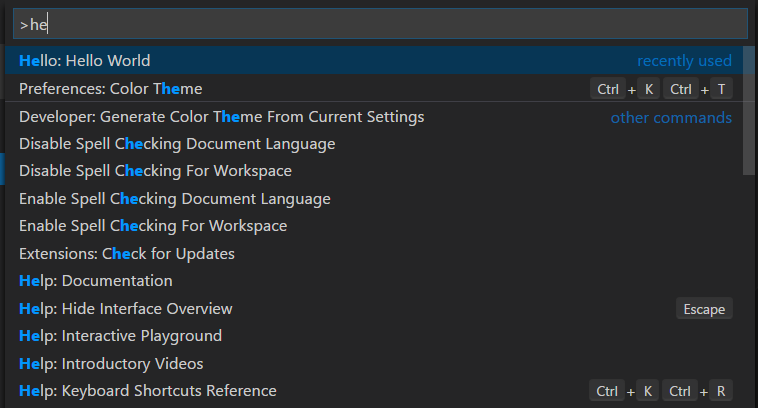

このドキュメントでは[`package.json`](/docs/extensionapi/extension-manifest.md)で定義する様々なコントリビューションポイントについて説明します。

* [`configuration`](/docs/extensionapi/extension-points.md#contributesconfiguration)
* [`commands`](/docs/extensionapi/extension-points.md#contributescommands)
* [`menus`](/docs/extensionapi/extension-points.md#contributesmenus)
* [`keybindings`](/docs/extensionapi/extension-points.md#contributeskeybindings)
* [`languages`](/docs/extensionapi/extension-points.md#contributeslanguages)
* [`debuggers`](/docs/extensionapi/extension-points.md#contributesdebuggers)
* [`breakpoints`](/docs/extensionapi/extension-points.md#contributesbreakpoints)
* [`grammars`](/docs/extensionapi/extension-points.md#contributesgrammars)
* [`themes`](/docs/extensionapi/extension-points.md#contributesthemes)
* [`snippets`](/docs/extensionapi/extension-points.md#contributessnippets)
* [`jsonValidation`](/docs/extensionapi/extension-points.md#contributesjsonvalidation)

## contributes.configuration

ユーザーに公開する設定の構成キーを提供します。これによりユーザーは、ユーザー設定またはワークスペース設定のいずれかで構成オプションを設定できます。

構成キーを提供することで、キーを記述するJSONスキーマを実際に提供します。これにより、設定を構成する際にユーザーは優れたツールサポートを受けるようになります。

あなたはこの値を`vscode.workspace.getConfiguration('myExtension')`を使用して拡張機能から読み込むことができます。

### Example

```json
"contributes": {
    "configuration": {
        "type": "object",
        "title": "TypeScript configuration",
        "properties": {
            "typescript.useCodeSnippetsOnMethodSuggest": {
                "type": "boolean",
                "default": false,
                "description": "Complete functions with their parameter signature."
            },
            "typescript.tsdk": {
                "type": ["string", "null"],
                "default": null,
                "description": "Specifies the folder path containing the tsserver and lib*.d.ts files to use."
            }
        }
    }
}
```


## contributes.configurationDefaults

既定の言語固有のエディター構成を提供します。これにより、提供された言語の既定のエディター構成を上書きします。

次の例は`markdown`の既定のエディター設定を提供します:

### Example

```json
contributes": {
    "configurationDefaults": {
        "[markdown]": {
            "editor.wordWrap": "on",
            "editor.quickSuggestions": false
        }
    }
}
```


## contributes.commands

コマンド パレット(`kb(workbench.action.showCommands)`)にコマンドを提供します

>**Note:** コマンドが(キーバインドかコマンドパレットから)呼び出されたとき、VS CodeはactivationEvent `onCommand:${command}` を発行します。

### Example

```json
"contributes": {
    "commands": [{
        "command": "extension.sayHello",
        "title": "Hello World"
    }]
}
```



## contributes.menus

エディターやエクスプローラーへメニュー項目を提供します。この定義には選択したときに呼びだすコマンドと、項目を表示する条件を含みます。後者は、キー バインドの [when clause contexts](/docs/getstarted/keybindings.md#when-clause-contexts)で使う`when`節で定義されます。必須の`command`プロパティに加えて、代替コマンドは`alt`プロパティを使って定義できます。これはメニュー項目をホバーしている間に`kbstyle(Alt)`を押すと表示して呼び出します。最後に`group`プロパティはメニュー項目のソートとグループ化を定義します。その中で`navigation`グループは特別で、常にメニューのトップ(先頭)にソートします。

現在、開発者は次を提供できます:

* コマンドパレット  - `commandPalette`
* エクスプローラーのコンテキスト メニュー - `explorer/context`
* エディターのコンテキスト メニュー - `editor/context`
* エディターのタイトル メニュー - `editor/title`
* エディターのタイトルのコンテキスト メニュー - `editor/title/context`
* デバッグ コールスタックのコンテキスト メニュー - `debug/callstack/context`

>**Note:** コマンドが(コンテキスト)メニューから呼び出されると、VS Codeは現在選択されているリソースを推定しようとして、コマンドを呼び出すときにパラメーターとして渡します。たとえば、エクスプローラー内のメニュー項目は選択したリソースのURLを渡して、エディタ内のメニュー項目ではドキュメントのURLを渡します。

その中で`commandPalette`は全てのコマンドを含んでいるため特殊です。なお、コマンドをその場所にのみ表示するようにするには`when`節を利用します。タイトルに加えて、コマンドはVS Codeがエディターのメニューバーで表示するアイコンを定義することもできます。

### Example

```json
"contributes": {
    "menus": {
        "editor/title": [{
            "when": "resourceLangId == markdown",
            "command": "markdown.showPreview",
            "alt": "markdown.showPreviewToSide",
            "group": "navigation"
        }]
    }
}
```


### Sorting of groups

メニュー項目をグループに分類できます。これらは、以下の既定ルールに沿って辞書式順序でソートします。

エディタのコンテキストメニューには、次のデフォルト値があります:

* `navigation` - 常に最初に表示します。
* `1_modification` - 次にきてコードを変更するコマンドを含みます。
* `9_cutcopypaste`  - 最後にきて基本的な編集コマンドを含みます。


あなたはこのグループでメニュー項目を追加したり、メニュー項目の新しいグループを上下中央のいずれかに追加したりできます。エディターのコンテキストメニューのみがこのグループ化の制御許されています。

### Sorting inside groups

グループ内の順序はタイトルや順序属性(order-attribute)に依存します。次に示すように、メニュー項目のグループローカル順序は`@<number>`をグループ識別子に追加することで指定します:

```json
"editor/title": [{
    "when": "editorHasSelection",
    "command": "extension.Command",
    "group": "myGroup@1"
}]
```

## contributes.keybindings

ユーザーがキーの組み合わせを押したときに呼びだすキー バインドを提供します。キー バインドについて詳しく説明している[Key Bindings](/docs/getstarted/keybindings.md)トピックを確認してください。

キー バインドを提供すると、既定のキーボードショートカットと全てのUI表現に追加のキーバインドを表示します。もちろんユーザーがキーの組み合わせを押せば、コマンドを呼び出せます。

>**Note:** VS CodeはWindows、Mac、Linux上で動作します。修飾子が異なる場合には"key"を使用して規定のキー組み合わせを設定し、特定のOS上で上書きしてください。

>**Note:** コマンドが(キーバインドかコマンドパレットから)呼び出されたとき、VS CodeはactivationEvent `onCommand:${command}` を発行します。

### Example

WindowsとLinuxで`kbstyle(Ctrl+F1)`、Macでは`kbstyle(Cmd+F1)`を定義して`"extension.sayHello"`をトリガーします。

```json
"contributes": {
    "keybindings": [{
        "command": "extension.sayHello",
        "key": "ctrl+f1",
        "mac": "cmd+f1",
        "when": "editorTextFocus"
    }]
}
```


## contributes.languages

言語の宣言を提供します。これは新しい言語を導入したり、既にVS Codeにある言語に関する情報を補充したりします。

これにおいて、言語を基本的にファイルに関連付けられた文字列の識別子で表します。(参照`TextDocument.getLanguageId()`)

VS Codeはファイルに関連付けられている言語を決定するために3つのヒントを使用します。それぞれの「ヒント」を個別に補完できます:

1. ファイル名の拡張子(以下`extensions`)
2. ファイル名(以下`filenames`)
3. ファイルの最初の行(以下`firstLine`)

ユーザーがファイルを開くと、これらの3つのルールを適用して、言語を決定します。このときVS CodeはactivationEvent `onLanguage:${language}`を発行します。(下記の例では:`onLanguage:python`)

`aliases`プロパティには他人が言語を識別できる名前を指定します。このリストの最初の項目は、右側のステータスバーに表示する言語ラベルとして選択されます。

`configuration`プロパティは、言語の構成オプションを含むファイルパスを指定します。パスは拡張機能フォルダーとの相対パスで、通常は`./language-configuration.json`です。このファイルはJSON形式を使用し、次のプロパティを含むことができます:

* `comments` - コメント記号を定義します。
  * `blockComment` - ブロック コメントをマークする開始と終了のトークンを指定します。'Toggle Block Comment'コマンドによって使用されます。
  * `lineComment` - 行コメントをマークする開始トークンを指定します。 'Add Line Comment'コマンドによって使用されます。
* `brackets` - 括弧の間のインデントに影響する括弧記号を定義します。新しい行を挿入するときに新しいインデントレベルを決定または修正するためにエディターで使用されます。
* `autoClosingPairs` - Auto-Close機能の開始と終了の記号を定義します。開始記号を入力すると、エディターは終了記号を挿入します。これは、オプションで`notIn`パラメーターをとってペアの文字列かコマンドを無効化します。
* `surroundingPairs`  - 文字列を囲う文字の開始と終了のペアを定義します。

もし言語構成のファイル名が`language-configuration.json`で終わるものであれば、VS Code内で検証と編集ができます。

### Example

```json
...
"contributes": {
    "languages": [{
        "id": "python",
        "extensions": [ ".py" ],
        "aliases": [ "Python", "py" ],
        "filenames": [ ... ],
        "firstLine": "^#!/.*\\bpython[0-9.-]*\\b",
        "configuration": "./language-configuration.json"
    }]
}
```

language-configuration.json

```json
{
    "comments": {
        "lineComment": "//",
        "blockComment": [ "/*", "*/" ]
    },
    "brackets": [
        ["{", "}"],
        ["[", "]"],
        ["(", ")"]
    ],
    "autoClosingPairs": [
        ["{", "}"],
        ["[", "]"],
        ["(", ")"],
        { "open": "'", "close": "'", "notIn": ["string", "comment"] },
        { "open": "/**", "close": " */", "notIn": ["string"] }
    ],
    "surroundingPairs": [
        ["{", "}"],
        ["[", "]"],
        ["(", ")"],
        ["<", ">"],
        ["'", "'"]
    ]
}
```

## contributes.debuggers

デバッグ アダプターを提供します。これには次のプロパティがあります:

* `type` は起動設定でこのデバッガーを識別する固有のIDです。
* `label` はデバッグ アダプターの表示名です。
* `program` は実際のデバッガーまたはランタイムに対してVS Codeデバッグ プロトコルを実装する、デバッグ アダプター プログラムへのパスです。
* `runtime` はデバッグ アダプターのプログラム属性が実行可能ファイルではなく、ランタイムが必要な場合に指定します。
* `configurationAttributes` は`launch.json' を検証するためのJSONスキーマ構成です。
* `initialConfigurations` は初期 'launch.json'を生成するための構成です。
* `configurationSnippets` は`launch.json`を編集するときにIntelliSenseで新しい構成を追加するためのスニペットを構成します。
* `variables` は置換変数を導入して、デバッガー拡張拡張機能で実装したコマンドにバインドします。

### Example

```json
"contributes": {
    "debuggers": [{
        "type": "node",
        "label": "Node Debug",

        "program": "./out/node/nodeDebug.js",
        "runtime": "node",

        "configurationAttributes": {
            "launch": {
                "required": [ "program" ],
                "properties": {
                    "program": {
                        "type": "string",
                        "description": "The program to debug."
                    }
                }
            }
        },

        "initialConfigurations": [{
            "type": "node",
            "request": "launch",
            "name": "Launch Program",
            "program": "${workspaceRoot}/app.js"
        }],

        "configurationSnippets": [
            {
                "label": "Node.js: Attach Configuration",
                "description": "A new configuration for attaching to a running node program.",
                "body": {
                    "type": "node",
                    "request": "attach",
                    "name": "${2:Attach to Port}",
                    "port": 5858
                }
            }
        ],

        "variables": {
            "PickProcess": "extension.node-debug.pickNodeProcess"
        }
    }]
}
```

`debugger`を統合する方法については[Debuggers](/docs/extensions/example-debuggers.md)を参照してください。

## contributes.breakpoints

通常デバッガー拡張機能でブレークポイントも提供します。これにブレークポイントを有効にする任意の言語ファイルタイプを設定します。

```json
"contributes": {
    "breakpoints": [
        {
            "language": "javascript"
        },
        {
            "language": "javascriptreact"
        }
    ]
}
```

## contributes.grammars

TextMate文法を提供します。文法を適応する`language`に文法とファイルパスのためのTextMate `scopeName`を提供しなければなりません。

>**Note:** 文法を含むファイルは、JSON(.jsonで終わるファイル名)またはXML plist format (全てファイル)にすることができます。

### Example

```json
"contributes": {
    "grammars": [{
        "language": "shellscript",
        "scopeName": "source.shell",
        "path": "./syntaxes/Shell-Unix-Bash.tmLanguage"
    }]
}
```

TextMateの.tmLanguageファイルを[yo code extension generator](/docs/extensions/yocode.md)を使用して、簡単にパッケージ化する方法を[Adding Language Colorization](/docs/extensions/themes-snippets-colorizers.md) で参照してください。


## contributes.themes

VS CodeにTextMateの配色テーマを提供します。エディターの周囲の色を定義する基本テーマをdarkかlightから選択し、ファイル(XML plist format)へのパスを指定する必要があります。

### Example

```json
"contributes": {
    "themes": [{
        "label": "Monokai",
        "uiTheme": "vs-dark",
        "path": "./themes/Monokai.tmTheme"
    }]
}
```


 [yo code extension generator](/docs/extensions/yocode.md)を使用してTextMate .tmThemeファイルを簡単に拡張機能へパッケージ化する方法については、[Changing the Color Theme](/docs/extensions/themes-snippets-colorizers.md)を参照してください。

## contributes.snippets

```json
"contributes": {
    "snippets": [{
        "language": "go",
        "path": "./snippets/go.json"
    }]
}
```

## contributes.jsonValidation

特定`json`ファイルにJSONスキーマ構成を提供します。`url`値には拡張機能内のスキーマへの相対パスか、[scheme](http://schemastore.org/json) URLを指定できます。

```json
"contributes": {
    "jsonValidation": [{
        "fileMatch": ".jshintrc",
        "url": "http://json.schemastore.org/jshintrc"
    }]
}
```

## 次のステップ

VS Codeの拡張モデルの詳細については次のトピックを試してください:

* [Extension Manifest File](/docs/extensionapi/extension-manifest.md) - VS Code package.json extension manifest file reference
* [Activation Events](/docs/extensionapi/activation-events.md) - VS Code activation events reference
