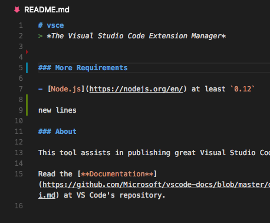

VIsual Studio Codeでは、extensionAPIを通してSource Control Mnagement(以下SCM)機能を定義できます。共通のユーザーインターフェイスを利用するスリムで強力なAPIがあり、異なるSCMをVS Codeに統合できます。


VS CodeではSource Controlプロバイダー(Git)を用意しており、このドキュメントは独自のSCMシステムを統合するのに役立ちます。

いつでも[`vscode` namespace API reference](/docs/extensionapi/vscode-api.md#scm) を参照可能なことに留意してください。

## Source Controlモデル

`SourceControl`は**resource states**、`SourceControlResourceState`のインスタンスを設定するエンティティです。Resource statesは**groups**、`SourceControlResourceGroup`のインスタンスに組織されます。

`vscode.scm.createSourceControl`を利用して新しいSourceControlを作成できます。

これら3つのエンティティはどのような相互関係があるのかを理解するには、[Git](https://github.com/Microsoft/vscode/tree/master/extensions/git)をサンプルにしてください。`git status`の次の出力を考えます:

```bash
vsce master* → git status
On branch master
Your branch is up-to-date with 'origin/master'.
Changes to be committed:
  (use "git reset HEAD <file>..." to unstage)

        modified:   README.md
        renamed:    src/api.ts -> src/test/api.ts

Changes not staged for commit:
  (use "git add/rm <file>..." to update what will be committed)
  (use "git checkout -- <file>..." to discard changes in working directory)

        deleted:    .travis.yml
        modified:   README.md
```

このワークスペースでは多くのことを行いました。まず`README.md`ファイルは変更され、ステージング後に再度修正がなされました。次に`src/api.ts`ファイルは`src/test/api.ts`に移動して、その移動をステージしました。最後に`.travis.yml` ファイルが削除されました。

このワークスペースでは、Gitが**working tree**と**index**という2つのリリースグループを定義しています。そのグループ内の各**file chnage**は**resource state**です:

- **Index** - resource group
  - `README.md`, modified - resource state
  - `src/test/api.ts`, renamed from `src/api.ts` - resource state
- **Working Tree** - resource group
  - `.travis.yml`, deleted - resource state
  - `README.md`, modified - resource state

同じファイルである`README.md`が2つの別個のリソース状態であることに注意してください。

ここでGitがこのモデルを作成する方法は次のようになります:

```ts
function createResourceUri(relativePath: string): vscode.Uri {
  const absolutePath = path.join(vscode.workspace.rootPath, relativePath);
  return vscode.Uri.file(absolutePath);
}

const gitSCM = vscode.scm.createSourceControl('git', "Git");

const index = gitSCM.createResourceGroup('index', "Index");
index.resourceStates = [
  { resourceUri: createResourceUri('README.md') },
  { resourceUri: createResourceUri('src/test/api.ts') }
];

const workingTree = gitSCM.createResourceGroup('workingTree', "Changes");
workingTree.resourceStates = [
  { resourceUri: createResourceUri('.travis.yml') },
  { resourceUri: createResourceUri('README.md') }
];
```

source controlとresource groupsに対する変更は、Source Controlビューに反映されます。

## Source Controlビュー

VS CodeはSource Controlビューが変更されるとSource Controlビューに追加(投入)することができます。Resource statesは`SourceControlResourceDecorations`を利用してカスタマイズします:

```ts
export interface SourceControlResourceState {
  readonly decorations?: SourceControlResourceDecorations;
}
```

前者の例は、Source Controlビューに単純なリストを作成するのには簡単で十分なものです。しかし、ユーザーが各リソースで実行したい多くのユーザインタラクションが多くあります。例えば、ユーザーがresource stateをクリックしたときにどのような事が起こるでしょうか？resource stateには、このアクションを処理するコマンドをオプションで指定できます。

```ts
export interface SourceControlResourceState {
  readonly command?: Command;
}
```

### Menus

ユーザーにもっと豊かなインターフェイスを提供するために、メニュー項目に配置する3つのSource Controlメニューidがあります。

`scm/title`はSCMビュータイトルの右側に位置します。`navigation`グループ内のメニュー項目はインラインになりますが、それと同時に他全ての項目は`…`ドロップダウンに表示します。

`scm/resourceGroup/context`と`scm/resourceState/context`は類似します。前者はリソースグループをカスタマイズできるようにして、後者はリソース状態を参照します。`inline`グループにメニュー項目を配置してインラインにします。他全てのメニュー項目グループは、マウスの右クリックを使用してアクセスするコンテキストメニューに表示します。これらメニューから呼び出されたコマンドは、それぞれのresource statesを引数として渡します。SCMビューが複数選択のサポートをしているため、コマンドは一度のリソースで複数の引数を受け取る場合があることに注意してください。

例えばGitは複数ファイルのステージをサポートしています。`git.stage`を`scm/resourceState/context`メニューに追加することによりこのようなメソッド定義を使用してください:

```ts
stage(...resourceStates: SourceControlResourceState[]): Promise<void>;
```

これらを作成するとき `SourceControl`と`SourceControlResourceGroup`インスタンスは`id`文字列を提供するように求めます。これらの値は`scmProvider`と`scmResourceGroup`のコンテキストキーにそれぞれ設定されます。これらのコンテキストキーは、メニュー項目の `when`節に制御させることができます。Gitが`git.stage`コマンドのメニュー項目を表示する方法は次の通りです:

```json
{
  "command": "git.stage",
  "when": "scmProvider == git && scmResourceGroup == merge",
  "group": "inline"
}
```

### SCM Input Box

Source Controlビュー上部にあるSource Control Input Boxではユーザーがメッセージを入力できます。操作を実行する時に、このメッセージを引用して代入することが可能です。例えばGitではこれをコミットボックスとして使用します。ユーザーはこれをコミットメッセージボックスとして使用し、git commitコマンドはこれを引用します。

```ts
export interface SourceControlInputBox {
  value: string;
}

export namespace scm {
  export const inputBox: SourceControlInputBox;
}
```

ユーザーは任意のコミットメッセージを確定するために<kbd>Ctrl+Enter</kbd> (macOS:  <kbd>Cmd+Enter</kbd>)を入力できます。`SourceControl`インスタンスに`acceptInputCommand`を提供することによりこのイベントを処理できます。

```ts
export interface SourceControl {
  readonly acceptInputCommand?: Command;
}
```

## Quick Diff

またVS Codeは**quick diff**エディターのガター装飾をサポートしています。



VS Codeによってこれらの装飾は計算されます。ここであなたがすることはVS Codeに任意ファイルの内容を提供することだけです。

```ts
export interface SourceControl {
  quickDiffProvider?: QuickDiffProvider;
}
```

`Uri`を引数として提供されるリソースと一致する元リソースの`Uri`をVS Codeに渡すことができます。

このAPIを [`workspace`名前空間の`registerTextDocumentContentProvider`メソッド](/docs/extensionapi/vscode-api.md#workspace)と組み合わせて、`Uri`を渡せば任意のリソースの内容を提供できます

## 次のステップ

VS Codeの拡張モデルの詳細については次のトピックを試してください:

* [SCM API Reference](/docs/extensionapi/vscode-api.md#scm) - Read the full SCM API documentation
* [Git Extension](https://github.com/Microsoft/vscode/tree/master/extensions/git) - Learn by reading the Git extension implementation
* [Extension API Overview](/docs/extensionapi/overview.md) - Learn about the full VS Code extensibility model.
* [Extension Manifest File](/docs/extensionapi/extension-manifest.md) - VS Code package.json extension manifest file reference
* [Contribution Points](/docs/extensionapi/extension-points.md) - VS Code contribution points reference
