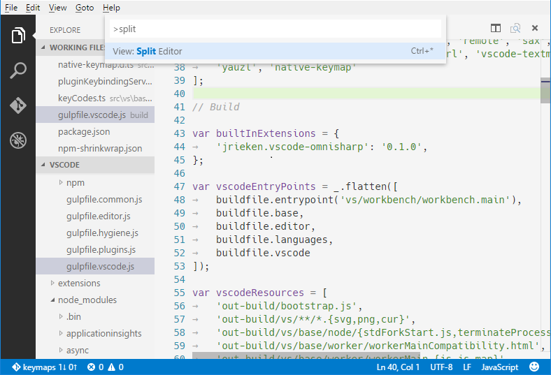
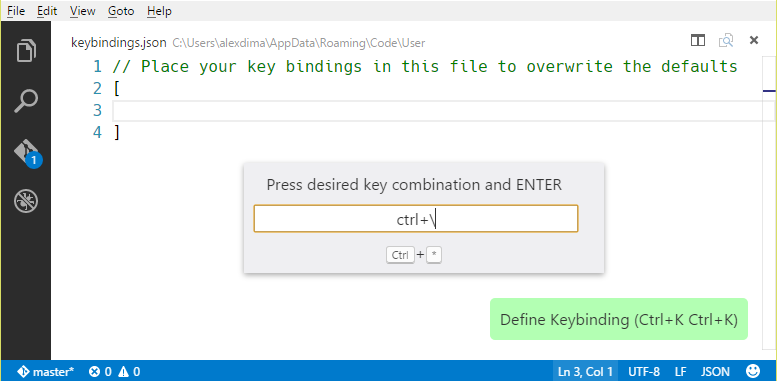

Visual Studio Codeでは、ほとんどのタスクをキーボードから直接実行することが可能です。このページでは、デフォルトのバインディング(キーボードショートカット)とその更新方法を説明します。

>**Note:** このページではアクセスしたプラットフォームのキーを表示します。他のプラットフォームを表示したい場合はマウスホバーしてください。

## エディターのキーボードショートカット

Visual Studio Codeは**キーボードショートカット**エディターを使用して、豊富で簡単なキーボードショートカットの編集ができます。これはキーバインドの有無にかかわらず使用可能なすべてのコマンドを一覧表示して、使用可能なアクションを使用してキーバインドを簡単に変更/削除/リセットできます。また上部には、コマンドやキーバインドの検索に役立つ検索窓があります。 * **ファイル**(**Code**)  > **基本設定** > **キーボード ショートカット**に移動してキーボードショートカットを構成します。


ここで最も重要なのは、キーボードレイアウトに合わせてキーバインドを確認できることです。例えばドイツ語に変更された場合、USレイアウトで表される`cmd+\`キーは`ctrl+shift+alt+cmd+7`と表します。キーバインドを入力するダイアログでは、キーボードレイアウトごとに正しいキーボードバインドを割り当てます。

高度なカスタマイズをするには[Advanced Customizations](/docs/getstarted/keybindings.md#advanced-customizations)を参照してください。

## キーマップの拡張機能

キーボード ショートカットは生産性にとって不可欠です。ですがキーボードの習慣を変えるのは難しいものです。この問題に対処するために **ファイル** > **基本設定** > **キーマップ拡張機能**では、一般的なキーマップ拡張機能のリストを用意しています。これら拡張機能は、VS Codeのショートカットを他のエディタのショートカットと一致するように変更できるので、新しいキーボードショートカットを習得する必要はありません。Marketplaceで[Keymaps category](https://marketplace.visualstudio.com/search?target=VSCode&category=Keymaps&sortBy=Downloads) をより詳細に確認してください。


## キーボード ショートカットの参照

印刷可能なキーボードショートカットリストを用意しています。**ヘルプ** > **キーボード ショートカットの参照**で印刷に最適化されたPDFバージョンを表示します。

各プラットホーム別のリンクは次の通りです:

* [Windows](https://go.microsoft.com/fwlink/?linkid=832145)
* [macOS](https://go.microsoft.com/fwlink/?linkid=832143)
* [Linux](https://go.microsoft.com/fwlink/?linkid=832144)

## Default Keyboard Shortcuts

>**Note:** 次のキーは標準のUSキーボードを想定してレンタリングしています。異なったキーボードレイアウトを使用する場合は[ここ](/docs/getstarted/keybindings.md#keyboard-layouts)を参照してください。

### 基本編集

(※VS Code i18nから引用し対応していない場合英文のままです

Key|Command|Command id
---|-------|----------
`kb(editor.action.clipboardCutAction)`|切り取り|`editor.action.clipboardCutAction`
`kb(editor.action.clipboardCopyAction)`|コピー|`editor.action.clipboardCopyAction`
`kb(editor.action.deleteLines)`|行の削除|`editor.action.deleteLines`
`kb(editor.action.insertLineAfter)`|行を下に挿入|`editor.action.insertLineAfter`
`kb(editor.action.insertLineBefore)`|行を上に挿入|`editor.action.insertLineBefore`
`kb(editor.action.moveLinesDownAction)`|行を下へ移動|`editor.action.moveLinesDownAction`
`kb(editor.action.moveLinesUpAction)`|行を上へ移動|`editor.action.moveLinesUpAction`
`kb(editor.action.copyLinesDownAction)`|行を下へコピー|`editor.action.copyLinesDownAction`
`kb(editor.action.copyLinesUpAction)`|行を上へコピー|`editor.action.copyLinesUpAction`
`kb(editor.action.addSelectionToNextFindMatch)`|選択した項目を次の一致項目に追加|`editor.action.addSelectionToNextFindMatch`
`kb(editor.action.moveSelectionToNextFindMatch)`|最後に選択した項目を次の一致項目に移動|`editor.action.moveSelectionToNextFindMatch`
`kb(cursorUndo)`|Undo last cursor operation|`cursorUndo`
`kb(editor.action.insertCursorAtEndOfEachLineSelected)`|選択した行から複数のカーソルを作成|`editor.action.insertCursorAtEndOfEachLineSelected`
`kb(editor.action.selectHighlights)`|一致するすべての出現箇所を選択します|`editor.action.selectHighlights`
`kb(editor.action.changeAll)`|すべての出現箇所を変更|`editor.action.changeAll`
`kb(expandLineSelection)`|Select current line|`expandLineSelection`
`kb(editor.action.insertCursorBelow)`|カーソルを下に挿入|`editor.action.insertCursorBelow`
`kb(editor.action.insertCursorAbove)`|カーソルを上に挿入|`editor.action.insertCursorAbove`
`kb(editor.action.jumpToBracket)`|ブラケットへ移動|`editor.action.jumpToBracket`
`kb(editor.action.indentLines)`|行のインデント|`editor.action.indentLines`
`kb(editor.action.outdentLines)`|行のインデント解除|`editor.action.outdentLines`
`kb(cursorHome)`|Go to Beginning of Line|`cursorHome`
`kb(cursorEnd)`|Go to End of Line|`cursorEnd`
`kb(cursorBottom)`|Go to End of File|`cursorBottom`
`kb(cursorTop)`|Go to Beginning of File|`cursorTop`
`kb(scrollLineDown)`|Scroll Line Down|`scrollLineDown`
`kb(scrollLineUp)`|Scroll Line Up|`scrollLineUp`
`kb(scrollPageDown)`|Scroll Page Down|`scrollPageDown`
`kb(scrollPageUp)`|Scroll Page Up|`scrollPageUp`
`kb(editor.fold)`|折りたたみ|`editor.fold`
`kb(editor.unfold)`|展開|`editor.unfold`
`kb(editor.foldRecursively)`|再帰的に折りたたむ|`editor.foldRecursively`
`kb(editor.unfoldRecursively)`|再帰的に展開する|`editor.unfoldRecursively`
`kb(editor.foldAll)`|全て折りたたみ|`editor.foldAll`
`kb(editor.unfoldAll)`|すべて展開|`editor.unfoldAll`
`kb(editor.action.addCommentLine)`|行コメントの追加|`editor.action.addCommentLine`
`kb(editor.action.removeCommentLine)`|行コメントの削除|`editor.action.removeCommentLine`
`kb(editor.action.commentLine)`|行コメントの切り替え|`editor.action.commentLine`
`kb(editor.action.blockComment)`|ブロック コメントの切り替え|`editor.action.blockComment`
`kb(actions.find)`|検索|`actions.find`
`kb(editor.action.startFindReplaceAction)`|置換|`editor.action.startFindReplaceAction`
`kb(editor.action.nextMatchFindAction)`|次を検索|`editor.action.nextMatchFindAction`
`kb(editor.action.previousMatchFindAction)`|前を検索|`editor.action.previousMatchFindAction`
`kb(editor.action.selectAllMatches)`|Select All Occurrences of Find Match|`editor.action.selectAllMatches`
`kb(toggleFindCaseSensitive)`|Toggle Find Case Sensitive|`toggleFindCaseSensitive`
`kb(toggleFindRegex)`|Toggle Find Regex|`toggleFindRegex`
`kb(toggleFindWholeWord)`|Toggle Find Whole Word|`toggleFindWholeWord`
`kb(editor.action.toggleTabFocusMode)`|Tabキーを切り替えるとフォーカスが移動します|`editor.action.toggleTabFocusMode`
`kb(toggleRenderWhitespace)`|空白文字の表示の切り替え|`toggleRenderWhitespace`
`kb(editor.action.toggleWordWrap)`|Toggle Word Wrap|`editor.action.toggleWordWrap`

### 言語編集

Key|Command|Command id
---|-------|----------
`kb(editor.action.triggerSuggest)`|候補をトリガー|`editor.action.triggerSuggest`
`kb(editor.action.triggerParameterHints)`|パラメーター ヒントをトリーが|`editor.action.triggerParameterHints`
`kb(editor.action.formatDocument)`|Format Document|`editor.action.formatDocument`
`kb(editor.action.formatSelection)`|Format Selection|`editor.action.formatSelection`
`kb(editor.action.goToDeclaration)`|定義へ移動|`editor.action.goToDeclaration`
`kb(editor.action.showHover)`|ホバーの表示|`editor.action.showHover`
`kb(editor.action.previewDeclaration)`|定義をここに表示|`editor.action.previewDeclaration`
`kb(editor.action.openDeclarationToTheSide)`|定義を横に開く|`editor.action.openDeclarationToTheSide`
`kb(editor.action.quickFix)`|クイック修正|`editor.action.quickFix`
`kb(editor.action.referenceSearch.trigger)`|すべての参照の検索|`editor.action.referenceSearch.trigger`
`kb(editor.action.rename)`|シンボルの名前を変更|`editor.action.rename`
`kb(editor.action.inPlaceReplace.down)`|次の値に置換|`editor.action.inPlaceReplace.down`
`kb(editor.action.inPlaceReplace.up)`|前の値に置換|`editor.action.inPlaceReplace.up`
`kb(editor.action.smartSelect.grow)`|選択範囲を拡大|`editor.action.smartSelect.grow`
`kb(editor.action.smartSelect.shrink)`|選択範囲を縮小|`editor.action.smartSelect.shrink`
`kb(editor.action.trimTrailingWhitespace)`|末尾の空白のトリミング|`editor.action.trimTrailingWhitespace`
`kb(workbench.action.editor.changeLanguageMode)`|言語モードの変更|`workbench.action.editor.changeLanguageMode`


### ナビゲーション

Key|Command|Command id
---|-------|----------
`kb(workbench.action.showAllSymbols)`|ワークスペース内のシンボルへ移動|`workbench.action.showAllSymbols`
`kb(workbench.action.gotoLine)`|指定行へ移動...|`workbench.action.gotoLine`
`kb(workbench.action.quickOpen)`|ファイルに移動...|`workbench.action.quickOpen`
`kb(workbench.action.gotoSymbol)`|ファイル内シンボルへ移動...|`workbench.action.gotoSymbol`
`kb(workbench.actions.view.problems)`|問題を表示する|`workbench.actions.view.problems`
`kb(editor.action.marker.next)`|次のエラーまたは警告へ移動|`editor.action.marker.next`
`kb(editor.action.marker.prev)`|前のエラーまたは警告へ移動|`editor.action.marker.prev`
`kb(workbench.action.showCommands)`|すべてのコマンドの表示|`workbench.action.showCommands`
`kb(workbench.action.openPreviousRecentlyUsedEditorInGroup)`|グループ内の最近使用したエディターのうち前のエディターを開く|`workbench.action.openPreviousRecentlyUsedEditorInGroup`
`kb(workbench.action.navigateBack)`|前に戻る|`workbench.action.navigateBack`
`kb(workbench.action.navigateForward)`|次に進む|`workbench.action.navigateForward`

## エディター/ウィンドウ管理

Key|Command|Command id
---|-------|----------
`kb(workbench.action.newWindow)`|新しいウィンドウ|`workbench.action.newWindow`
`kb(workbench.action.closeWindow)`|ウィンドウを閉じる|`workbench.action.closeWindow`
`kb(workbench.action.closeActiveEditor)`|エディターを閉じる|`workbench.action.closeActiveEditor`
`kb(workbench.action.closeFolder)`|フォルダーを閉じる|`workbench.action.closeFolder`
`kb(workbench.action.navigateEditorGroups)`|エディター グループ間で移動する|`workbench.action.navigateEditorGroups`
`kb(workbench.action.splitEditor)`|エディターの分割|`workbench.action.splitEditor`
`kb(workbench.action.focusFirstEditorGroup)`|1番目のエディター グループにフォーカス|`workbench.action.focusFirstEditorGroup`
`kb(workbench.action.focusSecondEditorGroup)`|2番目のエディター グループにフォーカス|`workbench.action.focusSecondEditorGroup`
`kb(workbench.action.focusThirdEditorGroup)`|3番目のエディター グループにフォーカス|`workbench.action.focusThirdEditorGroup`
`kb(workbench.action.focusPreviousGroup)`|前のグループにフォーカス|`workbench.action.focusPreviousGroup`
`kb(workbench.action.focusNextGroup)`|次のグループにフォーカス|`workbench.action.focusNextGroup`
`kb(workbench.action.moveEditorLeftInGroup)`|エディターを左へ移動|`workbench.action.moveEditorLeftInGroup`
`kb(workbench.action.moveEditorRightInGroup)`|エディターを右へ移動|`workbench.action.moveEditorRightInGroup`
`kb(workbench.action.moveActiveEditorGroupLeft)`|エディター グループを左側に移動する|`workbench.action.moveActiveEditorGroupLeft`
`kb(workbench.action.moveActiveEditorGroupRight)`|エディター グループを右側に移動する|`workbench.action.moveActiveEditorGroupRight`

### ファイル管理

Key|Command|Command id
---|-------|----------
`kb(workbench.action.files.newUntitledFile)`|無題の新規ファイル|`workbench.action.files.newUntitledFile`
`kb(workbench.action.files.openFile)`|ファイルを開く...|`workbench.action.files.openFile`
`kb(workbench.action.files.save)`|保存|`workbench.action.files.save`
`kb(workbench.action.files.saveAll)`|すべて保存|`workbench.action.files.saveAll`
`kb(workbench.action.files.saveAs)`|名前を付けて保存...|`workbench.action.files.saveAs`
`kb(workbench.action.closeActiveEditor)`|エディターを閉じる|`workbench.action.closeActiveEditor`
`kb(workbench.action.closeOtherEditors)`|その他のエディターを閉じる|`workbench.action.closeOtherEditors`
`kb(workbench.action.closeEditorsInGroup)`|グループ内のすべてのエディターを閉じる|`workbench.action.closeEditorsInGroup`
`kb(workbench.action.closeEditorsInOtherGroups)`|他のグループ内のエディターを閉じる|`workbench.action.closeEditorsInOtherGroups`
`kb(workbench.action.closeEditorsToTheLeft)`|左側のエディターを閉じる|`workbench.action.closeEditorsToTheLeft`
`kb(workbench.action.closeEditorsToTheRight)`|右側のエディターを閉じる|`workbench.action.closeEditorsToTheRight`
`kb(workbench.action.closeAllEditors)`|すべてのエディターを閉じる|`workbench.action.closeAllEditors`
`kb(workbench.action.reopenClosedEditor)`|閉じたエディターを再度開く|`workbench.action.reopenClosedEditor`
`kb(workbench.action.keepEditor)`|エディターを保持|`workbench.action.keepEditor`
`kb(workbench.action.openNextRecentlyUsedEditorInGroup)`|グループ内の最近使用したエディターのうち次のエディターを開く|`workbench.action.openNextRecentlyUsedEditorInGroup`
`kb(workbench.action.openPreviousRecentlyUsedEditorInGroup)`|グループ内の最近使用したエディターのうち前のエディターを開く|`workbench.action.openPreviousRecentlyUsedEditorInGroup`
`kb(workbench.action.files.copyPathOfActiveFile)`|アクティブ ファイルのパスのコピー|`workbench.action.files.copyPathOfActiveFile`
`kb(workbench.action.files.revealActiveFileInWindows)`|Windowsエクスプローラーでアクティブファイルを表示する|`workbench.action.files.revealActiveFileInWindows`
`kb(workbench.action.files.showOpenedFileInNewWindow)`|新しいウィンドウでアクティブ ファイルを開く|`workbench.action.files.showOpenedFileInNewWindow`
`kb(workbench.files.action.compareFileWith)`|アクティブ ファイルを比較|`workbench.files.action.compareFileWith`

### 表示

Key|Command|Command id
---|-------|----------
`kb(workbench.action.toggleFullScreen)`|全画面表示の切り替え|`workbench.action.toggleFullScreen`
`kb(workbench.action.toggleZenMode)`|Zen Modeの切り替え|`workbench.action.toggleZenMode`
`kb(workbench.action.exitZenMode)`|Leave Zen Mode|`workbench.action.exitZenMode`
`kb(workbench.action.zoomIn)`|拡大|`workbench.action.zoomIn`
`kb(workbench.action.zoomOut)`|縮小|`workbench.action.zoomOut`
`kb(workbench.action.zoomReset)`|ズームのリセット|`workbench.action.zoomReset`
`kb(workbench.action.toggleSidebarVisibility)`|サイドバーの表示の切り替え|`workbench.action.toggleSidebarVisibility`
`kb(workbench.view.explorer)`|エクスプローラーを表示|`workbench.view.explorer`
`kb(workbench.view.debug)`|デバッグの表示|`workbench.view.debug`
`kb(workbench.view.git)`|Gitを表示|`workbench.view.git`
`kb(workbench.view.extensions)`|拡張機能を表示する|`workbench.view.extensions`
`kb(workbench.action.output.toggleOutput)`|出力の切り替え|`workbench.action.output.toggleOutput`
`kb(workbench.action.quickOpenView)`|Quick Openビュー|`workbench.action.quickOpenView`
`kb(workbench.view.search)`|検索の表示|`workbench.view.search`
`kb(workbench.action.replaceInFiles)`|複数のファイルで置換|`workbench.action.replaceInFiles`
`kb(workbench.action.search.toggleQueryDetails)`|Toggle Search Details|`workbench.action.search.toggleQueryDetails`
`kb(workbench.action.terminal.openNativeConsole)`|新しいコマンドプロントを開く|`workbench.action.terminal.openNativeConsole`
`kb(markdown.showPreview)`|Toggle Markdown Preview|`markdown.showPreview`
`kb(markdown.showPreviewToSide)`|Open Preview to the Side|`markdown.showPreviewToSide`
`kb(workbench.action.terminal.toggleTerminal)`|統合端末の切り替え|`workbench.action.terminal.toggleTerminal`

### 基本設定

Key|Command|Command id
---|-------|----------
`kb(workbench.action.openGlobalSettings)`|ユーザー設定を開く|`workbench.action.openGlobalSettings`
`kb(workbench.action.openWorkspaceSettings)`|ワークスペース設定を開く|`workbench.action.openWorkspaceSettings`
`kb(workbench.action.openGlobalKeybindings)`|キーボード ショートカットを開く|`workbench.action.openGlobalKeybindings`
`kb(workbench.action.openSnippets)`|ユーザー スニペットを開く|`workbench.action.openSnippets`
`kb(workbench.action.selectTheme)`|配色テーマ|`workbench.action.selectTheme`
`kb(workbench.action.configureLocale)`|言語を構成する|`workbench.action.configureLocale`

### デバッグ

Key|Command|Command id
---|-------|----------
`kb(editor.debug.action.toggleBreakpoint)`|ブレークポイントの切り替え|`editor.debug.action.toggleBreakpoint`
`kb(workbench.action.debug.start)`|デバッグの開始|`workbench.action.debug.start`
`kb(workbench.action.debug.continue)`|続行|`workbench.action.debug.continue`
`kb(workbench.action.debug.run)`|デバッグなしで開始|`workbench.action.debug.run`
`kb(workbench.action.debug.pause)`|一時停止|`workbench.action.debug.pause`
`kb(workbench.action.debug.stepInto)`|ステップ インする|`workbench.action.debug.stepInto`
`kb(workbench.action.debug.stepOut)`|ステップ アウト|`workbench.action.debug.stepOut`
`kb(workbench.action.debug.stepOver)`|ステップ オーバー|`workbench.action.debug.stepOver`
`kb(workbench.action.debug.stop)`|停止|`workbench.action.debug.stop`
`kb(editor.debug.action.showDebugHover)`|ホバーの表示|`editor.debug.action.showDebugHover`

### タスク

Key|Command|Command id
---|-------|----------
`kb(workbench.action.tasks.build)`|Run Build Task|`workbench.action.tasks.build`
`kb(workbench.action.tasks.test)`|Run Test Task|`workbench.action.tasks.test`

### 拡張機能

Key|Command|Command id
---|-------|----------
`kb(workbench.extensions.action.installExtension)`|拡張機能のインストール|`workbench.extensions.action.installExtension`
`kb(workbench.extensions.action.showInstalledExtensions)`|インストール済みの拡張機能の表示|`workbench.extensions.action.showInstalledExtensions`
`kb(workbench.extensions.action.listOutdatedExtensions)`|古くなった拡張機能の表示|`workbench.extensions.action.listOutdatedExtensions`
`kb(workbench.extensions.action.showRecommendedExtensions)`|お勧めの拡張機能を表示|`workbench.extensions.action.showRecommendedExtensions`
`kb(workbench.extensions.action.showPopularExtensions)`|人気の拡張機能の表示|`workbench.extensions.action.showPopularExtensions`
`kb(workbench.extensions.action.updateAllExtensions)`|すべての拡張機能を更新します|`workbench.extensions.action.updateAllExtensions`

## 高度なカスタマイズ

VS Code内すべてのキーボードショートカットは`keybindings.json`ファイルでカスタマイズすることができます。

* キーボードショートカットをで設定するには、**Keyboard Shortcuts**エディターを開き、`keybindings.json`をクリックします。
* これにより、左側に**既定のキーバインド**と右側に`keybindings.json`ファイルを開きます。右側のファイルで既定のキーバインド設定を上書きできます 。
* なお上記のリストは完全なものではありません。**既定のキーボードショートカット**下の"Here are other available commands"でより多くを確認できます。

## キーボードのルール

キーボードショートカットの割り当ては、JSONによるルールのリストを分析することによって行われます。いくつかの例を次に示します:

```json
// Keybindings that are active when the focus is in the editor
{ "key": "home",            "command": "cursorHome",                  "when": "editorTextFocus" },
{ "key": "shift+home",      "command": "cursorHomeSelect",            "when": "editorTextFocus" },

// Keybindings that are complementary
{ "key": "f5",              "command": "workbench.action.debug.continue", "when": "inDebugMode" },
{ "key": "f5",              "command": "workbench.action.debug.start",    "when": "!inDebugMode" },

// Global keybindings
{ "key": "ctrl+f",          "command": "actions.find" },
{ "key": "alt+left",        "command": "workbench.action.navigateBack" },
{ "key": "alt+right",       "command": "workbench.action.navigateForward" },

// Global keybindings using chords (two separate keypress actions)
{ "key": "ctrl+k enter",    "command": "workbench.action.keepEditor" },
{ "key": "ctrl+k ctrl+w",   "command": "workbench.action.closeAllEditors" },
```

各ルールは次の通りです:

* `key` : 押されるキー
* `command` : 実行するコマンドID
* `when`(オプション) : 現在のコンテキストに応じて評価されるブール式を含める値

Chord(別個のキー操作)は、2つのキーをスペースで区切って記述します。E.g.: `kbstyle(ctrl+k ctrl+c)`。

キーが押されたとき:

* ルールは下から上に評価します。
* `key`と`when`が条件に一致した最初のルールを利用します。
* それ以降のルールは処理しません。
* ルールが一致したうえで`command`をセットしていれば、その` command`を実行します。

追加の` keybindings.json`ルールは実行時に既定ルールの最後に追加され、既定のルールを上書きします。`keybindings.json`ファイルはVS Codeで監視するので、実行中でもルールを更新できます。

## 利用可能なキー

`key`は修飾子とキーで構成します。

次の修飾子を受け付けます:

Platform|Modifiers
--|---------
Mac|`kbstyle(ctrl+)`, `kbstyle(shift+)`, `kbstyle(alt+)`, `kbstyle(cmd+)`
Windows|`kbstyle(ctrl+)`, `kbstyle(shift+)`, `kbstyle(alt+)`, `kbstyle(win+)`
Linux|`kbstyle(ctrl+)`, `kbstyle(shift+)`, `kbstyle(alt+)`, `kbstyle(meta+)`

次のキーを受け付けます:

* `kbstyle(f1-f19)`, `kbstyle(a-z)`, `kbstyle(0-9)`
* ``kbstyle(`)``, `kbstyle(-)`, `kbstyle(=)`, `kbstyle([)`, `kbstyle(])`, `kbstyle(\)`, `kbstyle(;)`, `kbstyle(')`, `kbstyle(,)`, `kbstyle(.)`, `kbstyle(/)`
* `kbstyle(left)`, `kbstyle(up)`, `kbstyle(right)`, `kbstyle(down)`, `kbstyle(pageup)`, `kbstyle(pagedown)`, `kbstyle(end)`, `kbstyle(home)`
* `kbstyle(tab)`, `kbstyle(enter)`, `kbstyle(escape)`, `kbstyle(space)`, `kbstyle(backspace)`, `kbstyle(delete)`
* `kbstyle(pausebreak)`, `kbstyle(capslock)`, `kbstyle(insert)`
* `kbstyle(numpad0-numpad9)`, `kbstyle(numpad_multiply)`, `kbstyle(numpad_add)`, `kbstyle(nupad_separator)`
* `kbstyle(numpad_subtract)`, `kbstyle(numpad_decimal)`, `kbstyle(numpad_divide)`

## コマンドの引数

引数を指定してコマンドを呼びだすことができます。これは、特定のファイルやフォルダーに対して同じ操作を繰り返し実行する場合などに便利な機能となります。カスタムキーボードショートカットを追加するだけで、必要な操作を正確に実行できます。

既存の`kbstyle(Enter)`キーを上書きする例です：

```json
  { "key": "enter", "command": "type",
                    "args": { "text": "Hello World" },
                    "when": "editorTextFocus" }
```

"command": "type" により、Enterキーが入力されると {"text"： "Hello World"} を最初の引数として受け取り、”Hello World” をエディターに出力する動作となります。

## when節のコンテキスト

VS Codeはオプションの`when`節を通して、キーバインディングの有効タイミングを細かく制御できます。なお`when`を設定していないキーバインディングは常に利用可能です。

次はtrue/falseのブーリアン式で評価可能な`when`節のコンテキスト例です:

Context name | True when
------------ | ------------
**Editor contexts** |
editorFocus | エディターにテキストまたはウィジェットいずれかのフォーカスがあるとき
editorTextFocus | エディター内のテキストにフォーカスがあるとき(カーソル点滅)
editorHasSelection | エディター内のテキストを選択しているとき
editorHasMultipleSelections | テキストを複数選択しているとき(マルチカーソル)
editorReadOnly | エディターが読み取り専用のとき
editorLangId | エディターの言語IDが一致するとき(e.g.`"editorLangId == typescript"`)
textCompareEditorVisible | Diff(compare)ビューを表示しているとき
**Mode contexts** |
inDebugMode | デバッグセッションを実行しているとき
inSnippetMode | スニペットモード内のとき
inQuickOpen | Quick Openドロップダウンにフォーカスがあるとき
**Explorer contexts** |
explorerViewletVisible | エクスプローラービューを表示しているとき
explorerViewletFocus | エクスプローラービューにキーボードフォーカスがあるとき
filesExplorerFocus | ファイルエクスプローラーセクションにキーボードフォーカスがあるとき
openEditorsFocus | 開いているエディターセクションにキーボードフォーカスがあるとき
explorerResourceIsFolder | エクスプローラー内のフォルダーを選択しているとき
**Editor widget contexts** |
findWidgetVisible | エディター検索ウィジェットを表示しているとき
suggestWidgetVisible | 提案ウィジェット(IntelliSense)を表示しているとき
suggestWidgetMultipleSuggestions | 複数の提案を表示しているとき
renameInputVisible | 名前の変更ボックスを表示しているとき
referenceSearchVisible | すべての参照を検索ウィンドウを開いているとき
inReferenceSearchEditor | すべての参照を検索ウィンドウにフォーカスがあるとき
config.editor.stablePeek | ピークエディター(キープ)を開いているとき(`editor.stablePeek`設定によって制御されます)
quickFixWidgetVisible | クイック修正を表示しているとき
parameterHintsVisible | パラメーターヒントを表示しているとき(`editor.parameterHints`設定によって制御されます)
parameterHintsMultipleSignatures | 複数のパラメーターヒントを表示しているとき
**Integrated terminal contexts** |
terminalFocus | 統合端末にフォーカスがあるとき
**Global UI contexts** |
resourceLangId | エクスプローラーもしくはエディターのタイトル言語IDが一致しているとき(e.g.`"resourceLangId == markdown"`)
globalMessageVisible | VS Code上部のメッセージを表示しているとき
searchViewletVisible | 検索ビューを開いているとき
replaceActive | 検索ビューの置換ボックスを開いているとき
**Configuration settings contexts** |
config.editor.minimap.enabled | `editor.minimap.enabled`設定が`true`のとき

>**Note**: 任意のユーザーまたはワークスペース設定で接頭辞`"config."`を持つブール値を使用できます。

上記のリストは完全なものではありません。**既定のキーボードショートカット**で`when`コンテキストを確認してください。

## 特定のキーバインド ルールを削除

既定のキーバインドを削除するキーバインド ルールを記述できます。`keybindings.json`ではVS Codeのすべてのキーバインドを再定義することが可能です。ですが`kbstyle(Tab)`や`kbstyle(Escape)`といったキーの一部を微調整をするには向きません。特定のキーバインディングを削除するには`command`に` -`を追加します。これによりルールは削除ルールにかわります。

例を次に示します:

```json
// In Default Keyboard Shortcuts
...
{ "key": "tab", "command": "tab", "when": ... },
{ "key": "tab", "command": "editor.emmet.action.expandAbbreviation", "when": ... },
{ "key": "tab", "command": "jumpToNextSnippetPlaceholder", "when": ... },
{ "key": "tab", "command": "acceptSelectedSuggestion", "when": ... },
...

// To remove the second rule, for example, add in keybindings.json:
{ "key": "tab", "command": "-editor.emmet.action.expandAbbreviation" }

```

## キーボードレイアウト

>**Note:** このセクションはキーバインディングにのみ関連し、エディタでの入力には関係しません。

上記のキー(印刷文字？)は仮想キーの文字列表現であり、押したときに入力される文字と必ずしも関連しません。詳細:

* 参考: [Virtual-Key Codes (Windows)](https://msdn.microsoft.com/en-us/library/windows/desktop/dd375731)
* `kbstyle(tab)` for `VK_TAB` (`0x09`)
* `kbstyle(;)` for `VK_OEM_1` (`0xBA`)
* `kbstyle(=)` for `VK_OEM_PLUS` (`0xBB`)
* `kbstyle(,)` for `VK_OEM_COMMA` (`0xBC`)
* `kbstyle(-)` for `VK_OEM_MINUS` (`0xBD`)
* `kbstyle(.)` for `VK_OEM_PERIOD` (`0xBE`)
* `kbstyle(/)` for `VK_OEM_2` (`0xBF`)
* ``kbstyle(`)`` for `VK_OEM_3` (`0xC0`)
* `kbstyle([)` for `VK_OEM_4` (`0xDB`)
* `kbstyle(\)` for `VK_OEM_5` (`0xDC`)
* `kbstyle(])` for `VK_OEM_6` (`0xDD`)
* `kbstyle(')` for `VK_OEM_7` (`0xDE`)
* etc.

異なったキーボードレイアウトを使用すると、上記の仮想キーの位置が変わっていたり押したときに挿入する文字が異なったりします。異なるキーボードレイアウトを使用する場合、Visual Studio Codeは次の処理を行います:

すべてのキーバインディングは、現在のシステムのキーボードレイアウトを使用してUIに表示します。たとえば、フランス語のキーボードレイアウトを使用しているときの `Split Editor`は`kbstyle(Ctrl+*)`としてレンダリングします:



`keybindings.json`を編集するとき、VS Codeは標準のUSキーボードレイアウトで生成された文字で表現します。現在のシステムキーボードレイアウトで異なる印字のキーを押す必要がある場合はそのキーバインディングを強調表示します。たとえばフランスのキーボードレイアウトを使用するときの**既定のキーバインド**ルールは次のようになります:


また`keybindings.json`を編集するときにキーバインドルール追加を助けるウィジェットがあります。このウィジェットを起動するには、 `kb(editor.action.defineKeybinding)`を押します。ウィジェットは、VSのコードは、現在のキーボードレイアウトの下で検出されたキーをキーの押下を待機し、テキストボックスに、それ以下のシリアル化されたJSON表現をレンダリングします。キーの組み合わせを入力しおえたら`kbstyle(Enter)`を押してルールを挿入します。



>**Note:** Visual Studio Codeは起動時に現在のキーボードレイアウトを検出して、この情報をキャッシュします。ですからキーボードレイアウトを変更した場合は、VS Codeの再起動をお勧めします。

## 次のステップ

今回キーバインドサポートについて確認できました。次は何を...

* [Language Support](/docs/languages/overview.md) - Our Good, Better, Best language grid to see what you can expect
* [Debugging](/docs/getstarted/debugging.md) - This is where VS Code really shines
* [Node.js](/docs/nodejs/nodejs-tutorial.md) - End to end Node.js scenario with a sample app

## よくある質問

**Q: どのコマンドがキーにバインドされているかを調べるにはどうすればいいですか？**

**A:** 既定のキーボードショートカットで`kb(workbench.action.gotoSymbol)`
を押して `Quick Outline`を開きます。


**Q: 行を削除するCtrl+Dのようなアクションをキーバインドに追加するにはどうすればいいですか？**

**A:** 既定のキーボード ショートカットのアクションをトリガするルールを見つけて、`keybindings.json`ファイルに変更したバージョンを書きます:

```json
// Original, in Default Keyboard Shortcuts
{ "key": "ctrl+shift+k",          "command": "editor.action.deleteLines",
                                     "when": "editorTextFocus" },
// Modified, in User/keybindings.json, Ctrl+D now will also trigger this action
{ "key": "ctrl+d",                "command": "editor.action.deleteLines",
                                     "when": "editorTextFocus" },
```

**Q: どのように特定ファイルタイプのキーバインドを追加できますか？**

**A:** `when`節に`editorLangId`コンテキストキーを使用します:

```json
{ "key": "shift+alt+a",           "command": "editor.action.blockComment",
                                     "when": "editorTextFocus && editorLangId == csharp" },
```

**Q: キーバインディングを`keybindings.json`で変更しましたが機能しません**

**A:** 最も一般的な問題はファイルの構文エラーです。 それ以外の場合は `when`節を削除するか、別の`key`を選んでみてください。残念ながら現時点では、このように試行錯誤するしかありません。
