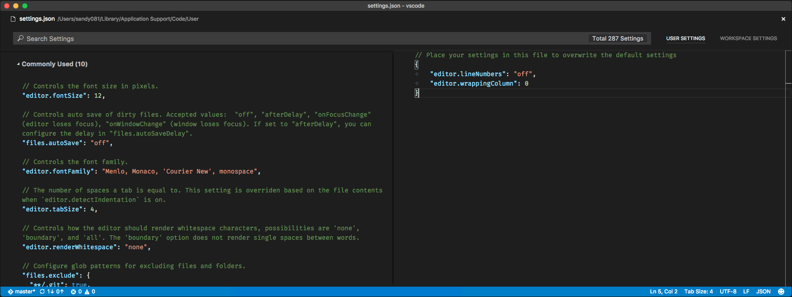
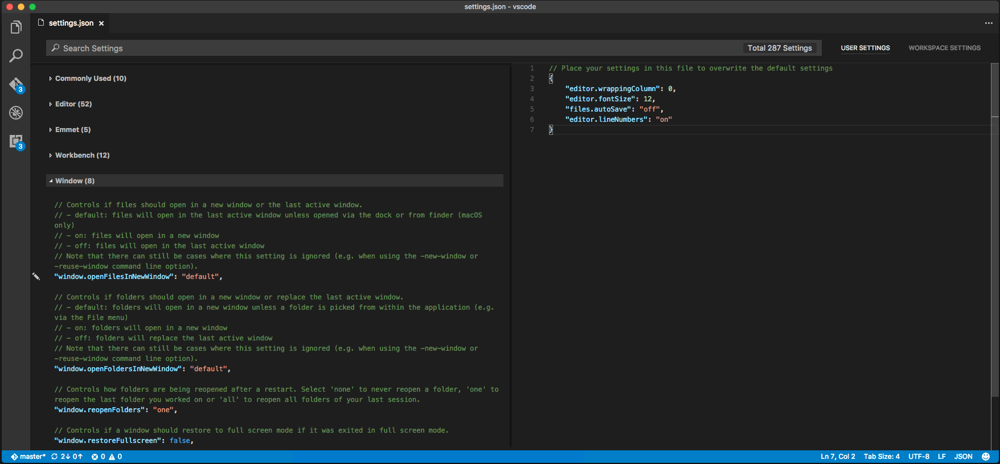
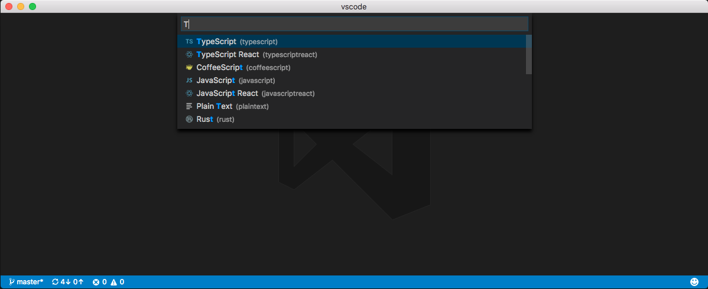
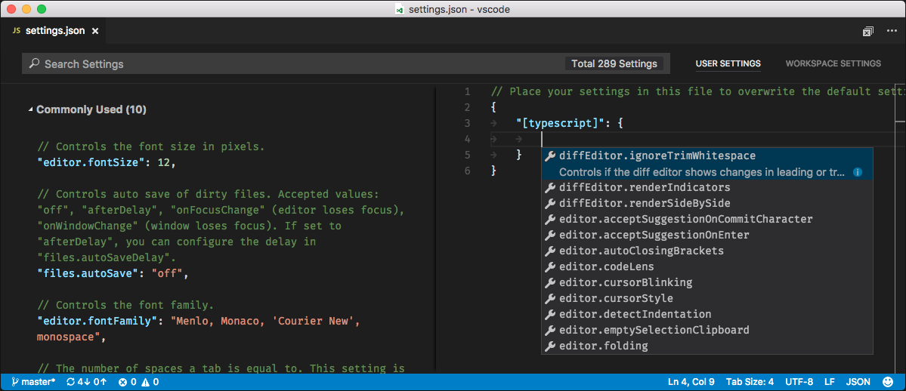

VS Codeを好みの設定で構成できます。VS Codeのエディタ、ユーザーインターフェイス、および機能的な動作のほぼすべての部分に、変更可能なオプションを用意しています

VS Codeでは設定用に2つのウィンドウを用意しました:

* **ユーザー**設定はVS Codeに登録され、グローバルに開いたもの全てに適用します。
* **ワークスペース**設定はワークスペースの`.vscode`フォルダーに登録され、ワークスペースを開いたときのみに適用します。この設定はユーザー設定よりも優先します。

## ユーザーとワークスペース設定を作成 <a id="creating-user-and-worksspace-settings"></a>

**ファイル**(**Code**) > **基本設定** > **設定**でユーザーとワークスペースの設定を構成するための項目を用意しています。設定リストがあるので、これから編集したい設定をコピーして`setting.json`に書き込みます。右側のタブを使用すると、ユーザーとワークスペース設定ファイルをすばやく切り替えることができます。

これを**コマンドパレット** (`kb(workbench.action.showCommands)`) から**Preferences: Open User Settings**か**Preferences: Open Workspace Settings**を実行することでも開くことができます。

行番号の無効化とビューポートの幅での折り返しを次の例で設定します。



変更は編集した `setting.json` を保存することで適用します。

>**Note:** ワークスペースの設定は、チーム全体でプロジェクト設定を共有するのに便利です。

## 設定ファイルの場所  <a id="settings-file-locations"></a>

プラットホーム別ユーザー設定ファイルは次の場所にあります:

* **Windows** `%APPDATA%\Code\User\settings.json`
* **Mac** `$HOME/Library/Application Support/Code/User/settings.json`
* **Linux** `$HOME/.config/Code/User/settings.json`

なおワークスペースの設定ファイルはプロジェクトの`.vscode`フォルダーの下にあります。

## 既定の設定  <a id="default-settings"></a>

設定を開いたとき、検索して見つけるのに役立つ**デフォルト設定**を表示します。大きな検索バーで検索すると、条件に一致する設定を表示および強調表示します。それだけでなく一致しない検索結果も除外します。これにより、設定をすばやく簡単に見つけることが可能です。また、**既定の設定**と**setting.json**エディターで設定をコピーまたは更新に役立つ操作を用意しています。


**Note**: VS Code拡張機能による独自設定の追加も可能で、これは**既定の設定**に表示します。

### 設定グループ  <a id="settings-groups"></a>

簡単に設定に辿り着けるように、既定の設定を種類ごとに分類しています。VS Codeユーザーがよく行う設定である**よく使用するもの**を一番上に配置しています。



またVS Codeに付属の[既定の設定のコピー](/docs/getstarted/settings.md#copy-of-default-settings)をこのページに設けています。

## 言語固有のエディター設定  <a id="language-specific-editor-settings"></a>

言語設定を設定するには **コマンドパレット** (`kb(workbench.action.showCommands)`) から **Preferences: Configure language specific settings...** (command id: `workbench.action.configureLanguageBasedSettings`) を実行します。言語を選択すると、言語エントリーを設定エディターに追記します。






もし既に開いているファイルのファイルタイプをカスタマイズする場合、VS Codeステータスバー右の言語モードをクリックします。これにより、**言語モードの選択**が開きます。この中の言語から選択することで、言語エントリーを追記した設定エディターを開きます。

もちろん直接`setting.json`を開くことによっても言語ベースの設定は可能です。他の設定と同じようにワークスペース設定に登録することで、ワークスペース内での適用が可能です。なおユーザーとワークスペースの両方で言語設定を定義している場合は、ワークスペースの設定を優先します。

次の例は、言語モード`typescript`と` markdown`のエディター設定をカスタマイズします。

```json
{
  "[typescript]": {
    "editor.formatOnSave": true,
    "editor.formatOnPaste": true
  },
  "[markdown]": {
    "editor.formatOnSave": true,
    "editor.wordwrap": "on",
    "editor.renderWhitespace": "all",
    "editor.acceptSuggestionOnEnter": false
  }
}
```

設定エディターでIntelliSenseを使用すると、言語ベースの設定を見つけるのに役立ちます。 すべてのエディター設定と非エディター設定をサポートしています。

## 設定とセキュリティー  <a id="settings-and-security"></a>

VS Codeの動作に使うファイルを設定で指定できます。たとえば、統合端末が使用するシェルを選択できます。なおセキュリティーを強化するためにも、従来のようにワークスペース毎に個別で定義することはできなくなりました。

ワークスペースでの設定をサポートしていないものは次の通りです:

- git.path
- terminal.integrated.shell.linux
- terminal.integrated.shellArgs.linux
- terminal.integrated.shell.osx
- terminal.integrated.shellArgs.osx
- terminal.integrated.shell.windows
- terminal.integrated.shellArgs.windows
- terminal.external.windowsExec
- terminal.external.osxExec
- terminal.external.linuxExec

これら設定のいずれかを設定したワークスペースを開くと、VS Codeは警告し、その後は常にその値を無視します。

### 既定の設定のコピー  <a id="copy-of-default-settings"></a>

次は、既定の設定とその値です。 (version 1.12.1:翻訳をメモリから当てました)

```json
{
// よく使用するもの

  // フォント サイズをピクセル単位で制御します。
  "editor.fontSize": 14,

  // ダーティ ファイルの自動保存を制御します。有効な値: 'off'、'afterDelay'、'onFocusChange' (エディターがフォーカスを失います)、'onWindowChange' (ウィンドウがフォーカスを失います)。'afterDelay' に設定すると、'files.autoSaveDelay' で遅延を構成できます。
  "files.autoSave": "off",

  // フォント ファミリを制御します。
  "editor.fontFamily": "Consolas, 'Courier New', monospace",

  // 1 つのタブに相当するスペースの数。`editor.detectIndentation` がオンの場合、この設定はファイル コンテンツに基づいて上書きされます。
  "editor.tabSize": 4,

  // エディターで空白文字を表示する方法を制御します。'none'、'boundary' および 'all' が使用可能です。'boundary' オプションでは、単語間の単一スペースは表示されません。
  "editor.renderWhitespace": "none",

  // ファイルとフォルダーを除外するための glob パターンを構成します。
  "files.exclude": {
    "**/.git": true,
    "**/.svn": true,
    "**/.hg": true,
    "**/CVS": true,
    "**/.DS_Store": true
  },

  // カーソルのスタイルを制御します。指定できる値は 'block'、'block-outline'、'line'、'line-thin'、'underline'、'underline-thin' です

  "editor.cursorStyle": "line",

  // Tab キーを押すとスペースが挿入されます。`editor.detectIndentation` がオンの場合、この設定はファイル コンテンツに基づいて上書きされます。
  "editor.insertSpaces": true,

  // 行の折り返し方法を制御します。次の値を指定できます。
  //  - 'off' (折り返さない)
  //  - 'on' (ビューポート折り返し)
  //  - 'wordWrapColumn' ('editor.wordWrapColumn' で折り返し)
  //  - 'bounded' (ビューポートと 'editor.wordWrapColumn' の最小値で折り返し)。
  "editor.wordWrap": "off",

  // 言語に対するファイルの関連付け (例 "*.extension": "html") を構成します。これらの関連付けは、インストールされている言語の既定の関連付けより優先されます。
  "files.associations": {}

// エディター

  // プレフィックスが一致する場合にスニペットを挿入します。'quickSuggestions' が無効な場合に最適です。
  "editor.tabCompletion": false,

  // フォント ファミリを制御します。
  "editor.fontFamily": "Consolas, 'Courier New', monospace",

  // フォントの太さを制御します。
  "editor.fontWeight": "normal",

  // フォント サイズをピクセル単位で制御します。
  "editor.fontSize": 14,

  // 行の高さを制御します。fontSize に基づいて lineHeight を計算する場合には、0 を使用します。
  "editor.lineHeight": 0,

  //  行番号の表示を制御します。使用可能な値は、'on'、'off'、および 'relative' です。'relative' は現在のカーソル位置からの行数を示します。
  "editor.lineNumbers": "on",

  // 垂直ルーラーを表示する列
  "editor.rulers": [],

  // 単語に関連したナビゲーションまたは操作を実行するときに、単語の区切り文字として使用される文字
  "editor.wordSeparators": "`~!@#$%^&*()-=+[{]}\\|;:'\",.<>/?",

  // 1 つのタブに相当するスペースの数。`editor.detectIndentation` がオンの場合、この設定はファイル コンテンツに基づいて上書きされます。
  "editor.tabSize": 4,

  // Tab キーを押すとスペースが挿入されます。`editor.detectIndentation` がオンの場合、この設定はファイル コンテンツに基づいて上書きされます。
  "editor.insertSpaces": true,

  // ファイルを開くと、そのファイルの内容に基づいて `editor.tabSize` と `editor.insertSpaces` が検出されます。
  "editor.detectIndentation": true,

  // 選択範囲の角を丸くするかどうかを制御します
  "editor.roundedSelection": true,

  // エディターで最後の行を越えてスクロールするかどうかを制御します
  "editor.scrollBeyondLastLine": true,

  // ミニマップを表示するかどうかを制御します
  "editor.minimap.enabled": false,

  // 行に (カラー ブロックではなく) 実際の文字を表示します
  "editor.minimap.renderCharacters": true,

  // 表示するミニマップの最大幅を特定の桁数に制限します
  "editor.minimap.maxColumn": 120,

  // 行の折り返し方法を制御します。次の値を指定できます。
  //  - 'off' (折り返さない)
  //  - 'on' (ビューポート折り返し)
  //  - 'wordWrapColumn' ('editor.wordWrapColumn' で折り返し)
  //  - 'bounded' (ビューポートと 'editor.wordWrapColumn' の最小値で折り返し)。
  "editor.wordWrap": "off",

  // 'editor.wordWrap' が 'wordWrapColumn' または 'bounded' の場合に、エディターの折り返し桁を制御します。
  "editor.wordWrapColumn": 80,

  // 折り返し行のインデントを制御します。'none'、'same'、または 'indent' のいずれかを指定できます。
  "editor.wrappingIndent": "same",

  // マウス ホイール スクロール イベントの `deltaX` と `deltaY` で使用される乗数
  "editor.mouseWheelScrollSensitivity": 1,

  // 入力中に候補を自動的に表示するかどうかを制御します
  "editor.quickSuggestions": {
    "other": true,
    "comments": false,
    "strings": false
  },

  // クイック候補が表示されるまでの待ち時間 (ミリ秒) を制御します
  "editor.quickSuggestionsDelay": 10,

  // パラメーター ヒントを有効にする
  "editor.parameterHints": true,

  // エディターで左角かっこの後に自動的に右角かっこを挿入するかどうかを制御します
  "editor.autoClosingBrackets": true,

  // エディターで入力後に自動的に行の書式設定を行うかどうかを制御します
  "editor.formatOnType": false,

  // 貼り付けた内容がエディターにより自動的にフォーマットされるかどうかを制御します。フォーマッタを使用可能にする必要があります。また、フォーマッタがドキュメント内の範囲をフォーマットできなければなりません。
  "editor.formatOnPaste": false,

  // トリガー文字の入力時に候補が自動的に表示されるようにするかどうかを制御します
  "editor.suggestOnTriggerCharacters": true,

  // 'Tab' キーに加えて 'Enter' キーで候補を受け入れるかどうかを制御します。改行の挿入や候補の反映の間であいまいさを解消するのに役立ちます。
  "editor.acceptSuggestionOnEnter": true,

  // コミット文字で候補を受け入れるかどうかを制御します。たとえば、JavaScript ではセミコロン (';') をコミット文字にして、候補を受け入れてその文字を入力することができます。
  "editor.acceptSuggestionOnCommitCharacter": true,

  // 他の修正候補と一緒にスニペットを表示するかどうか、およびその並び替えの方法を制御します。
  "editor.snippetSuggestions": "bottom",

  // 選択範囲を指定しないでコピーする場合に現在の行をコピーするかどうかを制御します。
  "editor.emptySelectionClipboard": true,

  // ドキュメント内の単語に基づいて入力候補を計算するかどうかを制御します。
  "editor.wordBasedSuggestions": true,

  // 候補のウィジェットのフォント サイズ
  "editor.suggestFontSize": 0,

  // 候補のウィジェットの行の高さ
  "editor.suggestLineHeight": 0,

  // エディターで選択範囲に類似する一致箇所を強調表示するかどうかを制御します
  "editor.selectionHighlight": true,

  // エディターでセマンティック シンボルの出現箇所を強調表示するかどうかを制御します
  "editor.occurrencesHighlight": true,

  // 概要ルーラーの同じ位置に表示できる装飾の数を制御します
  "editor.overviewRulerLanes": 3,

  // 概要ルーラーの周囲に境界線が描画されるかどうかを制御します。
  "editor.overviewRulerBorder": true,

  // カーソルのアニメーション スタイルを制御します。指定できる値は 'blink'、'smooth'、'phase'、'expand'、'solid' です
  "editor.cursorBlinking": "blink",

  // Ctrl キーを押しながらマウス ホイールを使用してエディターのフォントをズームします
  "editor.mouseWheelZoom": false,

  // カーソルのスタイルを制御します。指定できる値は 'block'、'block-outline'、'line'、'line-thin'、'underline'、'underline-thin' です
  "editor.cursorStyle": "line",

  // フォントの合字を使用します
  "editor.fontLigatures": false,

  // 概要ルーラーでカーソルを非表示にするかどうかを制御します。
  "editor.hideCursorInOverviewRuler": false,

  // エディターで空白文字を表示する方法を制御します。'none'、'boundary' および 'all' が使用可能です。'boundary' オプションでは、単語間の単一スペースは表示されません。
  "editor.renderWhitespace": "none",

  // エディターで制御文字を表示する必要があるかどうかを制御します
  "editor.renderControlCharacters": false,

  // エディターでインデントのガイドを表示する必要があるかどうかを制御します
  "editor.renderIndentGuides": false,

  // エディターが現在の行をどのように強調表示するかを制御します。考えられる値は 'なし'、'余白'、'行、'すべて' です。
  "editor.renderLineHighlight": "line",

  // エディターでコード レンズを表示するかをどうかを制御する
  "editor.codeLens": true,

  // エディターでコードの折りたたみを有効にするかどうかを制御します
  "editor.folding": true,

  // かっこを選択すると、対応するかっこを強調表示します。
  "editor.matchBrackets": true,

  // エディターで縦のグリフ余白が表示されるかどうかを制御します。ほとんどの場合、グリフ余白はデバッグに使用されます。
  "editor.glyphMargin": true,

  // 空白の挿入や削除はタブ位置に従って行われます
  "editor.useTabStops": true,

  // 自動挿入された末尾の空白を削除する
  "editor.trimAutoWhitespace": true,

  // エディターのコンテンツをダブルクリックするか、Esc キーを押しても、ピーク エディターを開いたままにします。
  "editor.stablePeek": false,

  // ドラッグ アンド ドロップによる選択範囲の移動をエディターが許可する必要があるかどうかを制御します。
  "editor.dragAndDrop": false,

  // 差分エディターが差分を横に並べて表示するか、行内に表示するかを制御します
  "diffEditor.renderSideBySide": true,

  // 差分エディターが、先頭または末尾の空白の変更を差分として表示するかどうかを制御します。
  "diffEditor.ignoreTrimWhitespace": true,

  // 差分エディターが追加/削除された変更に +/- インジケーターを示すかどうかを制御します
  "diffEditor.renderIndicators": true,

  // ファイルを保存するときにフォーマットしてください。フォーマッタを使用可能にして、ファイルを自動保存せず、エディターをシャットダウンしないでください。
  "editor.formatOnSave": false,

// Emmet

  // これをオンにすると、TAB キーを押したときに emmet 省略記法が展開されます.
  "emmet.triggerExpansionOnTab": true,

  // Emmet の一部のアクションやリゾルバーの動作の変更に使用される設定。
  "emmet.preferences": {},

  // 指定した構文に対してプロファイルを定義するか、特定の規則がある独自のプロファイルをご使用ください。
  "emmet.syntaxProfiles": {},

  // emmet 省略記法を展開すべきでない言語の配列。
  "emmet.excludeLanguages": [
    "markdown"
  ],

  // Emmet のプロファイル、スニペット、ユーザー設定を含むフォルダーへのパス
  "emmet.extensionsPath": null,

// ワークベンチ

  // 有効にすると、エディターを 1 つも開いていないときに透かしのヒントが表示されます。
  "workbench.tips.enabled": true,

  // 開いているエディターをタブに表示するかどうかを制御します。
  "workbench.editor.showTabs": true,

  // エディター タブの閉じるボタンの位置を制御するか、[オフ] に設定した場合に無効にします。
  "workbench.editor.tabCloseButton": "right",

  // 開いているエディターをアイコンで表示するかどうかを制御します。これには、アイコンのテーマを有効にする必要もあります。
  "workbench.editor.showIcons": true,

  // 開いているエディターをプレビューとして表示するかどうかを制御します。プレビュー エディターは、保持されている間、再利用されます (ダブルクリックまたは編集などによって)。
  "workbench.editor.enablePreview": true,

  // Quick Open で開いたエディターをプレビューとして表示するかどうかを制御します。プレビュー エディターは、保持されている間、再利用されます (ダブルクリックまたは編集などによって)。
  "workbench.editor.enablePreviewFromQuickOpen": true,

  // エディターを開く場所を制御します。[左] または [右] を選択して、現在アクティブになっているエディターの左または右にエディターを開きます。[最初] または [最後] を選択して、現在アクティブになっているエディターとは別個にエディターを開きます。
  "workbench.editor.openPositioning": "right",

  // 任意の表示グループが開かれた場合に、そこにエディターを表示するかどうかを制御します。無効にした場合、エディターは現在のアクティブなエディター グループに優先して開かれます。有効にした場合は、現在のアクティブなエディター グループにもう一度開くのではなく、既に開いているエディターが表示されます。特定のグループ内や現在アクティブなグループの横に強制的にエディターを開いた場合などに、この設定が無視される場合もあることにご注意ください。
  "workbench.editor.revealIfOpen": false,

  // フォーカスを失ったときに Quick Open を自動的に閉じるかどうかを制御します。
  "workbench.quickOpen.closeOnFocusLost": true,

  // 設定を開くとすべての既定の設定を表示するエディターも開くかどうかを制御します。
  "workbench.settings.openDefaultSettings": true,

  // サイド バーの位置を制御します。ワークベンチの左右のいずれかに表示できます。
  "workbench.sideBar.location": "left",

  // ワークベンチの下部にステータス バーを表示するかどうかを制御します。
  "workbench.statusBar.visible": true,

  // ワークベンチでのアクティビティ バーの表示をコントロールします。
  "workbench.activityBar.visible": true,

  // ファイルを表示しているエディターを、ファイルが削除されるかその他のプロセスによって名前を変更された場合に、自動的に閉じるかどうかを制御します。これを無効にすると、このような場合にエディターはダーティで開かれたままになります。アプリケーション内で削除すると、必ずエディターは閉じられ、ダーティ ファイルは閉じられることがなく、データは保存されませんのでご注意ください。
  "workbench.editor.closeOnFileDelete": true,

  // 有効にすると、スタートアップ時に、ようこそページが表示されます。
  "workbench.welcome.enabled": false,

  // ワークベンチで使用する配色テーマを指定します。
  "workbench.colorTheme": "Default Dark+",

  // ワークベンチで使用するアイコンのテーマを指定します。
  "workbench.iconTheme": null,

  // 現在選択している配色テーマで配色を上書きします。
  "workbench.colorCustomizations": {},

// ウィンドウ

  // ファイルを新しいウィンドウで開くかどうかを制御します。
  // - default: ファイルのフォルダーが開かれていたウィンドウでファイルを開くか、Dock または Finder を使用して開く場合以外は最後のアクティブ ウィンドウでファイルを開きます (macOS のみ)
  // - on: 新しいウィンドウでファイルを開きます
  // - off: ファイルのフォルダーが開かれていたウィンドウまたは最後のアクティブ ウィンドウでファイルを開きます
  // この設定は無視される場合もあります (-new-window または -reuse-window コマンド ライン オプションを使用する場合など)。
  "window.openFilesInNewWindow": "default",

  // フォルダーを新しいウィンドウで開くか、最後のアクティブ ウィンドウで開くかを制御します。
  // - 既定: アプリケーション内で ([ファイル] メニューなどから) 選択したものでなければ、新しいウィンドウでフォルダーを開く
  // - オン: 新しいウィンドウでフォルダーを開く
  // - オフ: 最後のアクティブ ウィンドウでフォルダーを開く
  // この設定は無視される場合もあります (-new-window または -reuse-window コマンド ライン オプションを使用する場合など)。
  "window.openFoldersInNewWindow": "default",

  // 再起動後にフォルダーを再度開く方法を制御します。'none' を選択するとフォルダーを再度開くことはありません。'one' を選択すると最後に作業したフォルダーを再度開きます。'all' を選択すると前回のセッションのフォルダーすべてを再度開きます。
  "window.reopenFolders": "one",

  // 全画面表示モードで終了した場合に、ウィンドウを全画面表示モードに復元するかどうかを制御します。
  "window.restoreFullscreen": false,

  // ウィンドウのズーム レベルを調整します。元のサイズは 0 で、1 つ上げるごとに (1 など) 20% ずつ拡大することを表し、1 つ下げるごとに (-1 など) 20% ずつ縮小することを表します。小数点以下の桁数を入力して、さらに細かくズーム レベルを調整することもできます。
  "window.zoomLevel": 0,

  // アクティブなエディターに基づいてウィンドウのタイトルを制御します。変数は、コンテキストに基づいて置換されます:
  // ${activeEditorShort}: 例: myFile.txt
  // ${activeEditorMedium}: 例: myFolder/myFile.txt
  // ${activeEditorLong}: 例: /Users/Development/myProject/myFolder/myFile.txt
  // ${rootName}: 例: myProject
  // ${rootPath}: 例: /Users/Development/myProject
  // ${appName}: 例: VS Code
  // ${dirty}: アクティブなエディターがダーティである場合のダーティ インジケーター
  // ${separator}: 値のある変数で囲まれた場合にのみ表示される条件付き区切り記号 (" - ")
  "window.title": "${dirty}${activeEditorShort}${separator}${rootName}${separator}${appName}",

  // 新しいウィンドウを開くときのサイズを制御します。既定では、新しいウィンドウは画面の中央に小さいサイズで開きます。'継承' に設定すると、最後のアクティブ ウィンドウと同じサイズで開きます。'最大化' に設定するとウィンドウは最大サイズで開き、'全画面表示' に設定すると全画面になります。
  "window.newWindowDimensions": "default",

  // メニュー バーの表示/非表示を制御します。'切り替え' 設定は Alt キーを 1 回押すとメニュー バーの表示/非表示が切り替わることを意味します。既定では、ウィンドウが全画面表示の場合を除き、メニュー バーは表示されます。
  "window.menuBarVisibility": "default",

  // 有効にすると、Windows でハイ コントラスト テーマが使用されている場合にはハイ コントラスト テーマに自動的に変更され、Windows のハイ コントラスト テーマから切り替えられている場合にはダーク テーマに自動的に変更されます。
  "window.autoDetectHighContrast": true,

// ファイル

  // ファイルとフォルダーを除外するための glob パターンを構成します。
  "files.exclude": {
    "**/.git": true,
    "**/.svn": true,
    "**/.hg": true,
    "**/CVS": true,
    "**/.DS_Store": true
  },

  // 言語に対するファイルの関連付け (例 "*.extension": "html") を構成します。これらの関連付けは、インストールされている言語の既定の関連付けより優先されます。
  "files.associations": {},

  // ファイルの読み取り/書き込みで使用する既定の文字セット エンコーディング。
  "files.encoding": "utf8",

  // 有効な場合、ファイルを開くときに文字セット エンコードを推測します
  "files.autoGuessEncoding": false,

  // 既定の改行文字。
  "files.eol": "\r\n",

  // 有効にすると、ファイルの保存時に末尾の空白をトリミングします。
  "files.trimTrailingWhitespace": false,

  // 有効にすると、ファイルの保存時に最新の行を末尾に挿入します。
  "files.insertFinalNewline": false,

  // ダーティ ファイルの自動保存を制御します。有効な値: 'off'、'afterDelay'、'onFocusChange' (エディターがフォーカスを失います)、'onWindowChange' (ウィンドウがフォーカスを失います)。'afterDelay' に設定すると、'files.autoSaveDelay' で遅延を構成できます。
  "files.autoSave": "off",

  // ダーティ ファイルの自動保存の遅延をミリ秒単位で制御します。'files.autoSave' が 'afterDelay' に設定されている場合のみ適用されます
  "files.autoSaveDelay": 1000,

  // ファイル モニタリングから除外するファイル パスの glob パターンを構成します。この設定を変更すると、再起動が必要になります。始動時に Code が消費する CPU 時間が多い場合は、大規模なフォルダーを除外して初期ロードを減らせます。
  "files.watcherExclude": {
    "**/.git/objects/**": true,
    "**/node_modules/**": true
  },

  // エディターを終了するときに保存を確認するダイアログを省略し、保存されていないファイルをセッション後も保持するかどうかを制御します。
  "files.hotExit": "onExit",

  // 新しいファイルに割り当てられる既定の言語モード。
  "files.defaultLanguage": "",

// Zen Mode

  // Zen Mode をオンにするとワークベンチを自動的に全画面モードに切り替えるかどうかを制御します。
  "zenMode.fullScreen": true,

  // Zen Mode をオンにするとワークベンチ タブを非表示にするかどうかを制御します。
  "zenMode.hideTabs": true,

  // Zen Mode をオンにするとワークベンチの下部にあるステータス バーを非表示にするかどうかを制御します。
  "zenMode.hideStatusBar": true,

  // Zen Mode をオンにするとワークベンチの左側にあるアクティビティ バーを非表示にするかを制御します。
  "zenMode.hideActivityBar": true,

  // Zen Mode で終了したウィンドウを Zen Mode に復元するかどうかを制御します。
  "zenMode.restore": false,

// エクスプローラー

  // [開いているエディター] ウィンドウに表示されているエディターの数。0 に設定するとウィンドウが非表示になります。
  "explorer.openEditors.visible": 9,

  // 開いているエディターのセクションの高さを要素の数に合わせて動的に調整するかどうかを制御します。
  "explorer.openEditors.dynamicHeight": true,

  // エクスプローラーでファイルを開くとき、自動的にファイルの内容を表示して選択するかどうかを制御します。
  "explorer.autoReveal": true,

  // ドラッグ アンド ドロップを使用したファイルとフォルダーの移動をエクスプローラーが許可するかどうかを制御します。
  "explorer.enableDragAndDrop": true,

// 検索

  // 検索でファイルとフォルダーを除外するために glob パターンを構成します。files.exclude 設定からすべての glob パターンを継承します。
  "search.exclude": {
    "**/node_modules": true,
    "**/bower_components": true
  },

  // テキスト検索で ripgrep を使用するかどうかを制御します
  "search.useRipgrep": true,

  // 新しいワークスペースで検索するときに、既定で .gitignore ファイルを使用するか .ignore ファイルを使用するかを制御します。
  "search.useIgnoreFilesByDefault": false,

  // グローバル シンボル検索の結果を、Quick Open の結果ファイルに含めるように構成します。
  "search.quickOpen.includeSymbols": false,

// HTTP

  // 使用するプロキシ設定。設定されていない場合、環境変数 http_proxy および https_proxy から取得されます。
  "http.proxy": "",

  // 提供された CA の一覧と照らしてプロキシ サーバーの証明書を確認するかどうか。
  "http.proxyStrictSSL": true,

  // すべてのネットワーク要求に対して 'Proxy-Authorization' ヘッダーとして送信する値。
  "http.proxyAuthorization": null,

// 更新

  // 更新チャネルから自動更新を受信するかどうかを構成します。変更後に再起動が必要です。
  "update.channel": "default",

// CSS

  // Controls CSS validation and problem severities.

  // すべての検証を有効または無効にします
  "css.validate": true,

  // カラー デコレーターを有効または無効にします
  "css.colorDecorators.enable": true,

  // ベンダー固有のプレフィックスを使用する場合は、他のすべてのベンダー固有のプロパティも必ず含めてください

  "css.lint.compatibleVendorPrefixes": "ignore",

  // ベンダー固有のプレフィックスを使用する場合は、標準のプロパティも含めます
  "css.lint.vendorPrefix": "warning",

  // 重複するスタイル定義を使用しないでください
  "css.lint.duplicateProperties": "ignore",

  // 空の規則セットを使用しないでください
  "css.lint.emptyRules": "warning",

  // 複数の Import ステートメントを同時に読み込むことはできません
  "css.lint.importStatement": "ignore",

  // パディングまたは枠線を使用する場合は幅または高さを使用しないでください
  "css.lint.boxModel": "ignore",

  // ユニバーサル セレクター (*) を使用すると処理速度が低下することが分かっています
  "css.lint.universalSelector": "ignore",

  // 0 の単位は必要ありません
  "css.lint.zeroUnits": "ignore",

  // @font-face 規則で 'src' プロパティと 'font-family' プロパティを定義する必要があります
  "css.lint.fontFaceProperties": "warning",

  // 16 進数の色には、3 つまたは 6 つの 16 進数が含まれる必要があります
  "css.lint.hexColorLength": "error",

  // 正しくないパラメーターの数
  "css.lint.argumentsInColorFunction": "error",

  // 不明なプロパティ。
  "css.lint.unknownProperties": "warning",

  // IE ハックは、IE7 以前をサポートする場合にのみ必要です
  "css.lint.ieHack": "ignore",

  // 不明なベンダー固有のプロパティ。
  "css.lint.unknownVendorSpecificProperties": "ignore",

  // 表示によりプロパティが無視されます。たとえば、'display: inline' の場合、width、height、margin-top、margin-bottom、および float のプロパティには効果がありません
  "css.lint.propertyIgnoredDueToDisplay": "warning",

  // !important は使用しないでください。これは CSS 全体の特定性が制御不能になり、リファクタリングが必要なことを示しています。
  "css.lint.important": "ignore",

  // 'float' は使用しないでください。float を使用すると、レイアウトの一部が変更されたときに CSS が破損しやすくなります。
  "css.lint.float": "ignore",

  // セレクターには ID を含めないでください。これらの規則と HTML の結合が密接すぎます。
  "css.lint.idSelector": "ignore",

  // Traces the communication between VS Code and the CSS language server.
  "css.trace.server": "off",

// SCSS (Sass)

  // Controls SCSS validation and problem severities.

  // すべての検証を有効または無効にします
  "scss.validate": true,

  // カラー デコレーターを有効または無効にします
  "scss.colorDecorators.enable": true,

  // ベンダー固有のプレフィックスを使用する場合は、他のすべてのベンダー固有のプロパティも必ず含めてください
  "scss.lint.compatibleVendorPrefixes": "ignore",

  // ベンダー固有のプレフィックスを使用する場合は、標準のプロパティも含めます

  "scss.lint.vendorPrefix": "warning",

  // 重複するスタイル定義を使用しないでください

  "scss.lint.duplicateProperties": "ignore",

  // 空の規則セットを使用しないでください

  "scss.lint.emptyRules": "warning",

  // 複数の Import ステートメントを同時に読み込むことはできません

  "scss.lint.importStatement": "ignore",

  // パディングまたは枠線を使用する場合は幅または高さを使用しないでください

  "scss.lint.boxModel": "ignore",

  // ユニバーサル セレクター (*) を使用すると処理速度が低下することが分かっています

  "scss.lint.universalSelector": "ignore",

  // 0 の単位は必要ありません
  "scss.lint.zeroUnits": "ignore",

  // @font-face 規則で 'src' プロパティと 'font-family' プロパティを定義する必要があります
  "scss.lint.fontFaceProperties": "warning",

  // 16 進数の色には、3 つまたは 6 つの 16 進数が含まれる必要があります
  "scss.lint.hexColorLength": "error",

  // 正しくないパラメーターの数
  "scss.lint.argumentsInColorFunction": "error",

  // 不明なプロパティ。
  "scss.lint.unknownProperties": "warning",

  // IE ハックは、IE7 以前をサポートする場合にのみ必要です
  "scss.lint.ieHack": "ignore",

  // 不明なベンダー固有のプロパティ。
  "scss.lint.unknownVendorSpecificProperties": "ignore",

  // 表示によりプロパティが無視されます。たとえば、'display: inline' の場合、width、height、margin-top、margin-bottom、および float のプロパティには効果がありません
  "scss.lint.propertyIgnoredDueToDisplay": "warning",

  // !important は使用しないでください。これは CSS 全体の特定性が制御不能になり、リファクタリングが必要なことを示しています。
  "scss.lint.important": "ignore",

  // 'float' は使用しないでください。float を使用すると、レイアウトの一部が変更されたときに CSS が破損しやすくなります。
  "scss.lint.float": "ignore",

  // セレクターには ID を含めないでください。これらの規則と HTML の結合が密接すぎます。
  "scss.lint.idSelector": "ignore",

// LESS

  // Controls LESS validation and problem severities.

  // すべての検証を有効または無効にします
  "less.validate": true,

  // カラー デコレーターを有効または無効にします
  "less.colorDecorators.enable": true,

  // ベンダー固有のプレフィックスを使用する場合は、他のすべてのベンダー固有のプロパティも必ず含めてください
  "less.lint.compatibleVendorPrefixes": "ignore",

  // ベンダー固有のプレフィックスを使用する場合は、標準のプロパティも含めます
  "less.lint.vendorPrefix": "warning",

  // 重複するスタイル定義を使用しないでください
  "less.lint.duplicateProperties": "ignore",

  // 空の規則セットを使用しないでください
  "less.lint.emptyRules": "warning",

  // 複数の Import ステートメントを同時に読み込むことはできません
  "less.lint.importStatement": "ignore",

  // パディングまたは枠線を使用する場合は幅または高さを使用しないでください
  "less.lint.boxModel": "ignore",

  // ユニバーサル セレクター (*) を使用すると処理速度が低下することが分かっています
  "less.lint.universalSelector": "ignore",

  // 0 の単位は必要ありません
  "less.lint.zeroUnits": "ignore",

  // @font-face 規則で 'src' プロパティと 'font-family' プロパティを定義する必要があります
  "less.lint.fontFaceProperties": "warning",

  // 16 進数の色には、3 つまたは 6 つの 16 進数が含まれる必要があります
  "less.lint.hexColorLength": "error",

  // 正しくないパラメーターの数
  "less.lint.argumentsInColorFunction": "error",

  // 不明なプロパティ。
  "less.lint.unknownProperties": "warning",

  // IE ハックは、IE7 以前をサポートする場合にのみ必要です
  "less.lint.ieHack": "ignore",

  // 不明なベンダー固有のプロパティ。
  "less.lint.unknownVendorSpecificProperties": "ignore",

  // 表示によりプロパティが無視されます。たとえば、'display: inline' の場合、width、height、margin-top、margin-bottom、および float のプロパティには効果がありません
  "less.lint.propertyIgnoredDueToDisplay": "warning",

  // !important は使用しないでください。これは CSS 全体の特定性が制御不能になり、リファクタリングが必要なことを示しています。
  "less.lint.important": "ignore",

  // 'float' は使用しないでください。float を使用すると、レイアウトの一部が変更されたときに CSS が破損しやすくなります。
  "less.lint.float": "ignore",

  // セレクターには ID を含めないでください。これらの規則と HTML の結合が密接すぎます。
  "less.lint.idSelector": "ignore",

// デバッグ

  // 任意のファイルにブレークポイントを設定できるようにする
  "debug.allowBreakpointsEverywhere": false,

  // デバッグ セッションの終わりにエクスプローラ ビューを自動的に開きます
  "debug.openExplorerOnEnd": false,

  // デバッグ中にエディターの行内に変数値を表示します
  "debug.inlineValues": false,

 // 浮動デバッグ操作バーを非表示にするかどうかを制御します
  "debug.hideActionBar": false,

  // グローバル デバッグ起動構成。ワークスペース間で共有される 'launch.json' の代わりとして使用する必要があります
  "launch": {},

// HTML

  // 既定の HTML フォーマッタを有効/無効にします (再起動が必要です)
  "html.format.enable": true,

  // 1 行あたりの最大文字数 (0 = 無効にする)。
  "html.format.wrapLineLength": 120,

  // 再フォーマットしてはならないタグの、コンマ区切りの一覧。'null' の場合、既定で https://www.w3.org/TR/html5/dom.html#phrasing-content にリストされているすべてのタグになります。
  "html.format.unformatted": "a, abbr, acronym, b, bdo, big, br, button, cite, code, dfn, em, i, img, input, kbd, label, map, object, q, samp, select, small, span, strong, sub, sup, textarea, tt, var",

  // 再フォーマットしてはならないタグを、コンマで区切ってリストにします。'null' は、既定値の 'pre' タグを表します。
  "html.format.contentUnformatted": "pre",

  // <head> セクションと <body> セクションをインデントします。
  "html.format.indentInnerHtml": false,

  // 要素の前にある既存の改行を保持するかどうか。要素の前でのみ機能し、タグの内側やテキストに対しては機能しません。
  "html.format.preserveNewLines": true,

  //  1 つのチャンク内に保持できる改行の最大数。無制限にするには、'null' を使います。
  "html.format.maxPreserveNewLines": null,

  // 書式設定とインデント {{#foo}} および {{/foo}}。
  "html.format.indentHandlebars": false,

  // 末尾に改行を入れます。
  "html.format.endWithNewline": false,

  // 直前に改行を 1 つ入れるタグの、コンマで区切られたリストです。'null' は、既定値の "head, body, /html" を表します。
  "html.format.extraLiners": "head, body, /html",

  // 属性を折り返します。
  "html.format.wrapAttributes": "auto",

  // ビルトイン HTML 言語サポートが Angular V1 のタグおよびプロパティを候補表示するかどうかを構成します。
  "html.suggest.angular1": true,

  // ビルトイン HTML 言語サポートが Ionic のタグ、プロパティ、および値を候補表示するかどうかを構成します。
  "html.suggest.ionic": true,

  // ビルトイン HTML 言語サポートが HTML5 のタグ、プロパティ、および値を候補表示するかどうかを構成します。
  "html.suggest.html5": true,

  // ビルトイン HTML 言語サポートが埋め込みスクリプトを検証するかどうかを構成します。
  "html.validate.scripts": true,

  // ビルトイン HTML 言語サポートが埋め込みスタイルを検証するかどうかを構成します。
  "html.validate.styles": true,

  // Traces the communication between VS Code and the HTML language server.
  "html.trace.server": "off",

// JSON

  // スキーマを現在のプロジェクトの JSON ファイルに関連付けます
  "json.schemas": [],

  // 既定の JSON フォーマッタを有効/無効にします (再起動が必要です)
  "json.format.enable": true,

  // Traces the communication between VS Code and the JSON language server.
  "json.trace.server": "off",

  // カラー デコレーターを有効または無効にします
  "json.colorDecorators.enable": true,

// Markdown

  // マークダウン プレビューから使用する CSS スタイル シートの URL またはローカル パスの一覧。相対パスは、エクスプローラーで開かれているフォルダーへの絶対パスと解釈されます。開かれているフォルダーがない場合、マークダウン ファイルの場所を基準としていると解釈されます。'' はすべて '\' と入力する必要があります。
  "markdown.styles": [],

  // マークダウン プレビューで YAML front matter がレンダリングされる方法を設定します。'hide' の場合、front matter が削除されます。その他の場合には、front matter はマークダウン コンテンツとして処理されます。
  "markdown.previewFrontMatter": "hide",

  // マークダウン プレビューで使用されるフォント ファミリを制御します。
  "markdown.preview.fontFamily": "-apple-system, BlinkMacSystemFont, 'Segoe WPC', 'Segoe UI', 'HelveticaNeue-Light', 'Ubuntu', 'Droid Sans', sans-serif",

  // マークダウン プレビューで使用されるフォント サイズ (ピクセル単位) を制御します。
  "markdown.preview.fontSize": 14,

  // マークダウン プレビューで使用される行の高さを制御します。 この数値はフォント サイズを基準とします。
  "markdown.preview.lineHeight": 1.6,

  // エディターの現在の選択行を示すため、マークダウンのプレビューがスクロールします。
  "markdown.preview.scrollPreviewWithEditorSelection": true,

  // マークダウンのプレビューに、エディターの現在の選択範囲を示すマークが付きます。
  "markdown.preview.markEditorSelection": true,

  // マークダウンのプレビューをスクロールすると、エディターのビューが更新されます。
  "markdown.preview.scrollEditorWithPreview": true,

  // マークダウンのプレビューでダブルクリックすると、エディターに切り替わります。
  "markdown.preview.doubleClickToSwitchToEditor": true,

  // [試験的]拡張機能にマークダウン プレビューへの拡張を許可します。
  "markdown.enableExperimentalExtensionApi": false,

  // マークダウン拡張機能のデバッグログを有効にします。
  "markdown.trace": "off",

// PHP

  // 組み込みの PHP 言語候補機能を有効にするかどうかを設定します。このサポートによって、PHP グローバルと変数の候補が示されます。
  "php.suggest.basic": true,

  // 組み込みの PHP 検証を有効/無効にします。
  "php.validate.enable": true,

  // PHP 実行可能ファイルを指します。
  "php.validate.executablePath": null,

  // リンターを保存時に実行するか、入力時に実行するか。
  "php.validate.run": "onSave",

// TypeScript

  // 使用する tsserver と lib*.d.ts ファイルが含まれているフォルダーのパスを指定します。
  "typescript.tsdk": null,

  // 種類の自動的な取得を無効にします。変更後、TypeScript 2.0.6 以降と再起動が必要です。
  "typescript.disableAutomaticTypeAcquisition": false,

  // グローバル インストール TypeScript コンパイラ (tsc など) が、使用された TypeScript 言語サービスと異なっているかどうかを確認します。
  "typescript.check.tscVersion": true,

  // 型定義の自動取得に NPM がインストールされているかどうかを確認する
  "typescript.check.npmIsInstalled": true,

  // Enable/disable references CodeLens.Requires TypeScript >= 2.0.6.
  "typescript.referencesCodeLens.enabled": false,

  // Enable/disable implementations CodeLens. Requires TypeScript >= 2.2.0.
  "typescript.implementationsCodeLens.enabled": false,

  // ファイルへの TS サーバーのログを有効にします。このログは TS サーバーの問題を診断するために使用できます。ログには、プロジェクトのファイルパス、ソースコード、その他の潜在的に機密性の高い情報が含まれている場合があります。
  "typescript.tsserver.log": "off",

  // TS サーバーに送信されるメッセージのトレースを有効にします。このトレースは TS サーバーの問題を診断するために使用できます。トレースには、プロジェクトのファイルパス、ソースコード、その他の潜在的に機密性の高い情報が含まれている場合があります。
  "typescript.tsserver.trace": "off",

  // パラメーター シグネチャを含む完全な関数。
  "typescript.useCodeSnippetsOnMethodSuggest": false,

  // TypeScript の検証を有効/無効にします。
  "typescript.validate.enable": true,

  // 既定の TypeScript フォーマッタを有効/無効にします。
  "typescript.format.enable": true,

  // コンマ区切り記号の後のスペース処理を定義します。
  "typescript.format.insertSpaceAfterCommaDelimiter": true,

  //  for ステートメント内のセミコロンの後のスペース処理を定義します。
  "typescript.format.insertSpaceAfterSemicolonInForStatements": true,

  // 2 項演算子の後のスペース処理を定義します。
  "typescript.format.insertSpaceBeforeAndAfterBinaryOperators": true,

  // 制御フロー ステートメント内のキーワードの後のスペース処理を定義します。
  "typescript.format.insertSpaceAfterKeywordsInControlFlowStatements": true,

  // 匿名関数の関数キーワードの後のスペース処理を定義します。
  "typescript.format.insertSpaceAfterFunctionKeywordForAnonymousFunctions": true,

  // 関数の引数のかっこの前にあるスペース処理を定義します。TypeScript が 2.1.5. 以上である必要があります。
  "typescript.format.insertSpaceBeforeFunctionParenthesis": false,

  // 左右の空でないかっこの間のスペース処理を定義します。
  "typescript.format.insertSpaceAfterOpeningAndBeforeClosingNonemptyParenthesis": false,

  // 左右の空でない角かっこの間のスペース処理を定義します。
  "typescript.format.insertSpaceAfterOpeningAndBeforeClosingNonemptyBrackets": false,

  // 左右の空でないかっこの間のスペース処理を定義します。TypeScript が 2.3.0 以上である必要があります。
  "typescript.format.insertSpaceAfterOpeningAndBeforeClosingNonemptyBraces": true,

  // テンプレート文字列の始め波かっこの後と終わり波かっこの前のスペース処理を定義します。TypeScript が 2.0.6 以上である必要があります。
  "typescript.format.insertSpaceAfterOpeningAndBeforeClosingTemplateStringBraces": false,

  // JSX 式の始め波かっこの後と終わり波かっこの前のスペース処理を定義します。TypeScript が 2.0.6 以上である必要があります。
  "typescript.format.insertSpaceAfterOpeningAndBeforeClosingJsxExpressionBraces": false,

  // 新しい行に関数の始め波かっこを配置するかどうかを定義します。
  "typescript.format.placeOpenBraceOnNewLineForFunctions": false,

  // 新しい行にコントロール ブロックの始め波かっこを配置するかどうかを定義します。
  "typescript.format.placeOpenBraceOnNewLineForControlBlocks": false,

  // JavaScript の検証を有効/無効にします。
  "javascript.validate.enable": true,

  // 既定の JavaScript フォーマッタを有効/無効にします。
  "javascript.format.enable": true,

  // コンマ区切り記号の後のスペース処理を定義します。
  "javascript.format.insertSpaceAfterCommaDelimiter": true,

  //  for ステートメント内のセミコロンの後のスペース処理を定義します。
  "javascript.format.insertSpaceAfterSemicolonInForStatements": true,

  // 2 項演算子の後のスペース処理を定義します。
  "javascript.format.insertSpaceBeforeAndAfterBinaryOperators": true,

  // 制御フロー ステートメント内のキーワードの後のスペース処理を定義します。
  "javascript.format.insertSpaceAfterKeywordsInControlFlowStatements": true,

  // 匿名関数の関数キーワードの後のスペース処理を定義します。
  "javascript.format.insertSpaceAfterFunctionKeywordForAnonymousFunctions": true,

  // 関数の引数のかっこの前にあるスペース処理を定義します。TypeScript が 2.1.5. 以上である必要があります。
  "javascript.format.insertSpaceBeforeFunctionParenthesis": false,

  // 左右の空でないかっこの間のスペース処理を定義します。.
  "javascript.format.insertSpaceAfterOpeningAndBeforeClosingNonemptyParenthesis": false,

  // 左右の空でない角かっこの間のスペース処理を定義します。
  "javascript.format.insertSpaceAfterOpeningAndBeforeClosingNonemptyBrackets": false,

  // 左右の空でないかっこの間のスペース処理を定義します。TypeScript が 2.3.0 以上である必要があります。
  "javascript.format.insertSpaceAfterOpeningAndBeforeClosingNonemptyBraces": true,

  // テンプレート文字列の始め波かっこの後と終わり波かっこの前のスペース処理を定義します。TypeScript が 2.0.6 以上である必要があります。
  "javascript.format.insertSpaceAfterOpeningAndBeforeClosingTemplateStringBraces": false,

  // JSX 式の始め波かっこの後と終わり波かっこの前のスペース処理を定義します。TypeScript が 2.0.6 以上である必要があります。
  "javascript.format.insertSpaceAfterOpeningAndBeforeClosingJsxExpressionBraces": false,

  // 新しい行に関数の始め波かっこを配置するかどうかを定義します。
  "javascript.format.placeOpenBraceOnNewLineForFunctions": false,

  // 新しい行にコントロール ブロックの始め波かっこを配置するかどうかを定義します。
  "javascript.format.placeOpenBraceOnNewLineForControlBlocks": false,

  //  自動 JSDoc コメントを有効/無効にします
  "jsDocCompletion.enabled": true,

  // JavaScript ファイルのセマンティック チェックを有効/無効にします。既存の jsconfi.json や tsconfi.json ファイルの設定はこれより優先されます。TypeScript は 2.3.1 以上である必要があります。
  "javascript.implicitProjectConfig.checkJs": false,

// 拡張機能

  // 拡張機能を自動的に更新します
  "extensions.autoUpdate": false,

// 外部ターミナル

  // どのターミナルを Windows で実行するかをカスタマイズします。
  "terminal.external.windowsExec": "%COMSPEC%",

  // どのターミナル アプリケーションを OS X で実行するかをカスタマイズします。
  "terminal.external.osxExec": "Terminal.app",

  // どのターミナルを Linux で実行するかをカスタマイズします。
  "terminal.external.linuxExec": "xterm",

// 統合端末

  // 端末が Linux で使用するシェルのパス。
  "terminal.integrated.shell.linux": "sh",

  // Linux 端末で使用するコマンド ライン引数。
  "terminal.integrated.shellArgs.linux": [],

  // 端末が OS X で使用するシェルのパス。
  "terminal.integrated.shell.osx": "sh",

  // OS X 端末で使用するコマンド ライン引数。
  "terminal.integrated.shellArgs.osx": [
    "-l"
  ],

  // 端末が Windows で使用するシェルのパス。Windows に付属のシェル (cmd、PowerShell、または Bash on Ubuntu) を使用する場合、64 ビット バージョンを使用するには、C:\Windows\System32 ではなく、C:\Windows\sysnative を選びます。
  "terminal.integrated.shell.windows": "C:\\WINDOWS\\Sysnative\\WindowsPowerShell\\v1.0\\powershell.exe",

  // Windows ターミナル上の場合に使用されるコマンド ライン引数。
  "terminal.integrated.shellArgs.windows": [],

  // 設定している場合、端末内で右クリックしたときにコンテキスト メニューを表示させず、選択範囲がある場合はコピー、選択範囲がない場合は貼り付けの操作を行います。
  "terminal.integrated.rightClickCopyPaste": true,

  // 端末のフォント ファミリを制御します。既定値は editor.fontFamily になります。
  "terminal.integrated.fontFamily": "",

  // 端末でフォントの合字が有効かどうかを制御します。
  "terminal.integrated.fontLigatures": false,

  // 端末のフォント サイズをピクセル単位で制御します。
  "terminal.integrated.fontSize": 14,

  // 端末の行の高さを制御します。この数値に端末のフォント サイズを乗算すると、実際の行の高さ (ピクセル単位) になります。
  "terminal.integrated.lineHeight": 1.2,

  // ターミナル内で太字を有効にするかどうか。これにはターミナルシェルからのサポートがひつようです。
  "terminal.integrated.enableBold": true,

  // 端末のカーソルを点滅させるかどうかを制御します。
  "terminal.integrated.cursorBlinking": false,

  // 端末のカーソルのスタイルを制御します。
  "terminal.integrated.cursorStyle": "block",

  // 端末がそのバッファーに保持できる最大行数を制御します。
  "terminal.integrated.scrollback": 1000,

  // 端末の開始時にロケール変数を設定するかどうかを制御します。OS X では既定で true になり、その他のプラットフォームでは false です。
  "terminal.integrated.setLocaleVariables": false,

  // 端末を起動する明示的な開始パスです。これはシェル プロセスの現在の作業ディレクトリ (cwd) として使用されます。特にルート ディレクトリが cwd に適していない場合に、ワークスペースの設定で役立ちます。
  "terminal.integrated.cwd": "",

  // アクティブなターミナル セッションがある場合に終了の確認をするかどうか。
  "terminal.integrated.confirmOnExit": false,

  // キーバインドがシェルに送信されず、代わりに常に Code で処理されるコマンド ID のセット。これにより、ターミナルがフォーカスされていない場合と同じ動作をするシェルによって通常使用されるキーバインドを使用できるようになります。例: Ctrl+p で Quick Open を起動します。
  "terminal.integrated.commandsToSkipShell": [
    "editor.action.toggleTabFocusMode",
    "workbench.action.debug.continue",
    "workbench.action.debug.pause",
    "workbench.action.debug.restart",
    "workbench.action.debug.run",
    "workbench.action.debug.start",
    "workbench.action.debug.stop",
    "workbench.action.focusActiveEditorGroup",
    "workbench.action.focusFirstEditorGroup",
    "workbench.action.focusSecondEditorGroup",
    "workbench.action.focusThirdEditorGroup",
    "workbench.action.openNextRecentlyUsedEditorInGroup",
    "workbench.action.openPreviousRecentlyUsedEditorInGroup",
    "workbench.action.quickOpen",
    "workbench.action.showCommands",
    "workbench.action.terminal.clear",
    "workbench.action.terminal.copySelection",
    "workbench.action.terminal.focus",
    "workbench.action.terminal.focusAtIndex1",
    "workbench.action.terminal.focusAtIndex2",
    "workbench.action.terminal.focusAtIndex3",
    "workbench.action.terminal.focusAtIndex4",
    "workbench.action.terminal.focusAtIndex5",
    "workbench.action.terminal.focusAtIndex6",
    "workbench.action.terminal.focusAtIndex7",
    "workbench.action.terminal.focusAtIndex8",
    "workbench.action.terminal.focusAtIndex9",
    "workbench.action.terminal.focusNext",
    "workbench.action.terminal.focusPrevious",
    "workbench.action.terminal.kill",
    "workbench.action.terminal.new",
    "workbench.action.terminal.paste",
    "workbench.action.terminal.runActiveFile",
    "workbench.action.terminal.runSelectedText",
    "workbench.action.terminal.scrollDown",
    "workbench.action.terminal.scrollDownPage",
    "workbench.action.terminal.scrollToBottom",
    "workbench.action.terminal.scrollToTop",
    "workbench.action.terminal.scrollUp",
    "workbench.action.terminal.scrollUpPage",
    "workbench.action.terminal.toggleTerminal"
  ],

// 問題ビュー

  // ファイルを開くときに問題ビューに自動的にそのファイルを表示するかどうかを制御します
  "problems.autoReveal": true,

// テレメトリ

  // 利用状況データとエラーを Microsoft に送信できるようにします。
  "telemetry.enableTelemetry": true,

  // クラッシュ レポートを Microsoft に送信するように設定します。
  // このオプションを有効にするには、再起動が必要です。
  "telemetry.enableCrashReporter": true,

// 既定の構成オーバーライド

  // [go] 言語に対して上書きされるエディター設定を構成します。
  "[go]":  {
    "editor.insertSpaces": false
  },

  // [json] 言語に対して上書きされるエディター設定を構成します。
  "[json]":  {
    "editor.quickSuggestions": {
        "strings": true
    }
  },

  // [makefile] 言語に対して上書きされるエディター設定を構成します。
  "[makefile]":  {
    "editor.insertSpaces": false
  },

  // [markdown] 言語に対して上書きされるエディター設定を構成します。
  "[markdown]":  {
    "editor.wordWrap": "on",
    "editor.quickSuggestions": false
  },

  // [yaml] 言語に対して上書きされるエディター設定を構成します。
  "[yaml]":  {
    "editor.insertSpaces": true,
    "editor.tabSize": 2
  },

// Gulp

  // Gulp タスクの自動検出をオンにするかオフにするかを制御します。既定はオンです。
  "gulp.autoDetect": "on",

// Grunt

  // Grunt タスクの自動検出をオンにするかオフにするかを制御します。既定はオンです。
  "grunt.autoDetect": "on",

// Git

  // Git が有効になっているかどうか
  "git.enabled": true,

  // Git 実行可能ファイルのパス
  "git.path": null,

  // 自動更新が有効かどうか
  "git.autorefresh": true,

  // 自動フェッチが有効かどうか
  "git.autofetch": true,

  // Git リポジトリを同期する前に確認する
  "git.confirmSync": true,

  // Git バッジ カウンターを制御します。`all`  はすべての変更をカウントします。 `tracked` は追跡している変更のみカウントします。 `off` はカウントをオフします。
  "git.countBadge": "all",

  // `Checkout to...` を実行するときに表示されるブランチの種類を制御します。`all` はすべての参照を表示します。`local` はローカル ブランチのみ、`tags`  はタグのみ、`remote` はリモート ブランチのみを表示します。
  "git.checkoutType": "all",

  // 旧 Git の警告を無視します
  "git.ignoreLegacyWarning": false,

  // リポジトリ内に変更が多い場合は警告を無視します
  "git.ignoreLimitWarning": false
}
```

## よくある質問

**Q: ワークスペース設定はいつ利用すべきですか？**

**A:** カスタム設定が必要なワークスペースを使用していて、他のプロジェクトに適用したくない場合です。いい例として言語固有のlintルールです。
