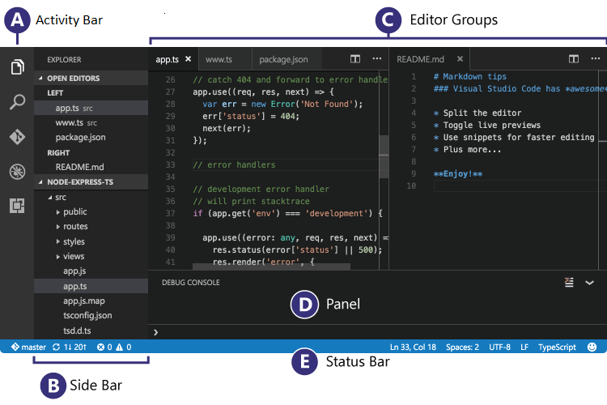
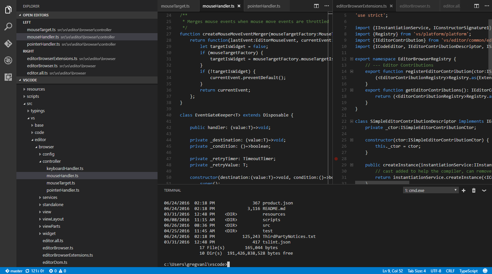
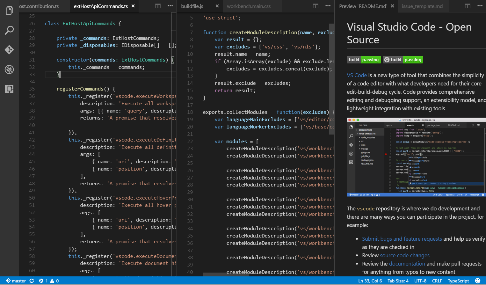
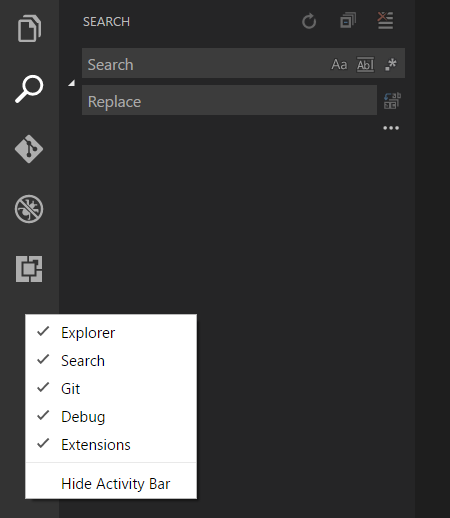
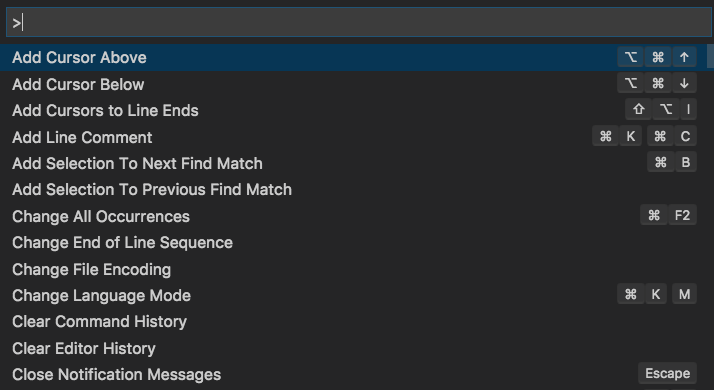
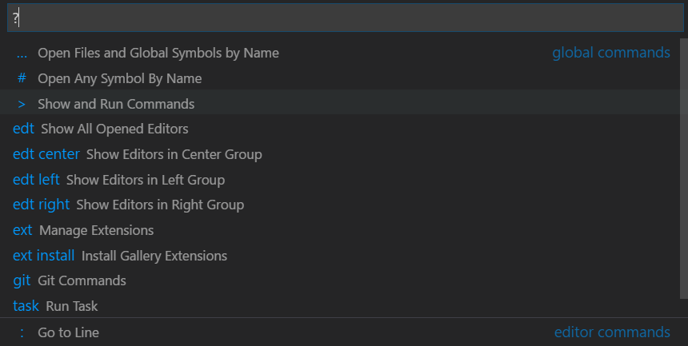

Visual Studio Codeはコードエディターです。他の多くのコードエディターと同様に、一般的なユーザーインターフェイスをもっており、左側にすべてのファイルとフォルダーを表示して、右側のエディターでそのコンテンツを開きます。



## ファイル、フォルダー、プロジェクト

VS Codeの基本はファイルとフォルダーです。ファイルやフォルダーを開いてすぐに使い始めることができます。

また、VS Codeは様々なフレームワークとプラットホームで定義されたプロジェクトの定義ファイルを読み込んで利用できます。例えば開いたコンテンツに`package.json`、`project.json`、`tsconfig.json`、.NET Core、Visual Studio solutionといったプロジェクトファイルがあれば、VS Codeはそれを読み込み、エディターで豊富なIntelliSenseなどの追加機能を提供するために使用します。

## 基本レイアウト

VS Codeにはフォルダーやプロジェクトの全文を閲覧してアクセスするために最大限活用可能なシンプルで直観的なレイアウトを用意しています。UIは次5つのエリアに分かれています:

* **Editor** ファイルを編集するメインエリアです。エディターを3つまで並べて開くことができます。
* **Side Bar** プロジェクトで作業中に役立つエクスプローラーなど様々なビューを含みます。
* **Status Bar** 開いているプロジェクトと編集したファイルに関する情報を表示します。
* **Activity Bar** 一番左に位置してビューを切り替えることができます。Gitが有効になっているときには変更の数をしめすようなコンテンツ特有のインジゲーターを表示します。
* **Panels** 出力またはデバッグ情報、エラーと警告の表示、統合端末など異なるパネルをエディター下部に表示します。

VS Codeはフォルダ、レイアウト、開いたファイルを保存するので、最後に閉じた時と同じ状態で開きます。



各エディター内で開いているファイルは、エディター領域内上部にタブ付きヘッダ(タブ)で表示します。タブ付きヘッダーの詳細については、下記の[Tabs](/docs/getstarted/userinterface.md#tabs)を参照してください。

>**Tip:** 右側にサイドバーを移動することが可能です。(**表示**>**サイド バーを右へ移動**)もしくは(`kb(workbench.action.toggleSidebarVisibility)`)

## 並べて編集

最大3つのエディターを並べて開くことができます。既存にエディターを開いているとき、既存のエディターの横に並べて開く方法を次のように用意しています:

* エクスプローラーのファイルで`kbstyle(Ctrl)` (Mac: `kbstyle(Cmd)`)クリックします。
* `kb(workbench.action.splitEditor)`を押してエディターを2つに分割します。
* エクスプローラーのコンテキストから**横に並べて開く**を実行します。
* エディター上部の**エディターの分割**ボタンをクリックします。
* D&Dでエディター領域をいずれかの場所に移動します。
* **Quick Open** (`kb(workbench.action.quickOpen)`)のファイルリストで`kbstyle(Ctrl+Enter)`(Mac: `kbstyle(Cmd+Enter)`)を押します。



別のファイルを開くとき、アクティブ状態のエディターにそのファイル内容を表示します。ですから2つのエディターを並べて表示しているときに、右側に`foo.cs`を表示したいなら、右側がアクティブ状態であることを確認してください。

複数のエディターを開いているときは、`kbstyle(Ctrl)` (Mac: `kbstyle('Cmd')`) を押しながら`kbstyle(1)`、`kbstyle(2)`、`kbstyle(3)`でその間を素早く切り替えることが可能です。

>**Tip:** エディターのサイズを変更したり並び替えるたりする事が可能です。エディタのタイトル領域をD&Dしてエディタの位置を変更するか、サイズを変更します。

## エクスプローラー

エクスプローラーはプロジェクト内のファイルおよびフォルダーを閲覧、展開および管理するために使用します。

VS Codeでフォルダーを開くとエクスプローラーにフォルダーの内容を表示します。次を実行可能です:

* ファイルおよびフォルダーの作成、削除、名前の変更
* ファイルおよびフォルダーのD&Dによる移動
* コンテキスト メニューを使用したオプションの表示

>**Tip:** VS Codeの外部からファイルをエクスプローラーにD&Dを使用してコピーすることもできます。


VS Codeはその他ツール、特にコマンドラインツールでも問題なく機能します。現在のVS Codeで開いているフォルダのコンテキストでコマンドラインを実行する場合には、フォルダーを右クリックして**Open in Command Prompt**(or **Open in Terminal** on Mac or Linux)を選択します。

また、エクスプローラーでファイルまたはフォルダーの場所を移動するには、ファイルまたはフォルダーを右クリックして**Reveal in Explorer**(or **Reveal in Finder** on the Mac or **Open Containing Folder** on Linux)を選択します。

>**Tip:** ファイルを名前で素早く検索して開くには`kb(workbench.action.quickOpen)` (**Quick Open**)を入力します。

既定でVS Codeはエクスプローラーからいくつかのフォルダーを除外します(例: `.git`)。エクスプローラーからファイルやフォルダーを非表示にするルールを設定するには`files.exclude`[設定](/docs/getstarted/settings.md)を使用してください。

**Tip:** これはUnityの`\*.meta`やTypeScriptの`\*.js`のようなリソースファイルを非表示するのに非常に便利です。Unityで`\*.cs.meta`ファイルを除外する場合のパターンは`"**/*.cs.meta": true`のようになります。TypeScriptで生成されたJavaScriptをTypeScritファイル用に除外することができます `"**/*.js": {"when": "$(basename).ts"}`。

## 開いているエディター

エクスプローラー上部には**開いているエディター**のセクションがあります。これはアクティブなファイルやプレビューのリストであり、以前にVS Codeで開いていたファイルでもあります。ファイルを**開いているエディター**セクションに表示するのは次の場合です:

* ファイルに変更を加えたとき
* ファイルのヘッダーをダブルクリックしたとき
* エクスプローラーでファイルをダブルクリックしたとき
* 現在のフォルダーの一部でないファイルを開いたとき

**開いているエディター**セクションで項目をクリックすると、それがVS Code内でアクティブなエディターになります。

作業を完了したら**開いているエディター**セクションからファイルを個別に削除するか、**View: Close All Editors**や**View: Close All Editors in Group**を使用してすべてのファイルをこのセクションから削除することができます。

## ビューとアクティビティバー

ファイルエクスプローラーはVS Codeで使用できるビューの1つに過ぎず、次のようなビューがまだあります:

* **Search** - 開いているフォルダー全体の検索、置換を提供します。
* **Source Control** - VS Codeは規定でGitソース管理を含みます。
* **Debug** - VS Codeのデバッグビューは変数、コールスタック、ブレークポイントを提供します。
* **Extensions** - VS Codeの拡張機能をインストールして管理します。

左側の**アクティビティバー**によってビューを素早く切り替えることが可能です。この**アクティビティバー**上でD&Dによるビューを並び替えや、ビューを削除(右クリック)することも可能です。



## コマンドパレット

VS Codeにはキーボードからも同じように操作可能です。キーの組み合わせは**コマンド パレット**`kb(workbench.action.showCommands)`で確認できます。ここから、一般的な操作のキーボードショートカットを含むVS Codeのすべての機能にアクセスできます。



**コマンド パレット**は多くのコマンドを提供します。同じインタラクティブ(?)ウィンドウを使用して、エディタコマンドの実行、ファイルを開く、シンボルの検索、ファイルの確認などを実行できます。いくつかの例を示します:

* `kb(workbench.action.quickOpen)` 名前を入力して、任意のファイルまたはシンボルに移動します
* `kb(workbench.action.openPreviousRecentlyUsedEditorInGroup)` ループ内の最近使用したエディターのうち前のエディターを開きます
* `kb(workbench.action.showCommands)` エディターコマンドを表示します
* `kb(workbench.action.gotoSymbol)` ファイル内シンボルへ移動します
* `kb(workbench.action.gotoLine)` 指定行へ移動します

入力フィールドに`?`を入力して、利用可能なコマンドリストをここから入手します:



## エディター設定

VS Codeはエディターを設定する多くのプションを提供しています。**表示**で **サイド バー**、**ステータス バーr**、 **アクティビティ バー**と言ったユーザーインターフェイスの様々な部分を非表示にしたり切り替えることができます。

### メニューバーの非表示(Windows Linux)

WindowsとLInuxでは**表示** > **メニュー バーの切り替え**を使用してメニューバーを非表示にできますこの場合でも`kbstyle(Alt)`を使用してメニューバーに再度アクセス可能です。


### 設定

ほとんどのエディター設定は直接変更できる状態で保存しています。ユーザー設定を使用してグローバルに開いたものすべてに適用したり、ワークスペース設定でプロジェクト/フォルダーごとに設定したりできます。なお設定値は`settings.json`[file](/docs/getstarted/settings.md#settings-file-locations)で保持します。

* ユーザー`setting.json`ファイルを編集するには**ファイル** > **基本設定** > **設定**に移動します(もしくは`kb(workbench.action.showCommands)`で`user`と`Enter`を入力します)。

* ワークスペース設定を編集するには **ファイル** > **基本設定** > **設定**に移動して**WORKSPACE SETTINGS** のタブを選択します(もしくは`kb(workbench.action.showCommands)`で`worksp`と`Enter`を入力します)。

>**Note for Mac users:** **基本設定**メニューは**ファイル**の下ではなく**Code**の下にあります。例: **Code** > **基本設定** > **設定**


左側のウィンドウにはVS Codeの[既定設定](/docs/getstarted/settings.md#default-settings)を表示して、右側には編集可能な`setting.json`を表示します上部の検索窓を使用して`Default Settings`を検索できます。右側の`setting.json`に設定をコピーするには、設定の左側にある編集アイコンをクリックします。設定値を固定して設定すると、編集アイコンメニューの一部として値を選択します。

設定編集後に変更を保存するには`kb(workbench.action.files.save)を入力します。これによりすぐに有効になります。

>**Note:** ワークスペースの設定はチーム全体でプロジェクト設定を共有するのに便利です。

## Zen Mode

Zen Modeでは、エディター(アクティビティ バー、ステータスバー、サイドバー、パネル)を除くすべてのUIを非表示にして、フルスクリーン表示にすることでコードに集中します。Zen Modeには**表示**、**コマンド パレット**または`kb(workbench.action.toggleZenMode)`を使用して切り替えることができます。`kbstyle(Esc)`を2回押すとZen Modeは終了します。全画面モードに切り替えるかどうかを`zenMode.fullScreen`で無効化できます。次の設定でZenModeを調整できます:`zenMode.hideStatusBar`、`zenMode.hideTabs`、`zenMode.fullScreen`、`zenMode.restore`

## タブ

Visual Studio Codeはエディター上のタイトル領域に、タブ(タブ付き見出し)で開いている項目を表示します。

ファイルを開けばファイルの新しいタブを追加します。


タブを使用するとアイテム間を素早く移動できますし、ドラッグアンドドロップで並び替えることもできます。

タイトルエリアに収まりきらない項目ある場合は **Show Opened Editors** コマンド(か`...`ボタン)を利用して、タブのドロップダウンを表示できます。

またタブ機能を使いたくない場合は `workbench.editor.showTabs` [設定](/docs/getstarted/settings.md)を`false`にして無効化することができます:

```json
    "workbench.editor.showTabs": false
```

タブなしで作業したい場合のVS Code最適化方法を[タブなしで作業](/docs/getstarted/userinterface.md#working-without-tabs)で参照してください。

## タブ順序

既定では新しいタブを既存のタブの右側に追加しますが`workbench.editor.openPositioning`設定で新しいタブを表示する場所を制御できます。

タブを左側に表示するようにするには次を設定します:

```json
    "workbench.editor.openPositioning": "left"
```

## プレビューモード

新しいタブで開かず既存のタブを利用するプレビューモードは、エクスプローラーでファイルをシングルクリックまたは選択することでできます。これは複数のファイルを見たいとき、開いたファイルごとのタブを作りたくない場合に便利です。編集を始めるときは、ファイルをダブルクリックして新しいタブでそのファイルを開きます。

プレビューモードはタブの見出しをイタリック体で表示します:


プレビューモードを使用せず、常に新しいタブを作成したい場合は次の設定で制御できます:

* `workbench.editor.enablePreview` : 開いているエディタをプレビューとして表示するかどうかを制御
* `workbench.editor.enablePreviewFromQuickOpen` : Quick Openで開いたエディタをプレビューとして表示するかどうかを制御

## エディタグループ

エディターを分割(**Split Editor**, **Open to the Side**)することで、エディタグループを配置する新しいレイアウトを作成できます。VS Codeは**左**、**中央**、**右**の3つのエディタグループまで作成できます。

エクスプローラー上部の**開いているエディタ**で現在の配置を見ることができます:


これを利用することでワークベンチ上のエディタグループを、ドラッグアンドドロップしたり、グループ間移動でのタブ移動そしてグループをすばやく閉じることができます。(**すべてのエディターを閉じる**)

>**Note:** VS Codeはタブの有効に関係なしにエディタグループを使用します。タブがない場合は、エディタグループは開いている項目のスタックにすぎず、エディタペインで最後に選択した項目を表示します。
(編集メモ: 訳し方がわからなかった

### 水平レイアウト

既定の設定でエディタグループは縦3列にレイアウトします。ですが必要に応じて **上**、**中央**、**下**のように横3行レイアウトに変更することが可能です。

次の方法で垂直と水平レイアウトを切り替えます:

* **表示** > **エディタ グループ レイアウトの切り替え*
* **View: Toggle Editor Group Vertical/ Layout**コマンド (コマンドパレット内)
* **開いているエディタ** のレイアウト切り替えボタン
* `kb(workbench.action.toggleEditorGroupLayout)` キーボードショートカット

### キーボードショートカット

エディタとエディタグループを素早く移動するための便利なキーボードショートカットを次に示します。

> 既定のキーボードショートカットを変更する場合は [Key Bindings](/docs/getstarted/keybindings.md)を参照してください。

* `kb(workbench.action.nextEditor)` 次のエディターで開く
* `kb(workbench.action.previousEditor)` 以前のエディターを開く
* `kb(workbench.action.openNextRecentlyUsedEditorInGroup)` グループ内の最近使用したエディターのうち次のエディターを開く
* `kb(workbench.action.openPreviousRecentlyUsedEditorInGroup)` グループ内の最近使用したエディターのうち前のエディターを開く
* `kb(workbench.action.focusFirstEditorGroup)` 最初のエディタ グループにフォーカス
* `kb(workbench.action.focusSecondEditorGroup)` 2番目のエディタ グループにフォーカス
* `kb(workbench.action.focusThirdEditorGroup)` 3番目のエディタ グループにフォーカス
* `kb(workbench.action.focusPreviousGroup)` 前のグループにフォーカス
* `kb(workbench.action.focusNextGroup)` 次のグループにフォーカス
* `kb(workbench.action.closeActiveEditor)` エディターを閉じる
* `kb(workbench.action.closeEditorsInGroup)` グループ内のすべてのエディターを閉じる
* `kb(workbench.action.closeAllEditors)` すべてのエディターを閉じる

## タブなしで作業

タブ(タブ付き見出し)を使用したくない場合は、この機能を`workbench.editor.showTabs`を`false`にして無効にすることができます。

### プレビューモードの無効化

ファイルエクスプローラーの**開いているエディタ**はファイル移動をタブなしで素早く行う方法です。[プレビューモード](/docs/getstarted/userinterface.md#preview-mode)ではシングルクリックをしたとき**開いているエディタ**やエディタグループにファイル追加しません。この機能を`workbench.editor.enablePreview`と`workbench.editor.enablePreviewFromQuickOpen`設定で無効化できます。

## Ctrl+Tabでエディタグループの一覧を表示するのではなく、最近開いた項目一覧にする

`kbstyle(Ctrl+Tab)`のキーバインドを変更して、開いているエディタグループ一覧を、(現在のエディタグループとは関係ない)最近開いた項目を表示することができます。

[キーバインド](/docs/getstarted/keybindings.md) で次を追記します:

```json
{ "key": "ctrl+tab", "command": "workbench.action.openPreviousEditorFromHistory" },
{ "key": "ctrl+tab", "command": "workbench.action.quickOpenNavigateNext", "when": "inQuickOpen" },
```

### 1つのエディターを閉じるのではなく、全体を閉じるようにする

既定の設定でkb(workbench.action.closeEditorsInGroup)は1つのエディターを閉じるように割り当てられています。これをぜんぶのエディターを閉じるようにしたくなったら[キーバインド](/docs/getstarted/keybindings.md)に次を設定することができます。

Mac:

```json
{ "key": "cmd+w", "command": "workbench.action.closeEditorsInGroup" }
```

Windows/Linux:

```json
{ "key": "ctrl+w", "command": "workbench.action.closeEditorsInGroup" }
```

## ウィンドウ管理

VS Codeにはセッション間でウィンドウ(インスタンス)を開くか復元するかを制御するオプションがあります。

`window.openFoldersInNewWindow`と`window.openFilesInNewWindow`は
ファイル、フォルダーを新しいウィンドウで開くか、最後のアクティブ ウィンドウで開くかを制御します。可能な値は`default` ` on` `off`です。

- default: アプリケーション内で([ファイル] メニューなどから)選択したものでなければ、新しいウィンドウでフォルダーを開く
- on: 新しいウィンドウでフォルダーを開く
- off: 最後のアクティブ ウィンドウでフォルダーを開く

Note: この設定は無視される場合もあります (-new-windowまたは -reuse-windowコマンド ライン オプションを使用する場合など)。

`window.reopenFolders`設定は、VS Codeが再起動後にフォルダーを再度開く方法を制御します。
規定でVS Codeは、最後に作業したフォルダーを再度開きます(setting: `one`)。フォルダーを再度開くことなく、常に空の状態でVS Codeインスタンスを起動するには`none`に設定を変更します。`all`を選択すると前回のセッションのフォルダーすべてを再度開きます。

## 次のステップ

VS Codeの全体的なレイアウトを確認できました。次のトピックを見てエディタでカスタマイズする方法を確認します:

* [Changing the Theme](/docs/getstarted/themes.md) - Set a Color and/or File Icon theme to your preference.
