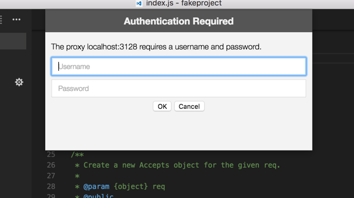

Visual Studio Code は [Electron](https://electron.atom.io/) 上で構築され [Chromium](https://www.chromium.org/) のプロトコル スタック(ネットワーキングスタック)機能を利用します。つまり VS Code ユーザーが [Google Chrome](https://www.google.com/chrome/index.html) で利用できるネットワーク サポートを同じように利用できるこということです。

## ホスト名  <a id="common-hostnames"></a>

VS Code では自動更新、拡張機能のクエリとインストール、テメトリなどの機能にネットワーク接続が必要です。これらの機能をプロキシ環境で正しく機能させるには、プロダクトが正しく構成される必要があります。

ホワイトリストに VS Code のドメインを追加する必要があるような Firewall を使用している場合に、追加する必要があるホスト名を次に示します:

* vscode-update.azurewebsites.net
* vscode.blob.core.windows.net
* marketplace.visualstudio.com
* rink.hockeyapp.net

## プロキシサーバーのサポート <a id="proxy-server-support"></a>

VS Code は Google Chromiumと同じプロキシ サーバーサポートを備えています。次は [Chromium's documentation](https://www.chromium.org/developers/design-documents/network-settings) の抜粋です:

```
"The Chromium network stack uses the system network settings so that users and administrators can control the network settings of all applications easily. The network settings include:

 - proxy settings
 - SSL/TLS settings
 - certificate revocation check settings
 - certificate and private key stores"
```

これは自動的にプロキシ設定が取得される必要があります。

これができないときは、次のコマンドライン引数を使用してプロキシ設定を制御します:

```bash
# Disable proxy
--no-proxy-server

# Manual proxy address
--proxy-server=<scheme>=<uri>[:<port>][;...] | <uri>[:<port>] | "direct://"

# Manual PAC address
--proxy-pac-url=<pac-file-url>

# Disable proxy per host
--proxy-bypass-list=(<trailing_domain>|<ip-address>)[:<port>][;...]
```

これらのコマンド ライン引数の詳細については [ここ](https://www.chromium.org/developers/design-documents/network-settings) を参照してください。

### 認証プロキシ <a id="authenticated-aproxies"></a>

認証プロキシは [PR #22369](https://github.com/Microsoft/vscode/pull/22369) の追加によって VS Code 内でシームレスに機能するようになりました。

サポートされる認証メソッドは次の通りです:

* Basic
* Digest
* NTLM
* Negotiate

認証プロキシ(HTTP) 環境で VS Code を使用すると次の認証ポップアップが表示されます:



SOCKS5 プロキシ認証の対応はまだ実装されていないことに注意してください。詳細 : [issue in Chromium's issue tracker](https://bugs.chromium.org/p/chromium/issues/detail?id=256785)

HTTP プロキシの認証の詳細については [ここ](https://www.chromium.org/developers/design-documents/http-authentication) を参照してください。

### SSL 証明書 <a id="ssl-certificates"></a>

HTTPS プロキシは着信要求の SSL 証明書を書き換えます。Chromium は信頼できない証明書で署名されたレスポンスを拒否するように設計されています。SSL のセキュリティー関係に問題が発生した場合は次の対処法があります:

* Chromium は OS の証明書信頼を利用するだけなので、OS の信頼チェーンにプロキシの証明書を追加することが推奨されます。Chromium の Root Certificate Policy については [こちら](https://www.chromium.org/Home/chromium-security/root-ca-policy) を参照してください。
* `localhost` でプロキシを動かしているときは、[`--allow-insecure-localhost`](https://peter.sh/experiments/chromium-command-line-switches/#allow-insecure-localhost) コマンドライン フラグを試してください。
* どれも失敗した場合は [`--ignore-certificate-errors`](https://peter.sh/experiments/chromium-command-line-switches/#ignore-certificate-errors) コマンドライン フラグを使用してすべての証明書エラーを無視するようにできます。**Warning:** セキュリティー問題が発生するので、**危険**で**推奨されません**。

## レガシー プロキシ サーバー のサポート <a id="legacy-proxy-server-support"></a>

まだ VS Code がサポートするプロキシ サポートでは拡張機能にまで効果がありません。[GitHub](https://github.com/Microsoft/vscode/issues/12588) の issue に関連します。

拡張機能と同様に、VS Code の機能のいくつかはプロキシ ネットワーキング、つまり CLI インターフェイスを完全にサポートしていません。CLI インターフェイスはコマンド プロントまたはターミナルから `code --install-extension vscodevim.vim` を実行するるときに得られるものです。この問題の開発状態は  [GitHub](https://github.com/Microsoft/vscode/issues/29910) で確認できます。

これらの制約のため VS Code 設定の一部 `http.proxy`, `http.proxyStrictSSL`, `http.proxyAuthorization` 変数はこの 2 つの場合にまだ利用されます。

## トラブルシューティング <a id="troubleshooting"></a>

ネットワーク接続のトラブルシューティングに役立つリンク:

* [Network Settings](https://www.chromium.org/developers/design-documents/network-settings)
* [Debugging problems with the network proxy](https://www.chromium.org/developers/design-documents/network-stack/debugging-net-proxy)
* [Configuring a SOCKS proxy server in Chrome](https://www.chromium.org/developers/design-documents/network-stack/socks-proxy)
* [Proxy settings and fallback (Windows)](https://www.chromium.org/developers/design-documents/network-stack/proxy-settings-fallback)
