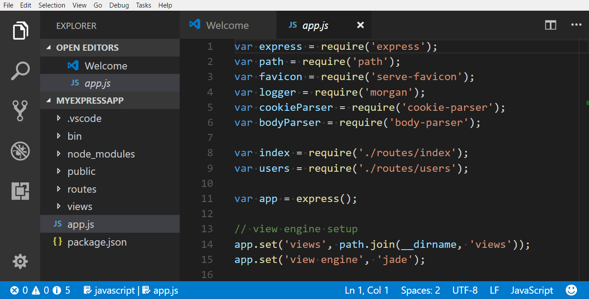
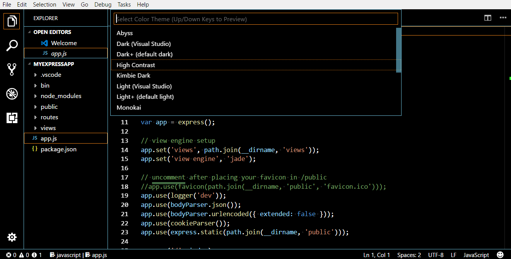
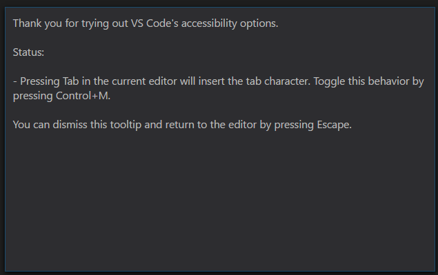

Visual Studio Codeにはすべてのユーザーが使い勝手のよいエディターにする機能が多く備わっています。ズームとハイコントラストはエディターの可読性を向上させ、キーボードナビゲーションによりマウスなしで操作でき、エディタはスクリーンリーダー用へ最適化しています。

## ズーム

VS Codeはエディタのズームレベルを変更可能です。**表示** > **拡大** か `kb(workbench.action.zoomIn)`) でズームレベルを上昇します。ズームレベルを低下する場合は**表示** > **縮小**か`kb(workbench.action.zoomOut)`)を試してください。

なおこれらの操作の場合には、レベルが20%ずつ変化します。

## ズームレベルの固定

ズームレベルを調整した場合は`window.zoomLevel`[設定](/docs/getstarted/settings.md)で値を保持できます。このときのデフォルト値は0です。

## ハイコントラストテーマ

ハイコントラストをすべてのプラットホーム上でサポートしています。配色テーマを変更するには**ファイル** > **基本設定** > **配色テーマ**で**配色テーマの選択**を表示した後**High Contrast**を選択します。

## キーボードナビゲーション

VS Codeはマウスを使わずに操作できるように**コマンドパレット** (`kb(workbench.action.showCommands)`)でコマンドの完全なリストを提供しています。コマンドパレットでは、入力した文字に基づいて並び替えを行います。

またコマンド用のプリセットキーボードショートカットを沢山用意しています。これらは**コマンドパレット**の右側に表示します。

独自のキーボードショートカットも設定可能です。キーボードショートカット(**ファイル** > **基本設定** > **キーボードショートカット**)は、左側に**既定のショートカット** 右側にカスタマイズ可能な`keybindings.json`を表示します。詳細については[Key Bindings](/docs/getstarted/keybindings.md) を確認してください。

## タブナビゲーション

`kbstyle(Tab)`を使ってUIを移動することができます。`kbstyle(Shift+Tab)`で逆順に移動することも可能です。この移動の場合は要素がフォーカスしたとき、UIの周りにインジケーターを表示します。

タブナビゲーションをサポートする場所は次のとおりです:

* アクティビティーバー(Files、Search、Git、Debug)
* 折りたたみ可能なセクションのヘッダー
* ビューとセクション
* エクスプローラーのツリーアイテム

## タブトラッピング

既定の設定ではソースコードファイル内で`kbstyle(Tab)`を押すとタブ文字(インデント設定に応じてスペース)を挿入して、開いているファイルから離れることはありません。`kb(editor.action.toggleTabFocusMode)`で`kbstyle(Tab)`のトラッピング機能を切り替えたら`kbstyle(Tab)`でファイルからフォーカスを外すことができます。もし`kbstyle(Tab)`トラッピングがオフなら、ステータスバーにインジケーターを表示します。

**コマンドパレット**(`kb(workbench.action.showCommands)`)から**Toggle Use of Tab Key for Setting Focus**(和訳不明)を実行することでも`kbstyle(Tab)`トラッピングを切り替えることが可能です。

読み取り専用ファイルでは`kbstyle(Tab)`キーを捉えることはありません。**統合ターミナル**は`kbstyle(Tab)`トラップモードを使えるよう`kb(editor.action.toggleTabFocusMode)`で切り替えることができます。

## スクリーンリーダー

VS Codeはテキストをページング方式にもとづく方法を使用してスクリーンリーダーをサポートしています。私たちは[NVDA screen reader](https://www.nvaccess.org)を使ってテストしていますが、すべてのスクリーンリーダーで機能すると考えています。

**次/前のエラーまたは警告へ移動**(`kb(editor.action.marker.next)` /`kb(editor.action.marker.prev)`)をしたときスクリーンリーダーはエラーと警告のメッセージを読み上げます。

また、提案がポップアップしたときも読み上げます。このとき提案を`kbstyle(Alt+Up)`か`kbstyle(Alt+Down)`で移動するか `kbstyle(Shift+Escape)`を使用して提案を却下できます。もし、この自動のポップアップ表示無効化したいときは`editor.quickSuggestions`で設定してください。

## アクセシビリティのヘルプ

`kb(editor.action.showAccessibilityHelp)`を押すと**アクセシビリティのヘルプ**ダイアログを表示して、さまざまな状態を確認できます。

## デバッガーのアクセシビリティ

デバッガーのアクセシビリティには次の機能があります:

* デバッグステータス(たとえば:開始、ブレークポイント、終了など)の変更表示。
* すべてのデバッグアクションへキーボードからの操作。
* デバッグ表示とデバッグコンソールの両方でタブナビゲーションをサポート。
* デバッグホバーにキーボードから操作(`kb(editor.action.showHover)`)。

## 既知の問題

VS Codeにはプラットホームに応じていくつかの既知の問題があります。

### Windows

矢印キーを利用してメニューバーのアイテム間を移動することができません。これはElectronの問題[#2504](https://github.com/atom/electron/issues/2504)によるものです。

### Mac

VoiceOverを使用したエディタのスクリーンリーダーは限られます。

### Linux

スクリーンリーダーのサポートはありません。

## 次のステップ

次を見てください:

* [Visual Studio Code User Interface](/docs/getstarted/userinterface.md) - A quick orientation to VS Code.
* [Basic Editing](/docs/userguide/codebasics.md) - Learn about the powerful VS Code editor.
* [Code Navigation](/docs/userguide/editingevolved.md) - Move quickly through your source code.

## よくある質問
