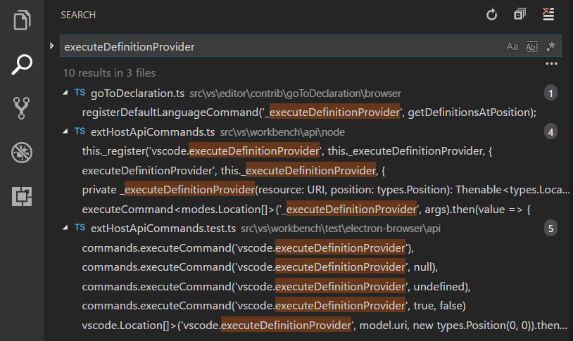
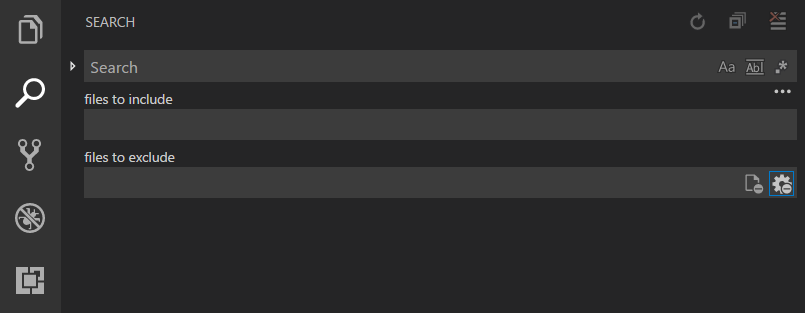

# Basic Editing

Visual Studio Code is an editor first and foremost and includes the features you need for highly productive source code editing. This topic takes you through the basics of the editor and helps you get moving with your code.

## Keyboard shortcuts

Being able to keep your hands on the keyboard when writing code is crucial for high productivity. VS Code has a rich set of default keyboard shortcuts as well as allowing you to customize them.

* [Keyboard Shortcuts Reference](/docs/getstarted/keybindings.md#keyboard-shortcuts-reference) - Learn the most commonly used and popular keyboard shortcuts by downloading the reference sheet.
* [Install a Keymap extension](/docs/getstarted/keybindings.md#keymap-extensions) - Use the keyboard shortcuts of your old editor (such as Sublime Text, Atom, and Vim) in VS Code by installing a Keymap extension.
* [Customize Keyboard Shortcuts](/docs/getstarted/keybindings.md#customizing-shortcuts) - Change the default keyboard shortcuts to fit your style.

## Multiple selections (multi-cursor)

VS Code supports multiple cursors for fast simultaneous edits. You can add secondary cursors (rendered thinner) with `kbstyle(Alt+Click)`. Each cursor operates independently based on the context it sits in. A common way to add more cursors is with `kb(editor.action.insertCursorBelow)` or `kb(editor.action.insertCursorAbove)` that insert cursors below or above.

> **Note:** Your graphics card driver (for example NVIDIA) might overwrite these default shortcuts.


`kb(editor.action.addSelectionToNextFindMatch)` selects the word at the cursor, or the next occurrence of the current selection.


> **Tip:** You can also add more cursors with `kb(editor.action.selectHighlights)`, which will add a selection at each occurrence of the current selected text.

### Shrink/expand selection

Quickly shrink or expand the current selection. Trigger it with `kb(editor.action.smartSelect.shrink)` and `kb(editor.action.smartSelect.grow)`

Here's an example of expanding the selection with `kb(editor.action.smartSelect.grow)`:


## Column (box) selection

Hold `kbstyle(Shift)` and `kbstyle(Alt)` while dragging to do column selection:


There are also default key bindings for column selection on Mac and Windows, but not on Linux.

Key|Command|Command id
---|-------|----------
`kb(cursorColumnSelectDown)`|Column Select Down|`cursorColumnSelectDown`
`kb(cursorColumnSelectUp)`|Column Select Up|`cursorColumnSelectUp`
`kb(cursorColumnSelectLeft)`|Column Select Left|`cursorColumnSelectLeft`
`kb(cursorColumnSelectRight)`|Column Select Right|`cursorColumnSelectRight`
`kb(cursorColumnSelectPageDown)`|Column Select Page Down|`cursorColumnSelectPageDown`
`kb(cursorColumnSelectPageUp)`|Column Select Page Up|`cursorColumnSelectPageUp`

You can [edit](/docs/getstarted/keybindings.md) your `keybindings.json` to bind them to something more familiar if you wish.

## Save / Auto Save

By default, VS Code requires an explicit action to save your changes to disk, `kb(workbench.action.files.save)`.

However, it's easy to turn on `Auto Save`, which will save your changes after a configured delay or when focus leaves the editor. With this option turned on, there is no need to explicitly save the file. The easiest way to turn on `Auto Save` is with the **File** > **Auto Save** toggle which turns on and off save after a delay.

For more control over `Auto Save`, open **User Settings** or **Workspace Settings** and find the associated settings:

* `files.autoSave`: Can have the values:
  * `off` - to disable auto save.
  * `afterDelay` - to save files after a configured delay.
  * `onFocusChange` - to save files when focus moves out of the editor of the dirty file.
  * `onWindowChange` - to save files when the focus moves out of the VS Code window.
* `files.autoSaveDelay`: Configures the delay in milliseconds when `files.autoSave` is configured to `afterDelay`.

## Hot Exit

VS Code will remember unsaved changes to files when you exit by default. Hot exit is triggered when the application is closed via **File** > **Exit** (**Code** > **Quit** on macOS) or when the last window is closed.

Hot exit can be disabled by changing the setting `files.hotExit` to `false`.

## Search Across Files

VS Code allows you to quickly search over all files in the currently-opened folder.  Press `kb(workbench.view.search)` and enter in your search term. Search results are grouped into files containing the search term, with an indication of the hits in each file and its location. Expand a file to see a preview of all of the hits within that file. Then single-click on one of the hits to view it in the editor.



>**Tip:** We support regular expression searching in the search box, too.

You can configure advanced search options by typing `kb(workbench.action.search.toggleQueryDetails)`. This will show additional fields to configure the search.



In the two input boxes below the search box, you can include and exclude files. Click on the toggle to the right to enable the glob pattern syntax:

* `*` to match one or more characters in a path segment
* `?` to match on one character in a path segment
* `**` to match any number of path segments, including none
* `{}` to group conditions (e.g. `{**/*.html,**/*.txt}` matches all HTML and text files)
* `[]` to declare a range of characters to match (e.g., `example.[0-9]` to match on `example.0`, `example.1`, …)

VS Code excludes some folders by default to reduce the number of search results that you are not interested in (for example: `node_modules`). Open [settings](/docs/getstarted/settings.md) to change these rules under the `files.exclude` and `search.exclude` section.

>**Tip:** From the Explorer you can right-click on a folder and select **Find in Folder** to search inside a folder only.

You can also Search and Replace across files. Expand the Search widget to display the Replace text box.


When you type text into the Replace text box, you will see a diff display of the pending changes. You can replace across all files from the Replace text box, replace all in one file or replace a single change.


>**Tip:** You can quickly reuse a previous search term by using `kb(search.history.showNext)` and `kb(search.history.showPrevious)` to navigate through your search term history.

## IntelliSense

We'll always offer word completion, but for the rich [languages](/docs/languages/overview.md), such as JavaScript, JSON, HTML, CSS, Less, Sass, C# and TypeScript, we offer a true IntelliSense experience. If a language service knows possible completions, the IntelliSense suggestions will pop up as you type. You can always manually trigger it with `kb(editor.action.triggerSuggest)`.  By default, `kbstyle(Tab)` or `kbstyle(Enter)` are the accept keyboard triggers but you can also [customize these key bindings](/docs/getstarted/keybindings.md).

> **Tip:** The suggestions filtering supports CamelCase so you can type the letters which are upper cased in a method name to limit the suggestions. For example, "cra" will quickly bring up "createApplication".

> **Tip:** IntelliSense suggestions can be configured via the `editor.quickSuggestions` and `editor.suggestOnTriggerCharacters` [settings](/docs/getstarted/settings.md).

JavaScript and TypeScript developers can take advantage of the [npmjs](https://www.npmjs.com) type declaration (typings) file repository to get IntelliSense for common JavaScript libraries (Node.js, React, Angular). You can find a good explanation on using type declaration files in the [JavaScript language](/docs/languages/javascript.md#intellisense) topic and the [Node.js](/docs/nodejs/nodejs-tutorial.md) tutorial.

Learn more in the [IntelliSense document](/docs/userguide/intellisense.md).

## Formatting

VS Code has great support for source code formatting. The editor has two explicit format actions:

* **Format Document** (`kb(editor.action.formatDocument)`) - Format the entire active file.
* **Format Selection** (`kb(editor.action.formatSelection)`) - Format the selected text.

You can invoke these from the **Command Palette** (`kb(workbench.action.showCommands)`) or the editor context menu.

VS Code has default formatters for JavaScript, TypeScript, JSON, and HTML. Each language has specific formatting options (for example, `html.format.indentInnerHtml`) which you can tune to your preference in your user or workspace [settings](/docs/getstarted/settings.md). You can also disable the default language formatter if you have another extension installed that provides formatting for the same language.

```json
"html.format.enable": false
```

Along with manually invoking code formatting, you can also trigger formatting based on user gestures such as typing, saving or pasting. These are off by default but you can enable these behaviors through the following [settings](/docs/getstarted/settings.md):

* `editor.formatOnType` - Format the line after typing.
* `editor.formatOnSave` - Format a file on save.
* `editor.formatOnPaste` - Format the pasted content.

>Note: Not all formatters support format on paste as to do so they must support formatting a selection or range of text.

In addition to the default formatters, you can find extensions on the Marketplace to support other languages or formatting tools. There is a `Formatters` category so you can easily search and find [formatting extensions](https://marketplace.visualstudio.com/search?target=VSCode&category=Formatters&sortBy=Downloads). In the **Extensions** view search box, type 'formatters' or 'category:formatters' to see a filtered list of extensions within VS Code.

## Folding

You can fold regions of source code using the folding icons on the gutter between line numbers and line start. Move the mouse over the gutter to fold and unfold regions. The folding regions are evaluated based on the indentation of lines. A folding region starts when a line has a smaller indent than one or more following lines, and ends when there is a line with the same or smaller indent.

You can also use the following actions:

 * Fold (`kb(editor.fold)`) folds the innermost uncollapsed region at the cursor
 * Unfold (`kb(editor.unfold)`) unfolds the collapsed region at the cursor
 * Fold All (`kb(editor.foldAll)`) folds all region in the editor
 * Unfold All (`kb(editor.unfoldAll)`) unfolds all regions in the editor
 * Fold Level X (`kb(editor.foldLevel2)` for level 2) folds all regions of level X, except the region at the current cursor position


## File Encoding Support

Set the file encoding globally or per workspace by using the `files.encoding` setting in **User Settings** or **Workspace Settings**.


You can view the file encoding in the status bar.


Click on the encoding button in the status bar to reopen or save the active file with a different encoding.


Then choose an encoding.


## Next Steps

You've covered the basic user interface - there is a lot more to VS Code.  Read on to find out about:

* [Intro Video - Setup and Basics](/docs/introvideos/basics.md) - Watch a tutorial on the basics of VS Code.
* [User/Workspace Settings](/docs/getstarted/settings.md) - Learn how to configure VS Code to your preferences through user and workspace settings.
* [Code Navigation](/docs/userguide/editingevolved.md) - Peek and Goto Definition, and more
* [Integrated Terminal](/docs/userguide/integrated-terminal.md) - Learn about the integrated terminal for quickly performing command line tasks from within VS Code.
* [IntelliSense](/docs/userguide/intellisense.md) - VS Code brings smart code completions.
* [Debugging](/docs/userguide/debugging.md) - This is where VS Code really shines

## Common Questions

**Q: Is it possible to globally search and replace?**

**A:** Yes, expand the Search view text box to include a replace text field. You can search and replace across all the files in your workspace. Note that if you did not open VS Code on a folder, the search will only run on the currently open files.


**Q: How do I turn on word wrap?**

**A:** You can control word wrap through the `editor.wordWrap` [setting](/docs/getstarted/settings.md). By default `editor.wordwrap` is `off` but if you set to it to `on`, text will wrap on the editor's viewport width.

```json
    "editor.wordwrap": "on"
```

You can toggle word wrap for the VS Code session with `kb(editor.action.toggleWordWrap)`. Restarting VS Code will pick up the persisted `editor.wordwrap` value.

You can also add vertical column rulers to the editor with the `editor.rulers` setting which takes an array of column character positions where you'd like vertical rulers.

**Q: How can I show more files in the OPEN EDITORS section?**

**A:** You can configure the appearance of **OPEN EDITORS** through your [settings](/docs/getstarted/settings.md). For example, you can set the maximum number of visible files before a scroll bar appears via the `explorer.openEditors.visible` setting and whether the **OPEN EDITORS** section should dynamically set its height via `explorer.openEditors.dynamicHeight`.
