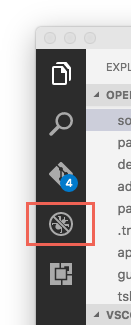
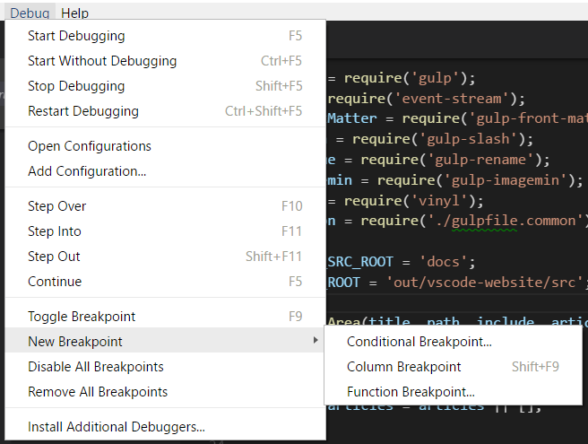

Visual Studio Codeの魅力的な機能の1つは優れたデバッグの対応です。VS Codeのデバッガは編集、コンパイル、デバッグのループを高速化します。


## デバッガ拡張機能 <a id="debugger-extensions"></a>

VS Codeにはビルドインの[Node.js](https://nodejs.org/)ランタイムデバックのサポートがありJavaScript、TypeScript、JavaScriptに変換(transpiled)されたその他の言語をデバッグ可能です。

その他の言語のデバッグとランタイムには (including [PHP](https://marketplace.visualstudio.com/items?itemName=felixfbecker.php-debug), [Ruby](https://marketplace.visualstudio.com/items?itemName=rebornix.Ruby), [Go](https://marketplace.visualstudio.com/items?itemName=lukehoban.Go), [C#](https://marketplace.visualstudio.com/items?itemName=ms-vscode.csharp), [Python](https://marketplace.visualstudio.com/items?itemName=donjayamanne.python), [C++](https://marketplace.visualstudio.com/items?itemName=ms-vscode.cpptools), [Powershell](https://marketplace.visualstudio.com/items?itemName=ms-vscode.PowerShell) and [many others](https://marketplace.visualstudio.com/search?term=debug&target=VSCode&category=Debuggers&sortBy=Relevance)), look for `Debuggers` [extensions](/docs/userguide/extension-gallery.md) in our VS Code [Marketplace](https://marketplace.visualstudio.com/vscode/Debuggers)を入手するか、デバッグメニューの**Install Additional Debuggers**を利用します。

## デバッグの開始 <a id="start-debugging"></a>

次のドキュメントは組み込み[Node.js](https://nodejs.org/)デバッガに基づいていますが、ほとんどのコンセプトと機能は他のデバッガでも同様に適用できます。

なおデバッグについて読み進める前に、Node.jsアプリケーションを作成すると便利です。[Node.js walkthrough](/docs/nodejs/nodejs-tutorial.md)にしたがってNode.jsをインストールして簡単な"Hello World"JavaScriptアプリケーション(`app.js`)を作成して見てください。簡単なアプリケーションを用意しておけば、このページでVS Codeのデバッグ機能を通して利用できるでしょう。

## デバッグビュー <a id="debug-view"></a>

デバッグビューを表示するには、VS Codeの横にある**アクティビティーバー**でデバッグアイコンをクリックします。



デバッグビューではデバッグに関するすべての情報を表示しており、デバッグコマンドと構成の設定を含むトップバーがあります。

## デバッグメニュー <a id="debug-menu"></a>

一番上のデバッグメニューには最も一般的なデバッグコマンドが用意されています。



## 起動構成 <a id="launch-configurations"></a>

VS Codeで単純なアプリケーションをデバッグするには`kb(workbench.action.debug.start)`を押します。これによりVS Codeは現在アクティブなファイルのデバッグを開始しようとします。

>**Tip**: VS Codeでフォルダーを開いていなくても簡単なアプリケーションをデバッグするすることができますが、起動構成を管理して高度なデバッグを設定することはできません。

高度なデバッグをするには、まずフォルダーを開いて起動構成ファイル`launch.json`を準備する必要があります。デバッグビューのトップバーにある歯車アイコンをクリックすると、VS Codeはワークスペースの`.vscode`フォルダーの下に`launch.json`ファイルを作成します。なおVS Codeはデバッグ環境を自動的に検出しようとしますが、これに失敗したときはデバッグ環境を自分で選択する必要があります。

Node.jsのデバッグ用に生成されたファイルは次の通りです:

```json
{
    "version": "0.2.0",
    "configurations": [
        {
            "type": "node",
            "request": "launch",
            "name": "Launch Program",
            "program": "${file}",
            "cwd": "${workspaceRoot}"
        },
        {
            "type": "node",
            "request": "attach",
            "name": "Attach to Process",
            "port": 5858
        }
    ]
}
```

ここでこれら起動構成に利用できる属性はデバッガごとに異なることに注意してください。IntelliSenseを使用すると特定のデバッガの属性を見つけることができますし、すべての属性に対してホバーヘルプが利用可能です。もし起動構成で緑色の提案がみえたら、その上にカーソルをホバーして問題の内容を確認し、デバッグセッションを起動する前に修正するようにしてください。

通常VS Codeのデバッガではデバッグモードでプログラムを起動するか、既に実行中のプログラムにアタッチすることが可能です。そのリクエスト(`attach`や`launch`)によって異なった属性が必要となります。これには`launch.json`の検証と提案が役立つはずです。

生成された値を確認して、プロジェクトとデバッグ環境に適しているかどうかを確認してください。

既存の`launch.json`に新しい構成を追加するには、次の方法のいずれかを利用します:

* カーソルが構成の配列にあるときはIntelliSenseを利用します。
* 配列の先頭にスニペットを呼びだすには**構成の追加**ボタンを押します。
* デバッグドロップダウンの**構成の追加**オプションを選択します。


デバッグビューの**構成のドロップダウン**で`Launch`という構成を選択します。起動構成を設定出来たら`kb(workbench.action.debug.start)`を使用してデバッグセッションを開始します。

構成を設定するもう1つの方法には**コマンドパレット** (`kb(workbench.action.showCommands)`)を通して**Debug: Select and Start Debugging*を選択または、`'debug '`を入力してデバッグしたい構成を選択します。

### グローバル起動構成 <a id="global-launch-configuration"></a>

ユーザー設定には`"launch"`オプジェクトを追加できます。この`"launch"`構成はワークスペース全体で共有されます。例:
```json
"launch": {
    "version": "0.2.0",
    "configurations": [{
        "type": "node",
        "request": "launch",
        "name": "Launch Program",
        "program": "${file}"
    }]
}
```

>**Tip**: ワークスペースに`"launch.json"`があるときはグローバル起動構成が無視されます。

## デバッグ動作 <a id="debug-actions"></a>

デバッグセッションが開始したときは、**デバッグ動作のパネル**がエディター上部に現れます。


* 続行 / 一時停止 `kb(workbench.action.debug.continue)`
* ステップオーバー `kb(workbench.action.debug.stepOver)`
* ステップイン `kb(workbench.action.debug.stepInto)`
* ステップアウト `kb(workbench.action.debug.stepOut)`
* 再起動`kb(workbench.action.debug.restart)`
* 停止 `kb(workbench.action.debug.stop)`

## Launch.jsonの属性 <a id="launchjson-attributes"></a>

さまざまなデバッガとデバッグ方法に対応するために多くの`launch.json`属性が用意されています。上記の`type`属性の値を指定するときのように、IntelliSense (`kb(editor.action.triggerSuggest)`)を使用して利用可能な属性を確認することができます。


次の属性はすべての起動構成で必須です:

* `type` - 起動構成に使用するデバッガの種類。インストールされたすべての拡張機能は型(例: ビルトインnodeデバッガでは`node`、`php`(PHP拡張機能)、`go`(Go拡張機能))を持っています。
* `request` - 起動構成のリクエストタイプ。現在サポートされているのは`launch`と`attach`です。
* `name` - デバッグ起動構成のドロップダウンに表示する親しみやすい名前。

すべての起動構成で利用可能なオプション属性は次の通りです:

* `preLaunchTask` - デバッグセッションの開始前に起動するタスク。属性は[tasks.json](/docs/userguide/tasks.md)(ワークスペースの`.vscode`フォルダーの下)で指定したタスクの名前になります。
* `internalConsoleOptions` - デバッグセッション中のデバッグコンソールパネルの動作制御。
* `debugServer` - **拡張機能作成者用**: 起動するデバッグアダプターの代わりに接続する特定のポート。

多くのデバッガで次の属性の一部をサポートしています:

* `program` - デバッガを起動するときに起動する実行可能ファイルもしくはファイル
* `args` - デバッグするプログラムに渡される引数
* `env` - 環境変数
* `cwd` - 環境依存とその他のファイルを見つけ出すために利用する現在の作業ディレクトリ
* `port` - 実行中のプロセスにアタッチするときのポート
* `stopOnEntry` - プログラムを起動したとき指定したものを停止します
* `console` - 使用するコンソールの種類。例:`internalConsole`, `integratedTerminal`, `externalTerminal`

## 変数置換 (変数) <a id="variable-substitution"></a>

VS Codeは`launch.json`ファイル内で文字列の変数置換をサポートしており、次の定義された変数を持っています:

- **${workspaceRoot}** - VS Codeで開いたフォルダーのパス
- **${workspaceRootFolderName}** - VS Codeで開いたスラッシュ(/)を含まないフォルダーの名前
- **${file}** - 現在開いているファイル
- **${relativeFile}** - `workspaceRoot`と相対的な現在開いているファイル
- **${fileBasename}** - 現在開いているファイルのベース名
- **${fileBasenameNoExtension}** - 現在開いているファイルから拡張子を含まないファイルの名前
- **${fileDirname}** - 現在開いているファイルのディレクトリ名
- **${fileExtname}** - 現在開いているファイルの拡張子
- **${cwd}** - タスクランナー起動時の現在の作業ディレクトリ
- **${lineNumber}** - アクティブなファイルの現在選択されている行番号


 **${env.Name}**を利用して、環境変数を参照することもできます(例:${env.PATH})。環境変数のNAMEは必ず大文字と小文字を区別してください。例: `env.Path`(windows)

```json
{
    "type": "node",
    "request": "launch",
    "name": "Launch Program",
    "program": "${workspaceRoot}/app.js",
    "cwd": "${workspaceRoot}",
    "args": [ "${env:USERNAME}" ]
}
```

VS Codeの設定とコマンドは次の構文を使用して参照できます:

* **${config:Name}** - 例: `${config:editor.fontSize}`
* **${command:CommandID}** - 例: `${command:explorer.newFolder}`

## OS特有のプロパティ <a id="operating-system-specific-properties"></a>
`Launch.json`は、OS固有の定義値(例:プログラムに渡す引数)をサポートしています。これを行うには`launch.json`ファイルにOSのリテラル(名前)を書き込み、その中に対応するプロパティを指定します。

次の例は`"args"`をLinux-MacとWindowsで異なった引数を渡す例です:
```json
{
    "version": "0.2.0",
    "configurations": [
        {
            "type": "node",
            "request": "launch",
            "name": "Launch Program",
            "program": "./node_modules/gulp/bin/gulpfile.js",
            "args": ["myFolder/path/app.js"],
            "windows": {
                "args": ["myFolder\\path\\app.js"]
            }
        }
    ]
}
```
有効なプロパティはWindowsでは`windows`、Linuxでは`linux`、Macでは`osx`です。OS特有のスコープで定義したプロパティは、グローバルスコープで定義するプロパティより優先されます。

例:
```json
{
    "version": "0.2.0",
    "configurations": [
        {
            "type": "node",
            "request": "launch",
            "name": "Launch Program",
            "program": "./node_modules/gulp/bin/gulpfile.js",
            "stopOnEntry": true,
            "osx": {
                "stopOnEntry": false
            }
        }
    ]
}
```
このプログラムはOSXを除くOSでエントリー時に一時停止されます。

## 実行モード <a id="run-mode"></a>

プログラムのデバッグに加えVS Codeはプログラムの実行をサポートしています。この**実行**アクション`kb(workbench.action.debug.run)`では起動構成の多くがサポートされており、現在選択されている起動構成を使用してプログラムを起動します。VS Codeはプログラムを実行している間デバッグセッションを維持し、**停止**ボタンを押すとプログラムが終了します。

>**Tip**: 常に**実行**アクションは利用できますが、すべてのデバック拡張機能で'Run'がサポートされているわけではありません。今回の場合'Run'は'Debug'と同じです。

## マルチターゲットのデバッグ <a id="multi-target-debugging"></a>

VS Codeはマルチターゲットのデバッグをサポートしており、1つ以上のプロセス(例:クライアントやサーバー)を含む複雑なシナリオをデバッグできます。

マルチターゲットのデバッグはとてもシンプルです。最初のデバッグセッションを開始しすれば別のセッションも開始するからです。2つめのセッションが起動して実行されるとVS CodeのUIは_multi-target mode_に切り替わります:

- 個々のセッションは**CALL STACK**ビューでトップレベル要素として表示するようになります。

- 浮動デバッグウィジェットには現在_アクティブなセッション_を表示します(他すべてのセッションはドロップダウンメニューで利用可能です)。

- デバッグアクション(例:浮動デバッグウィジェットのすべてのアクション)はアクティブセッションで実行されます。アクティブなセッションは、浮動デバッグウィジェットのドロップダウンを利用するか、**CALL STACK**ビューでこれと別の要素を選択して変更します。

複数のデバッグセッションを開始する別の方法はいわゆる_compound_ 起動構成を使用する方法です。この起動構成では2つ以上の起動構成の名前を並べて起動します。ドロップダウンメニューでこれを確認してください。

```json
{
    "version": "0.2.0",
    "configurations": [
        {
            "type": "node",
            "request": "launch",
            "name": "Server",
            "program": "${workspaceRoot}/server.js",
            "cwd": "${workspaceRoot}"
        },
        {
            "type": "node",
            "request": "launch",
            "name": "Client",
            "program": "${workspaceRoot}/client.js",
            "cwd": "${workspaceRoot}"
        }
    ],
    "compounds": [
        {
            "name": "Server/Client",
            "configurations": ["Server", "Client"]
        }
    ]
}
```

## ブレークポイント <a id="breakpoints"></a>

**エディターマージン**をクリックするとブレークポイントを切り替えることができます。デバッグビューの**BREAKPOINTS**セクションで細かいブレークポイントの制御(有効/無効/再適用)を行うこともできます。

* 通常エディターマージンのブレークポイントは赤く塗りつぶされた円で表示されます。
* 無効なブレークポイントはグレーの円です。
* 列ブレークポイントはエディターのインラインで表示します。
* デバッグセッションが開始されると、デバッガに登録できないブレークポイントはグレーの中抜きの円に変わります。live-edit support(?)なしのデバッグセッションが実行中にソースが編集されるときも同じことが起きる可能性があります。

**すべてのブレークポイントを再適用する**コマンドはすべてのブレークポイントを元の位置で再設定します。これはデバッグ環境が実行されていないソースコードで、"lazy"で"misplaces"なブレークポイントの時に役立ちます。

VS Codeの優れたデバッグ機能は式やヒット数に基づいて設定する機能です。

- **Expression condition**: 式が`true`と評価されるたびにブレークポイントがヒットします。
- **Hit count**: 'hit count'はブレークポイントがヒットする必要がある回数を制御します。'hit count'が尊重されるかや式の評価方法は使用するデバッグ拡張機能によって異なります。

**条件付きブレークポイントの追加**アクションや既存のブレークポイントに**ブレークポイントの編集...**を使用して条件またはヒットカウントを追加できます。どちらの場合も式を入力できるドロップダウンメニューがあるインラインテキストボックスが開きます:


デバッガが条件付きブレークポイントをサポートしていない場合は**条件次ブレークポイントの追加**アクションは失われます。

**列のブレークポイント**は`kb(editor.debug.action.toggleColumnBreakpoint)`を使用するか、デバッグセッション中にコンテキストメニューを介して設定できます。列のブレークポイントは実行がその列に達するとヒットします。これは1つの表に複数のステートメントを含むminifiedコードをデバッグする場合特に便利です。列ブレークポイントに条件を付けることもできます。エディタグリフマージンのコンテキストメニューを通して列にこれを編集してください。

## 関数ブレークポイント <a id="function-breakpoints"></a>

デバッカーはソースコードにブレークポイントを直接的に配置する他に、関数名を指定してブレークポイントを作成することができます。これはソースが利用できない状況で関数名がわかっている場合に便利です。

関数ブレークポイントは**BREAKPOINS**セクションヘッダで**+**buttonをおして、関数名を入力することで作成されます:


## データの検査 <a id="data-inspection"></a>

変数はデバッグビューの**VARIABLES**セクションで検査するか、エディターでそのソースをホバーすることで検査できます。変数と式の評価は**CALL STACK**セクションで選択したスタックフレームと対応します。


変数と式はデバッグビューの**WATCH**セクションで評価して監視することもできます。


変数値は変数のコンテキストメニューから**値の設定**アクションで変更できます。

## デバッグコンソール <a id="debug-console"></a>

式を**デバッグコンソール**で評価することが可能です。デバッグコンソールを開くにはデバッグパネル上部にある**コンソールを開く**を利用するか、 **コマンドパレット** (`kb(workbench.action.showCommands)`)を使用してください。デバッグコンソールでは入力中に提案が表示されます。複数の行を入力する必要があるときは、行の間でShift + Enterキーを利用し、Enterキーを押して評価するすべての行を送信します。


## 次のステップ

VS CodeのNode.jsサポートについては:

* [Node.js](/docs/nodejs/nodejs-debugging.md) - Node.js debugging is included in VS Code.

Node.jsデバッグの基本に関するチュートリアル:

* [Intro Video - Debugging](/docs/introvideos/debugging.md) - Introductory video showcasing the basics of debugging.

VS Codeのタスクについて:

* [Tasks](/docs/userguide/tasks.md) - Running tasks with Gulp, Grunt and Jake.  Showing Errors and Warnings

独自のデバッガ拡張機能を作成するには:

* [Debuggers](/docs/extensions/example-debuggers.md) - Steps to create a VS Code debug extension starting from a mock sample

## よくある質問

**Q: サポートされているデバッグシナリオはなんですか？**

**A:** VS Codeを使用するNode.jsベースのアプリケーションのデバッグはLinux、macOS、Windowsで初めから利用できます。そのほかにもMarketplaceで多くのシナリオをサポートする[VS Code extensions](https://marketplace.visualstudio.com/vscode/Debuggers?sortBy=Downloads)があります。

**Q: デバッグビューのドロップダウンメニューで起動構成が表示されません**

**A:** よくある問題としては`launch.json`をまだ設定していないか、`launch.json`に構文エラーがあることです。もしくはフォルダーなしのデバッグで起動構成をサポートしおらず、フォルダーを開く必要があるのかもしれません。
