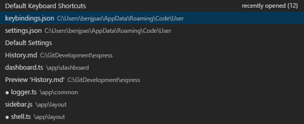
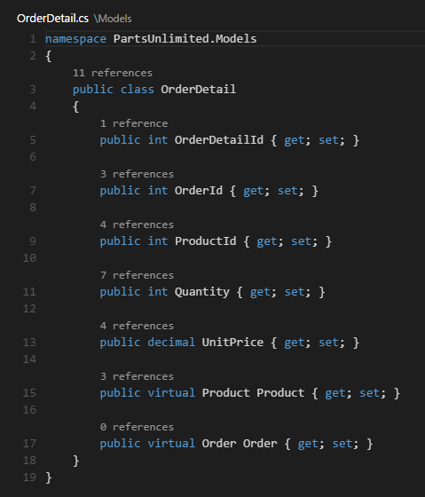

Visual Studio Codeには機能性の高いコードエディターが備わっています。これを言語サービスと組み合わせることにより、IDEの機能とテキストエディターの快適性を得ることが可能です。このトピックではまず、VS Codeの言語インテリジェンス機能(提案、パラメータヒント、スマートコードナビゲーション)について説明し、コアテキストエディターの機能を紹介します。

## すばやいファイル移動 

エクスプローラーはプロジェクトを捜索するときに、ファイル間を移動するのに最適です。しかしあなたがタスクを実行しているとき、同じファイルの間をすばやく移動できることに気が付くでしょう。VS Codeには使いやすいキーバインドを利用して、ファイル間を移動する2つの強力なコマンドが用意されています。

エディターグループで開いているファイルのすべてのリストを表示するには、`kbstyle(Ctrl)`を押しながら`kbstyle(Tab)`を押します。これらのファイルの1つを開くには、再度`kbstyle(Tab)`を使用して移動したいファイルを選択し、`kbstyle(Ctrl)`を離してそれを開きます。

もしくは、`kb(workbench.action.navigateBack)`と`kb(workbench.action.navigateForward)`を使用してファイル間を移動して、位置を変更します。同じファイルの異なる行の間を移動している場合、これらのショートカットキーを使用してそれらの位置を簡単に移動できます。

>**Tip:** `kb(workbench.action.quickOpen)`(**ファイルに移動する**)を利用すると任意のファイルをそのファイル名で開くことができます。

## 定義に移動 

[言語](/docs/languages/overview.md)がこれをサポートしている場合は、`kb(editor.action.goToDeclaration)`を押してシンボルの定義に移動することができます。

`kbstyle(Ctrl)`を押しながらシンボルにカーソルを合わせると、宣言のプレビューを表示します:

> **Tip:** `kbstyle(Ctrl+Click)`で定義にジャンプしたり、`kbstyle(Ctrl+Alt+Click)`で定義を横に開くことができます。

## 型定義に移動 

いくつかの[言語](/docs/languages/overview.md) では`kb(editor.action.goToTypeDefinition)`を押すことによってシンボルの型定義に移動することもサポートしています。これはシンボルの型定義を表示します。

## 実装に移動 

対応する[言語](/docs/languages/overview.md)では`kb(editor.action.goToImplementation)`を押すことによってシンボルの実装に移動することもサポートしています。インスタンスの場合はそのインターフェイスのすべての実装を表示して、抽象メソッドの場合はメソッドのすべての具体的な実装を表示します。

## シンボルに移動 

`kb(workbench.action.gotoSymbol)`を使用してファイル内のシンボルに移動することができます。`kbstyle(:)`を入力すると、そのシンボルがカテゴリー別にグループ化されます。あとは`kbstyle(Up)`や`kbstyle(Down)`を押して、望む場所へ移動するだけです。

## シンボルを名前で開く 

いくつかの言語は`kb(workbench.action.showAllSymbols)`を使用する、ファイル間のシンボル移動をサポートしています。どのファイルに含まれているかにかかわらず、移動したい型の先頭文字を入力して、`kbstyle(Enter)`を押すだけです。

## Peek(のぞき見) 

私たちが考える最悪なことは、何かを素早くチェックしたいだけのときに大きなコンテキストに切り替えることです。そんな訳でPeek(のぞき見)エディターをサポートしています。**すべての参照の検索**検索(via `kb(editor.action.referenceSearch.trigger)`)または**定義をここに表示**(via `kb(editor.action.previewDeclaration)`)を実行したとき、結果をインラインに埋め込みます:

表示されたPeekエディターで異なった参照の間を移動して、すぐに編集することができます。表示されたPeekエディターのファイル名をクリックするか、結果リストをダブルクリックすると外部のエディターでその参照を開きます。

> **Tip:** さらに、`kbstyle(Escape)`を押すかPeekエディターの領域をダブルクリックするとPeekウィンドウを閉じます。この動作は`editor.stablePeek`[設定](/docs/getstarted/settings.md)で無効にすることができます。

## ブラケットマッチング 

ブラケットマッチングはかっこを選択すると、対応するかっこを強調表示します。

> **Tip:** `kb(editor.action.jumpToBracket)`で対応するかっこに移動できます。

## 参照情報 

C#のようないくつかの言語はリアルタイムでインラインの参照情報をサポートしています。これにより編集による影響や、プロジェクトのいたるところの特定メソッドやプロパティのpopularity(需要?)を素早く分析できます。

> **Tip:** これらのコメントをクリックすると、**すべての参照の検索**アクションが直接呼び出されます。

> **Tip:** CodeLensに表示される参照情報は`editor.codeLens`設定を通してオンまたはオフにできます。

## シンボルの名前を変更 

いくつかの言語ではファイル間でシンボルの名前変更をサポートします。`kb(editor.action.rename)`を押して、希望する新しい名前を入力したら`kbstyle(Enter)`を押してください。すべてのシンボルの用法はファイル間で変更されます。

## エラーと警告 

警告やエラーは、[構成済みのタスク](/docs/userguide/tasks.md)を介して、言語サービスによって、またはバックグランドで絶えず解析するLinterによって生成されます。私たちはバグのないコードが好きですから、警告とエラーは複数の場所で目立つように表示します:

* ステータスバーには、すべてのエラーと警告の件数と概要が表示されます。
* 概要をクリックするか`kb(workbench.actions.view.problems)`を押すと、現在のエラーのすべてのリストを表示する**問題**パネルが表示されます。
* エラーや警告を含むファイルを開くと、エラーと警告はテキストでまた概要ルーラー内でインラインにレンダリングされます。

> **Tip:** 現在のファイルでエラーや警告のループ移動は`kb(editor.action.marker.next)`や`kb(editor.action.marker.prev)`を押すことで出来ます。これはインラインで問題と利用可能なコードアクションを表示します。

## コードアクション 

警告とエラーはコードアクション(Quick Fixesとも呼ばれます)を問題を解決するために提供します。これらはエディターの左端に電球アイコンとして表示し、電球をクリックすると、コードアクションを表示するかアクションを実行します。

## 次のステップ

エディターの仕組みを確認しました。ほかにも試してみてください...

* [Intro Video - Code Editing](/docs/introvideos/codeediting.md) - Watch an introductory video on code editing features.
* [User Interface](/docs/getstarted/userinterface.md) - In case you missed a basic orientation around VS Code.
* [Key Bindings](/docs/getstarted/keybindings.md) - Learn how to modify key bindings to your preference.
* [Debugging](/docs/userguide/debugging.md) - This is where VS Code really shines.
