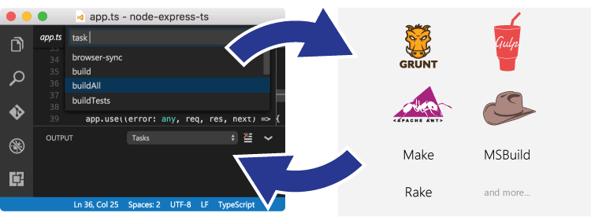
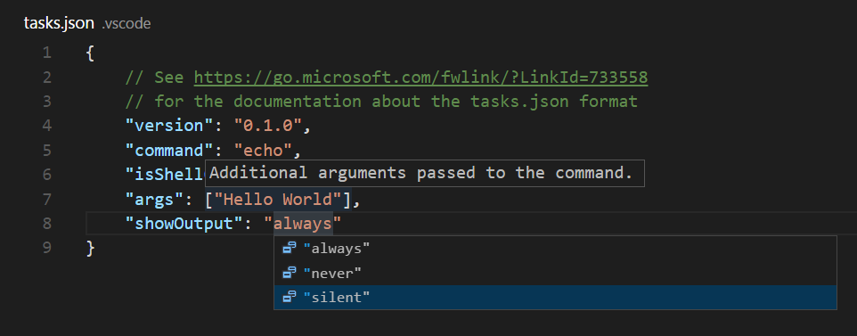

---
title: タスク
MetaDescription: Expand your development workflow with task integration in Visual Studio Code (Gulp, Grunt, Jake and more).
commitid: 1f68e5e21c25890c3261c4f7c6203c8bb8a4ffe3
---

# タスクを利用して外部ツールと統合する <a id="integrate-with-external-tools-via-tasks"></a>

ビルド、パッケージング、テストやソフトウェアのシステム構築などのタスクを自動化するツールが多数存在します。いわゆる [Make](https://en.wikipedia.org/wiki/Make_software), [Ant](https://ant.apache.org/), [Gulp](http://gulpjs.com/), [Jake](http://jakejs.com/), [Rake](http://rake.rubyforge.org/), [MSBuild](https://github.com/Microsoft/msbuild)のことです。



これらのツールは主にコマンドラインから実行され、ソフトウェア開発(編集 コンパイル テスト デバッグ)以外のジョブを自動化します。開発ライフサイクルにおけるこれらの重要性を考えると、VS Codeから実行してその結果を分析できることはとても便利だといえます。

> **Note:** タスクはワークスペースフォルダー上で作業している場合にのみ使用できます。つまり、一つのファイルを編集時は使用できません。

## Hello World <a id="hello-world"></a>

実行時に**出力**パネルにテキストを表示する、単純な"Hello World"タスクから始めてみましょう。

`tasks.json`ファイルはワークスペース内で定義可能で、VS Codeは一般的なタスクのテンプレートを用意しています。**コマンドパレット**(`kb(workbench.action.showCommands)`)では、`task`でフィルターをかけて、タスクに関連するコマンドを確認できます。


まず**Tasks: Configure Task Runner**コマンドを選択して、テンプレートのリストを表示します。次に、外部コマンドを実行する**Others**を選択してください。

ワークスペースの`.vscode`フォルダに`tasks.json`ファイルが次の内容で表示されるはずです:

```json
{
    "version": "0.1.0",
    "command": "echo",
    "isShellCommand": true,
    "args": ["Hello World"],
    "showOutput": "always"
}
```

今回の例では"Hello World"を引数として、シェルコマンド`echo`を実行していきます。

タスク`echo`をテストしてみましょう。**Tasks: Run Task**を実行して、ドロップダウンから`echo`を選択してください。**出力**パネルが開き、"Hello World"というテキストを確認できます。

`tasks.json`ではIntelliSenseを利用可能です。変数とその値にホバーして`kb(editor.action.triggerSuggest)`でトリガーできます。



>**Tip:** **Quick Open**(`kb(workbench.action.quickOpen)`)で"`task``kbstyle(Space) <commandname>"と入力すればタスクを実行できます。今回の場合は 'task echo'です。

## 出力ウィンドウの動作 <a id="output-window-behavior"></a>

場合によっては、タスクを実行時に出力ウィンドウの動作を制御したいこと思うことでしょう。たとえば、タスクに問題があるときは、エディターを最大化して、タスク出力ウィンドウのみを表示したいと思うかもしれません。**showOutput**プロパティはこれを制御できます。有効な値は次の通りです:

- **always** - 出力ウィンドウを常に前面表示します。(既定)。
- **never** - ユーザーが **表示** > **出力**(`kb(workbench.action.output.toggleOutput)`) を実行して出力ウィンドウを開くまで確認できません。
- **silent** - タスクに[問題マッチャー](/docs/userguide/tasks.md#processing-task-output-with-problem-matchers)が設定されていない場合にのみ、出力ウィンドウを全面に表示します。

### echoCommand

VS Codeが実行している正確なコマンドを確認するには、`tasks.json`内の`echoCommand`設定を有効にします:


>**Note:**VS Codeにはnpm、MSBuild、mavenおよびその他のコマンドラインを実行するために、定義済みの`tasks.json`テンプレートが同梱されています。タスクについて学習したいならこのテンプレートを確認し、使用している他のツールに類似したツールやタスクランナーを確認することが最適です。

## command and tasks[]

`tasks.json`は単一の`command`値をとります。この値はGuplやGruntといったタスクランナーや、任意のコマンドラインツール(コンパイラーやlinter)の値になります。既定で`command`は、**Tasks: Run Task**のドロップダウンに利用されます。

また`tasks`配列に複数のタスクを定義して、異なる引数を渡したり`command`を実行したときに異なる設定を使うこともできます。

次は、異なる引数を`echo`コマンドに渡す簡単な例です:

```json
{
    "version": "0.1.0",
    "command": "echo",
    "isShellCommand": true,
    "args": [],
    "showOutput": "always",
    "echoCommand": true,
    "suppressTaskName": true,
    "tasks": [
        {
            "taskName": "hello",
            "args": ["Hello World"]
        },
        {
            "taskName": "bye",
            "args": ["Good Bye"]
        }
    ]
}
```

いま**Tasks: Run Task**を実行すれば、ドロップダウンに`hello`と`bye`という2つのタスクが確認できます。私たちは`suppressTaskName`をtrueに設定しました。これによりタスク名もコマンドに渡されます。結果は"echo hello Hello World"になるでしょう。


`showOutput`や`suppressTaskName`は、グローバルに設定したり特定のタスクで上書きしたりすることが可能です。`tasks args`プロパティ値はグローバル変数に追加されます。その結果のコマンドラインは次の通りです:

* `suppressTaskName`が`true`: `command 'global args' 'task args'`
* `suppressTaskName`が`false`:`command 'global args' taskName 'task args'`

`tasks`固有のプロパティもあります。便利なプロパティの1つは`isBuildCommand`です。これをtrueに設定すると、**Tasks: Run Build Task** (`kb(workbench.action.tasks.build)`)を実行しただけでそのタスクを実行します。

## 複数のコマンドを実行 <a id="running-multiple-commands"></a>

複数の異なるコマンドを実行したいとき、タスクごとに異なるコマンドを指定することが可能です。タスクごとにコマンドを使用するときの`tasks.json`ファイルは次のようになります:

```json
{
    "version": "0.1.0",
    "tasks": [
        {
            "taskName": "tsc",
            "command": "tsc",
            "args": ["-w"],
            "isShellCommand": true,
            "isBackground": true,
            "problemMatcher": "$tsc-watch"
        },
        {
            "taskName": "build",
            "command": "gulp",
            "args": ["build"],
            "isShellCommand": true
        }
    ]
}
```

1つ目のタスクはwatchモードでTypeScriptコンパイラーを開始し、2番目のタスクはgulpのビルドを開始します。タスクがローカルコマンドを指定すると、実行時にタスク名はコマンドラインに含まれません(`suppressTaskName`は既定で`true`です)。ローカルのコマンドはローカル引数を指定できるので、既定ではそれを追加する必要はありません。もし`tasks.json`ファイルがグローバルとタスクのローカルコマンドの両方を指定するなら、タスクのローカルコマンドが優先されます。つまり、グローバルコマンドとタスクのローカルコマンドは一緒になることがないのです。

## タスクにキーボードショートカットをバインド <a id="binding-keyboard-shortcuts-totasks"></a>

タスクを頻繁に実行する必要があるとき、タスクのキーボードショートカットを定義することもできます。

たとえば`ctrl+h`を`build`に上書きするバインドなら、`keybindings.json`に次を追加します:

```json
{
    "key": "ctrl+h",
    "command": "workbench.action.tasks.runTask",
    "args": "build"
}
```

## 変数置換 (変数) <a id="variable-substitution"></a>

タスクを構成するとき、事前に定義された共通変数を利用すると便利なことがよくあります。VS Codeは`tasks.json`ファイル内で文字列の変数置換をサポートしており、次の定義された変数を持っています:

- **${workspaceRoot}** VS Codeで開いたフォルダーのパス
- **${workspaceRootFolderName}** VS Codeで開いたスラッシュ(/)を含まないフォルダーの名前
- **${file}** 現在開いているファイル
- **${relativeFile}** `workspaceRoot`と相対的な現在開いているファイル
- **${fileBasename}** 現在開いているファイルのベース名
- **${fileBasenameNoExtension}** 現在開いているファイルから拡張子を含まないファイルの名前
- **${fileDirname}** 現在開いているファイルのディレクトリ名
- **${fileExtname}** 現在開いているファイルの拡張子
- **${cwd}** タスクランナー起動時の現在の作業ディレクトリ
- **${lineNumber}** アクティブなファイルの現在選択されている行番号

 **${env.Name}**を利用して、環境変数を参照することもできます(例:${env.PATH})。環境変数のNAMEは必ず大文字と小文字を区別してください。例: `env.Path`(windows)

次の例は、現在開いているファイルをTypeScriptのコンパイラーに渡す設定の例です。

```json
{
    "command": "tsc",
    "args": ["${file}"]
}
```

## OS特有のプロパティ <a id="operating-system-specific-properties"></a>

タスクシステムは、OS固有の定義をサポートしています。これを行うには、`tasks.json`ファイルにOSのリテラル(名前)を書き込み、その中に対応するプロパティを指定します。

次の例は、Node.jsの実行可能ファイルの場所をコマンドとして使用する例であり、WindowsとLinuxで異なった扱い受けます:

```json
{
    "version": "0.1.0",
    "windows": {
        "command": "C:\\Program Files\\nodejs\\node.exe"
    },
    "linux": {
        "command": "/usr/bin/node"
    }
}
```

有効なプロパティは、Windowsでは`windows`、Linuxでは`linux`、Macでは`osx`です。OS特有のスコープで定義したプロパティは、グローバルスコープで定義するプロパティより優先されます。

例:

```json
{
    "version": "0.1.0",
    "showOutput": "never",
    "windows": {
        "showOutput": "always"
    }
}
```

実行したタスクからの出力は、常に表示されるWindowsを除いて前面には表示しません。

タスクのローカルコマンドもまた同様に動作させることができます。構文はグローバルコマンドと同じです。OS固有の引数をコマンドに追加する例を次に示します:

```json
{
    "version": "0.1.0",
    "tasks": [
        {
            "taskName": "build",
            "command": "gulp",
            "isShellCommand": true,
            "windows": {
                "args": ["build", "win32"]
            },
            "linux": {
                "args": ["build", "linux"]
            },
            "osx": {
                "args": ["build", "osx"]
            }
        }
    ]
}
```

## 実践的なタスクの例 <a id="examples-of-tasks-in-action"></a>

タスクの機能を最大限活用するために、VS Codeのタスクを使用してlintやコンパイラーなどの外部ツールを統合する方法を次に示します:

### TypeScriptをJavaScriptに変換

[TypeScriptトピック](/docs/languages/typescript.md#transpiling-typescript-into-javascript)では、TypeScriptをJavaScriptに変換し、VS Code内で関連するエラーを監視するタスクを作成する例を解説します。

### MarkdownをHTMLにコンパイル

Markdownトピックでは、MarkdownをHTMLにコンパイルするための2つの例を解説しています。

1. [ビルドタスクを利用して手動のコンパイルを行う](/docs/languages/markdown.md#compiling-markdown-into-html)
2. [file watcherによるコンパイル手順の自動化](/docs/languages/markdown.md#automating-markdown-compilation)

### LessとSassをCSSへ変換

CSSトピックでは、タスクを使用してCSSファイルを生成する方法の例を開設しています。

1. [ビルドタスクを利用して手動で変換を行う](/docs/languages/css.md#transpiling-sass-and-less-into-css)
2. [file watcherによるコンパイル手順の自動化](/docs/languages/css.md#automating-sassless-compilation)

## Gulp, Grunt, Jakeタスクの自動検出

VS CodeはGulp、Grunt、Jakeファイルのタスクを自動検出できます。これにより、追加の構成を必要とせずにタスクリストにタスクを追加します(問題マッチャーを使用する必要がある場合を除きます )。

この例を具体的にするために、次の簡単なGulpファイルを使用してみましょう。これは、ビルドとデバッグの2つのタスクを定義しています。1つ目は[Mono](http://www.mono-project.com/)を使用してC#のコードをコンパイルします。2つ目はMonoデバッガのもとでMyAppを開始します。

```javascript
var gulp = require("gulp");

var program = "MyApp";
var port = 55555;

gulp.task('default', ['debug']);

gulp.task('build', function() {
    return gulp
        .src('./**/*.cs')
        .pipe(msc(['-fullpaths', '-debug', '-target:exe', '-out:' + program]));
});

gulp.task('debug', ['build'], function(done) {
    return mono.debug({ port: port, program: program}, done);
});
```

`kb(workbench.action.showCommands)`をおし、`Run Task`に続けて`kbstyle(Enter)`を入力すれば、利用可能なタスクの一覧を表示します。その中から選択して`kbstyle(Enter)`で確定すれば、そのタスクを実行します。


>**Note:** Gulp、Grunt、Jakeの自動検出は、対応するファイル(例: `guplfile.js`)が開いているフォルダーのルートに存在する場合のみ機能します。

## 問題マッチャーによるタスク出力の処理 <a id="processing-task-output-with-problem-matchers"></a>

VS Codeは問題マッチャーを利用して、タスクからの出力を処理することができます。次に標準の例を示します:

- **TypeScript**: `$tsc`は出力のファイル名が開かれたフォルダーと相対的であることを前提としています。
- **TypeScript Watch**: `$tsc-watch`はwatchモードで実行されたとき、`tsc`コンパイラーから報告される問題と一致します。
- **JSHint**: `$jshint`はファイル名が絶対パスとして報告されることを前提としています。
- **JSHint Stylish**: `$jshint-stylish`はファイル名が絶対パスとして報告されることを前提としています。
- **ESLint Compact**: `$eslint-compact`は出力のファイル名が開かれたフォルダーと相対的であることを前提としています。
- **ESLint Stylish**: `$eslint-stylish` は出力のファイル名が開かれたフォルダーと相対的であることを前提としています。
- **Go**: `$go`は`go`コンパイラーから報告される問題と一致します。ファイル名は開いているファイルと相対であることを前提とします。
- **CSharp and VB Compiler**: `$mscompile`はファイル名が絶対パスとして報告されることを前提としています。
- **Less**: `$lessCompile`はファイル名が絶対パスとして報告されることを前提としています。

問題マッチャーは既知の警告やエラー文字列を確認するために、タスクの出力テキストを解析して、エディターと問題パネルにインラインで報告します。問題マッチャーは、グローバルか特定タスクのエントリー内で設定できます。

また、独自の問題マッチャーも作成可能です。これについて後で解説していきます。

## Gulp, Grunt, Jake出力のマッピング

タスクを実行するだけでなくもっと多くのことをしたい場合、`tasks.json`ファイル(ワークスペースの`.vscode`内)にタスクを構成する必要があります。たとえば、報告された問題をVS Code内で参照したり、**Tasks: Run Build Task**(`kb(workbench.action.tasks.build)`)を使用してビルドタスクをトリガしたいと思ったときです。

ワークスペースの`.vscode`フォルダー内に`tasks.json`がまだない場合は、**コマンドパレット**(`kb(workbench.action.showCommands)`)から**Tasks: Configure Task Runner**を実行することで、テンプレートを用意できます。

今回の例ではリストから`Gulp`を選択します。上記の例のように `gulpfile.js`が与えられた場合の`tasks.json`は次のようになります:

```json
{
    // See https://go.microsoft.com/fwlink/?LinkId=733558
    // for the documentation about the tasks.json format
    "version": "0.1.0",
    "command": "gulp",
    "isShellCommand": true,
    "args": [
        "--no-color"
    ],
    "tasks": [
        {
            "taskName": "build",
            "args": [],
            "isBuildCommand": true,
            "problemMatcher": [
                "$lessCompile",
                "$tsc",
                "$jshint"
            ]
        }
    ]
}
```

Monoコンパイラーを実行してC#ファイルをコンパイルするので、`$msCompile`の問題マッチャーを使用して、コンパイラーによって報告された問題を検出しなければなりません。

その`problemMatcher`プロパティは次のようになります:

```json
            "problemMatcher": [
                "$msCompile"
            ]
```

この`tasks.json`についていくつか確認しておきましょう:

1. gulpコマンドを(直接VS Codeが)シェルを実行するようにしたいので、**isShellCommand**を使用しました。
2. 明示的に**tasks**プロパティを追加しました。これにより`gulpfile.js`内にオプションのタスクを増やすことができました。
3. 問題マッチャー**$msCompile**を定義して、出力を処理しました。C#コンパイルにMonoコンパイラーを使用しているので、Microsoftコンパイラーのパターンに順守し、**msc**として動作します。

## 問題マッチャーの定義

VS Codeは一般的な問題のマッチャーのいくつかを同封しています。ですが実際には、多くのコンパイラーとlintのツールがあります。そしてこれらツールはそれぞれ独自の形式のエラーと警告を生成します。独自の問題マッチャーを確認していきましょう。

ここに、開発者が**printf**と間違って入力した**prinft**を含む`helloWorld.c`プログラムがあります。
これを[gcc](https://gcc.gnu.org/)でコンパイルすれば次の警告を表示します:

```bash
helloWorld.c:5:3: warning: implicit declaration of function ‘prinft’
```

出力のメッセージをキャプチャして、VS Codeで該当する問題を表示できる問題マッチャーを作りたいと思います。問題マッチャーは[正規表現](https://en.wikipedia.org/wiki/Regular_expression)に大きく依存しています。
次のセクションは、正規表現に精通していることを前提にしています。

>**Tip:** 私たちは[RegEx101 playground](https://regex101.com/)が正規表現を確認するときにいい方法であることを確認しています。

上記の警告(エラー)をキャプチャするマッチャーは次のようになります:

```json
{
    // The problem is owned by the cpp language service.
    "owner": "cpp",
    // The file name for reported problems is relative to the opened folder.
    "fileLocation": ["relative", "${workspaceRoot}"],
    // The actual pattern to match problems in the output.
    "pattern": {
        // The regular expression. Example to match: helloWorld.c:5:3: warning: implicit declaration of function ‘prinft’ [-Wimplicit-function-declaration]
        "regexp": "^(.*):(\\d+):(\\d+):\\s+(warning|error):\\s+(.*)$",
        // The first match group matches the file name which is relative.
        "file": 1,
        // The second match group matches the line on which the problem occurred.
        "line": 2,
        // The third match group matches the column at which the problem occurred.
        "column": 3,
        // The fourth match group matches the problem's severity. Can be ignored. Then all problems are captured as errors.
        "severity": 4,
        // The fifth match group matches the message.
        "message": 5
    }
}
```

ファイル、行、メッセージのプロパティが必須であることに注意してください。

次の`tasks.json`ファイルは先ほどの例からコメントを削除した、実際のタスクです:

```json
{
    "version": "0.1.0",
    "command": "gcc",
    "args": ["-Wall", "helloWorld.c", "-o", "helloWorld"],
    "problemMatcher": {
        "owner": "cpp",
        "fileLocation": ["relative", "${workspaceRoot}"],
        "pattern": {
            "regexp": "^(.*):(\\d+):(\\d+):\\s+(warning|error):\\s+(.*)$",
            "file": 1,
            "line": 2,
            "column": 3,
            "severity": 4,
            "message": 5
        }
    }
}
```

VS Code内でこれを実行し、`kb(workbench.actions.view.problems)`をおして次のような問題のリストを表示します:


パターン内で使用可能なプロパティはもう複数あります:

- **location** if the problem location is line or line,column or startLine,startColumn,endLine,endColumn then our generic location match group can be used.
- **endLine** the match group index for the problem's end line. Can be omitted if no end line value is provided by the compiler.
- **endColumn** the match group index for the problem's end column. Can be omitted if no end column value is provided by the compiler.
- **code** the match group index for the problem's code. Can be omitted if no code value is provided by the compiler.

>**Note:** これらパターンにはファイル、メッセージ、行、場所のマッチグループを指定する必要があります。

## 複数行の問題マッチャーの定義

いくつかのツールではstylishを利用している場合に、ソースファイル内の問題を複数行に広げて表現します。例として[ESLint](http://eslint.org/)をとります。このstylishモードでは次のような出力を得ます:

```bash
test.js
  1:0   error  Missing "use strict" statement                 strict
✖ 1 problems (1 errors, 0 warnings)
```

私たちの問題マッチャーは行を基準とするので、メッセージ(1:0   error  Missing "use strict" statement)で使用したものとは異なる正規表現を使用して、test.js(ファイル名)をキャプチャする必要があります。

これを行うには、**pattern**プロパティで複数の問題パターンを使用します。この方法で、一致させたい行ごとにパターンを定義します。

次の問題パターンは、stylishモードにおいてESLintからの出力に対応できます。ですが、これにはまだ問題がありますのでこの次で解決しましょう。次のコードで、1番目の正規表現はファイル名を取得し、2番目の正規表現は行、列、重大度、メッセージおよびエラーコードを取得します。

```json
{
    "owner": "javascript",
    "fileLocation": ["relative", "${workspaceRoot}"],
    "pattern": [
        {
            "regexp": "^([^\\s].*)$",
            "file": 1
        },
        {
            "regexp": "^\\s+(\\d+):(\\d+)\\s+(error|warning|info)\\s+(.*)\\s\\s+(.*)$",
            "line": 1,
            "column": 2,
            "severity": 3,
            "message": 4,
            "code": 5
        }
    ]
}
```

もちろんこれほど簡単なものではなく、リソースに他複数の問題があるならこれは機能しません。たとえば、ESLintからの次の出力を想像してみてください:

```bash
test.js
  1:0   error  Missing "use strict" statement                 strict
  1:9   error  foo is defined but never used                  no-unused-vars
  2:5   error  x is defined but never used                    no-unused-vars
  2:11  error  Missing semicolon                              semi
  3:1   error  "bar" is not defined                           no-undef
  4:1   error  Newline required at end of file but not found  eol-last
✖ 6 problems (6 errors, 0 warnings)
```

パターンの最初の正規表現は "test.js"と一致し、次に "1:0  error ...".と一致します。次の行の"1:9  error ..."は処理されますが、先ほどの正規表現では一致しないため問題はキャプチャされません。

これを機能させるために、パターン最後の正規表現で**loop**プロパティを指定することができます。**true**に設定すると正規表現が一致するかぎり、出力内の各行にし対してマッチャーの最後のパターンを適用し続けるようにタスクシステムに指示します。

すべてのパターンでキャプチャされた情報は、最後のパターンでキャプチャされた情報と組み合わせて、VS Code内の問題に変換されます。

これはESLintにおけるstylish問題を完全にキャプチャするための問題マッチャーです:

```json
{
    "owner": "javascript",
    "fileLocation": ["relative", "${workspaceRoot}"],
    "pattern": [
        {
            "regexp": "^([^\\s].*)$",
            "file": 1
        },
        {
            "regexp": "^\\s+(\\d+):(\\d+)\\s+(error|warning|info)\\s+(.*)\\s\\s+(.*)$",
            "line": 1,
            "column": 2,
            "severity": 3,
            "message": 4,
            "code": 5,
            "loop": true
        }
    ]
}
```

## バックグラウンド / 監視 タスク

いくつかのツールはバックグラウンドでの動作をサポートしています。これはファイルシステムでファイルの変更を監視し、ディスク上でファイルが変更されたときにタスクをトリガーします。`Gulp`はこのような機能を[gulp-watch](https://www.npmjs.com/package/gulp-watch)により提供しています。TypeScriptコンパイラ`tsc`では、これを`--watch command`のラインオプションによってサポートしています。


バックグランドのタスクはVS Code内でのフィードバックを提供するために、問題マッチャーは出力における追加の情報を検出するために、いずれも状態を示す追加の情報を使用する必要があります。`tsc`を例にとってみましょう。コンパイラーがwatchモードで起動されると、次の追加情報がコンソールに出力されます:

```
> tsc --watch
12:30:36 PM - Compilation complete. Watching for file changes.
```

ディスク上の問題があるファイルが変更されると、次の出力を表示します:

```
12:32:35 PM - File change detected. Starting incremental compilation...
src/messages.ts(276,9): error TS2304: Cannot find name 'candidate'.
12:32:35 PM - Compilation complete. Watching for file changes.
```

出力では次のようなパターンを監視しています:

- `File change detected. Starting incremental compilation...`がコンソールに表示されているときコンパイラーを実行します。
-  `Compilation complete. Watching for file changes.`がコンソールに表示されているときコンパイラーを停止します。
- この間に問題は報告されます。
- またコンパイラーは最初の開始(`File change detected. Starting incremental compilation...`がコンソールに表示されていない場合)でも一度実行します。

この情報をキャプチャするために、問題マッチャーは`watching`プロパティを提供できます。

tscコンパイラーの場合は次のようになります:

```json
"watching": {
    "activeOnStart": true,
    "beginsPattern": "^\\s*\\d{1,2}:\\d{1,2}:\\d{1,2}(?: AM| PM)? - File change detected\\. Starting incremental compilation\\.\\.\\.",
    "endsPattern": "^\\s*\\d{1,2}:\\d{1,2}:\\d{1,2}(?: AM| PM)? - Compilation complete\\. Watching for file changes\\."
}
```

問題マッチャーの`watching`プロパティに加えて、タスク自体に`isBackground`とマークして、タスクがバッググラウンドで実行し続けるようにする必要があります。

watchモードで機能するtscタスクの完全なtasks.jsonは次のようになります:

```json
{
    "version": "0.1.0",
    "command": "tsc",
    "suppressTaskName": true,
    "tasks": [
        {
            "taskName": "watch",
            "args": ["--watch"],
            "isBackground": true,
            "problemMatcher": {
                "owner": "typescript",
                "fileLocation": "relative",
                "pattern": {
                    "regexp": "^([^\\s].*)\\((\\d+|\\,\\d+|\\d+,\\d+,\\d+,\\d+)\\):\\s+(error|warning|info)\\s+(TS\\d+)\\s*:\\s*(.*)$",
                    "file": 1,
                    "location": 2,
                    "severity": 3,
                    "code": 4,
                    "message": 5
                },
                "watching": {
                    "activeOnStart": true,
                    "beginsPattern": "^\\s*\\d{1,2}:\\d{1,2}:\\d{1,2}(?: AM| PM)? - File change detected\\. Starting incremental compilation\\.\\.\\.",
                    "endsPattern": "^\\s*\\d{1,2}:\\d{1,2}:\\d{1,2}(?: AM| PM)? - Compilation complete\\. Watching for file changes\\."
                }
            }
        }
    ]
}
```

## 次のステップ

That was tasks - let's keep going...

* [tasks.json Schema](/docs/userguide/tasks-appendix.md) - You can review the full `tasks.json` schema and descriptions.
* [Basic Editing](/docs/userguide/codebasics.md) - Learn about the powerful VS Code editor.
* [Code Navigation](/docs/userguide/editingevolved.md) - Move quickly through your source code.* [Language Support](/docs/languages/overview.md) - Learn about our supported programming languages, both shipped with VS Code and through community extensions.
* [Debugging](/docs/userguide/debugging.md) - Debug your source code directly in the VS Code editor.
