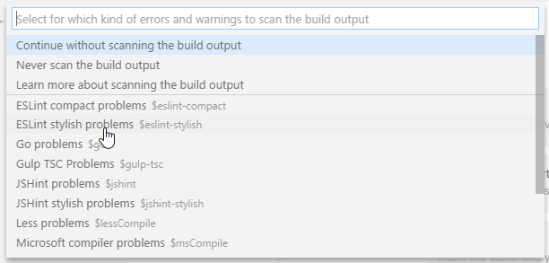
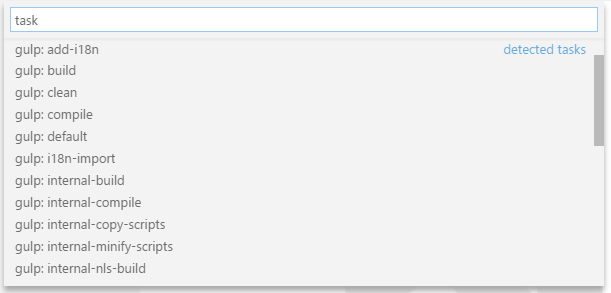

# タスクを利用して外部ツールと統合する <a id="integrate-with-external-tools-via-tasks"></a>

---

Visual Studio Code 1.13以前のバージョンを使用している場合は、以前のバージョンのタスク[ドキュメント](/docs/userguide/tasks-v1.md)を参照してください。

---

ビルド、パッケージング、テストやソフトウェアのシステム構築などのタスクを自動化するツールが多数存在します。いわゆる [Make](https://en.wikipedia.org/wiki/Make_software), [Ant](https://ant.apache.org/), [Gulp](http://gulpjs.com/), [Jake](http://jakejs.com/), [Rake](https://ruby.github.io/rake/), [MSBuild](https://github.com/Microsoft/msbuild)のことです。


これらのツールは主にコマンドラインから実行され、ソフトウェア開発(編集, コンパイル, テスト, デバッグ)以外のジョブを自動化します。開発ライフサイクルにおけるこれらの重要性を考えると、VS Codeからツールを実行してその結果を分析できることはとても便利だといえます。

>**Note:** タスクはワークスペースフォルダー上で作業している場合にのみ使用できます。つまり、1つのファイルを編集しているときは使用できません。

## TypeScript Hello World <a id="typescript-hello-world"></a>

JavaScriptにコンパイルする単純な "Hello World" TypeScriptプログラムから始めましょう。

空のフォルダー"mytask"を作成したのち、そこに`tsconfig.json`ファイルを作成して、VS Codeをこのフォルダーから開始します。

```bash
mkdir mytask
cd mytask
tsc --init
code .
```

次の内容の `HelloWorld.ts`ファイルを作成します

```ts
class Startup {
    public static main(): number {
        console.log('Hello World');
        return 0;
    }
}

Startup.main();
```

`kb(workbench.action.tasks.build)`を押すか**タスク**メニューから**ビルドタスクの実行...**を実行すると、次のピッカーを表示します:


エントリーを選択するとTypeScriptコンパイラーが実行され、TypeScriptファイルがJavaScriptファイルに変換されます。コンパイラーが終了したとき、`HelloWorld.js`ファイルがあるはずです。

このTypeScriptのビルドタスクを既定のビルドタスクとして定義して、**ビルドタスクの実行** (`kb(workbench.action.tasks.build)`)を実行するだけでこれが実行されるようにできます。これを行うには**タスク**メニューから**既定のビルドタスクの構成**を選択してください。これにより利用可能なビルドタスクのピッカーが表示されます。そこで**TypeScript**を選択することで、VS Codeは次の`tasks.json`ファイルを生成します:

```json
{
    // See https://go.microsoft.com/fwlink/?LinkId=733558
    // for the documentation about the tasks.json format
    "version": "2.0.0",
    "tasks": [
        {
            "type": "typescript",
            "tsconfig": "tsconfig.json",
            "group": {
                "kind": "build",
                "isDefault": true
            }
        }
    ]
}
```

`0.1.0`バージョンの`tasks.json`ファイルとは異なり、これは新しいタスクを定義しません。これはVS CodeのTypeScript拡張機能によってTypeScriptのコンパイラータスクに提供され、既定のビルドタスクになります。(?)これにより`kb(workbench.action.tasks.build)`を押すことでTypeScriptコンパイラーが実行できるようになります。

## タスクの自動検出 <a id="task-auto-detection"></a>

現在VS Codeでは、Gulp、Grunt、Jake、npmのタスクを自動検出します。私たちはMavenとC# `dotnet`コマンドでもサポートするように、拡張機能の作成者と協力して対応中です。ランタイムにNode.jsを使用するJavaScriptアプリケーションを開発する場合、たいていは依存関係とスクリプトの実行を記述する`package.json`があります。ここで既に[eslint-starter](https://github.com/spicydonuts/eslint-starter)の例をクローンしている場合は、メニューから**タスクの実行**を実行すれば次のリストが表示されます:


必要なNode.jsモジュールをインストールするために**npm: install**を選択します。問題マッチャーを選択するように求められたら、**Continue without scanning the build output**(タスクの出力をスキャンしません)を選択してください。(編集メモ: この誤訳は次のバージョンのころに治ると思います17/07/29)これにより必要なNode.jsモジュールがすべてインストールされます。

次に`server.js`ファイルを開いて、statementの最後にセミゴロンを追加します(ES Lint starterはセミコロンなしのstatementを設定することに注意してください)。そうしたら**タスクの実行**をもう一度実行します。今回は**npm: run lint**タスクを選択します。問題マッチャーを選択す量に求められたら、**ESLint stylish**を選択してください。



実行すると**問題**ビューにタスクのエラーが1つ発生します:


また、VS Codeは次の内容の`tasks.json`ファイルを作成しています:

```json
{
    // See https://go.microsoft.com/fwlink/?LinkId=733558
    // for the documentation about the tasks.json format
    "version": "2.0.0",
    "tasks": [
        {
            "type": "npm",
            "script": "lint",
            "problemMatcher": [
                "$eslint-stylish"
            ]
        }
    ]
}
```

これは、VS Codeが問題の形式にESLintのstylishを使用して、**npm lint**の出力をスキャンするように指示します。

Gulp、Grunt、Jakeの場合でも同じように自動検出が機能します。下記は[vscode-node-debug](https://github.com/Microsoft/vscode-node-debug)拡張機能に検出されたタスクの例です。



>**Tip:** **Quick Open**(`kb(workbench.action.quickOpen)`)で"`task``kbstyle(Space) <commandname>"と入力すればタスクを実行できます。今回の場合は'task lint'です。

## カスタムタスク <a id="custom-tasks"></a>

ワークスペース内のすべてのタスクやスクリプトが自動検出できるわけではありません。場合によっては独自のカスタムタスクを定義する必要があります。環境によって異なる設定をする必要があるテストを実行するスクリプトがあるとします。このスクリプトは、LinuxとmacOSで`test.sh`、Windowsで`test.cmd`という名前でワークスペース内のスクリプトフォルダーに格納されます。ここで**タスク**メニューから**タスクの構成**を実行すると、次のピッカーが開きます:


>**Note:** タスクランナーのテンプレートが表示されない場合は、フォルダー内に`tasks.json`ファイルが既にある可能性があります。(既にある場合はエディターでこれが開かれます。)今回はファイルを閉じて削除するか名前を変更してください。

私たちはより多くの自動検出の対応に取り組んでおり、このリストは今後さらに小さくなる予定です。私たちは独自のカスタムタスクを作成したいので、リストから**Others**を選択します。これによりタスクのひな形を持つ`task.json`が開きます。内容を次のように置き換えます:

```json
{
    // See https://go.microsoft.com/fwlink/?LinkId=733558
    // for the documentation about the tasks.json format
    "version": "2.0.0",
    "tasks": [
        {
            "taskName": "Run tests",
            "type": "shell",
            "command": "./scripts/test.sh",
            "windows": {
                "command": ".\\scripts\\test.cmd"
            },
            "group": "test",
            "presentation": {
                "reveal": "always",
                "panel": "new"
            }
        }
    ]
}
```

このタスクのプロパティには次のセマンティックがあります:

- **taskName**: ユーザインターフェイスで使用されるタスクの名前。
- **type**: タスクの種類。カスタムタスクの場合`shell`か`process`のどちらかです。`shell`を指定した場合、コマンドはシェルコマンド(例: bash cmd PowerShell)として解釈されます。`process`を指定した場合、コマンドは実行されるプロセスとして解釈されます。`shell`を選択した場合、適切な引数を引用するために、コマンドへの引数は`command`プロパティに埋め込む必要があります。たとえば、テストスクリプトが`--debug`引数を受け入れる場合、コマンドのプロパティは`./scripts/test.sh --debug`になります。
- **command**: 実行する実際のコマンド。
- **windows**: Windows固有のプロパティ。Windows OS上で実行されるとき、既定のプロパティの代わりに使用されます。
- **group**: タスクが属するグループを定義します。この例では`test`グループに属しています。テストグループに属するコマンドは**コマンドパレット**から**テストタスクの実行**で実行できます。
- **presentation**: タスク出力をユーザインターフェイスで処理する方法を制御します。今回の例では、常に出力を統合ターミナルで表示する`always`で、実行するタスクすべてで新しいターミナルが作られます。

ワークスペースを構成するタスクプロパティはこの他にもあります。`kb(editor.action.triggerSuggest)`を使用してIntelliSenseを使用すれば、有効なプロパティの概要を知ることができます。


グローバルメニューバーに加えて、タスクのコマンドは**コマンドパレット**(`kb(workbench.action.showCommands)`)を使用してアクセスできます。ここでは'task'でフィルターをかけることでタスクのコマンドに関係するものを確認できます。


## 出力の動作 <a id="output-behavior"></a>

タスクを実行しているときに、統合ターミナルのパネル動作を制御したいと思うことでしょう。たとえば、タスクに問題があるときは、エディターを最大化して、タスク出力ウィンドウのみを表示したいと思うかもしれません。ターミナルの動作は、タスクの`presentation`プロパティを使用して制御することができます。次のプロパティが提供されています:

- **reveal**: 統合ターミナルのパネルを全面に表示するかどうかを制御します。有効値は次の通りです:
  - *always* - パネルを常に全面で表示します。(既定)
- **never** - ユーザーが **表示** > **統合ターミナル**(`kb(workbench.action.output.toggleTerminal)`)を実行してターミナルパネルを開くまで確認できません。
  - *silent* - エラーと警告がスキャンされなかったときのみ、ターミナルパネルを全面に表示します。
- **focus**: ターミナルにフォーカスするかどうかを制御します。既定は`false`です。
- **echo**: 実行されたコマンドがターミナルにエコーされるかどうかを制御します。既定は`true`です。
- **panel**: タスクをターミナル間で共有するかどうかを制御します。可能値は次の通りです:
  - *shared*: ターミナルは共有され、別タスクの実行出力も同じターミナルに追加されます。
  - *dedicated*: ターミナルは特定のタスクで使用されます。もしそのタスクがもう一度実行されれば、ターミナルが再利用されます。よって異なるタスクの出力は異なるターミナルに表示します。
  - *new*: タスクが実行されるたびに、新しい空のターミナルを使用します。

自動検出のタスクでもターミナルパネルの動作を変更できます。たとえば、上記のESLintの例から**npm: run lint** の出力動作を変更するには、 `presentation`プロパティを追加します:

```json
{
    // See https://go.microsoft.com/fwlink/?LinkId=733558
    // for the documentation about the tasks.json format
    "version": "2.0.0",
    "tasks": [
        {
            "type": "npm",
            "script": "lint",
            "problemMatcher": [
                "$eslint-stylish"
            ],
            "presentation": {
                "reveal": "never"
            }
        }
    ]
}

```

また検出されたタスクと、構成済みのカスタムタスクを一緒にすることもできます。**npm: run lint**タスクを構成し、カスタム**Run Test**タスクを追加する`tasks.json`次のようになります:

```json
{
    // See https://go.microsoft.com/fwlink/?LinkId=733558
    // for the documentation about the tasks.json format
    "version": "2.0.0",
    "tasks": [
        {
            "type": "npm",
            "script": "lint",
            "problemMatcher": [
                "$eslint-stylish"
            ],
            "presentation": {
                "reveal": "never"
            },
        },
        {
            "taskName": "Run tests",
            "type": "shell",
            "command": "./scripts/test.sh",
            "windows": {
                "command": ".\\scripts\\test.cmd"
            },
            "group": "test",
            "presentation": {
                "reveal": "always",
                "panel": "new"
            }
        }
    ]
}

```

## 自動検出タスクのカスタマイズ <a id="customizing-auto-detected-tasks"></a>

上記の通り、`tasks.json`ファイルで自動検出タスクをカスタマイズすることができます。通常はpresentationプロパティを編集するか、問題マッチャーでタスクの出力をスキャンしてエラーと警告を探します。**タスクの実行**のリストから直接カスタマイズすることができます。右の歯車アイコンを押して対応するタスクを`tasks.json`ファイルに挿入します。ESLintを使用しているJavaScriptをLintする次のGulpファイルがあるとします(https://github.com/adametry/gulp-eslint から引用):


```js
const gulp = require('gulp');
const eslint = require('gulp-eslint');

gulp.task('lint', () => {
    // ESLint ignores files with "node_modules" paths.
    // So, it's best to have gulp ignore the directory as well.
    // Also, Be sure to return the stream from the task;
    // Otherwise, the task may end before the stream has finished.
    return gulp.src(['**/*.js','!node_modules/**'])
        // eslint() attaches the lint output to the "eslint" property
        // of the file object so it can be used by other modules.
        .pipe(eslint())
        // eslint.format() outputs the lint results to the console.
        // Alternatively use eslint.formatEach() (see Docs).
        .pipe(eslint.format())
        // To have the process exit with an error code (1) on
        // lint error, return the stream and pipe to failAfterError last.
        .pipe(eslint.failAfterError());
});

gulp.task('default', ['lint'], function () {
    // This will only run if the lint task is successful...
});
```

**タスク**メニューから**タスクの実行**を実行すると、次のピッカーを表示します:


歯車アイコンを押します。これにより次の内容で`tasks.json`が作成されます:

```json
{
    // See https://go.microsoft.com/fwlink/?LinkId=733558
    // for the documentation about the tasks.json format
    "version": "2.0.0",
    "tasks": [
        {
            "type": "gulp",
            "task": "default",
            "problemMatcher": []
        }
    ]
}
```

通常は問題マッチャー(この場合は`$eslint-stylish`)を追加するかpresentation設定を編集します。

## 問題マッチャーによるタスク出力の処理 <a id="processing-task-output-with-problem-matchers"></a>

VS Codeは問題マッチャーを利用して、タスクからの出力を処理することができます。次に標準の例を示します:

- **TypeScript**: `$tsc`は出力のファイル名が開かれたフォルダーと相対的であることを前提としています。
- **TypeScript Watch**: `$tsc-watch`はwatchモードで実行されたとき、`tsc`コンパイラーから報告される問題と一致します。
- **JSHint**: `$jshint`はファイル名が絶対パスとして報告されることを前提としています。
- **JSHint Stylish**: `$jshint-stylish`はファイル名が絶対パスとして報告されることを前提としています。
- **ESLint Compact**: `$eslint-compact`は出力のファイル名が開かれたフォルダーと相対的であることを前提としています。
- **ESLint Stylish**: `$eslint-stylish` は出力のファイル名が開かれたフォルダーと相対的であることを前提としています。
- **Go**: `$go`は`go`コンパイラーから報告される問題と一致します。ファイル名は開いているファイルと相対であることを前提とします。
- **CSharp and VB Compiler**: `$mscompile`はファイル名が絶対パスとして報告されることを前提としています。
- **Less**: `$lessCompile`はファイル名が絶対パスとして報告されることを前提としています。

問題マッチャーは既知の警告やエラー文字列を確認するために、タスクの出力テキストを解析してエディターと問題パネルにインラインで報告します。

また、独自の問題マッチャーも作成可能です。この後の[セクション](/docs/userguide/tasks.md#defining-a-problem-matcher)で解説します。

## タスクにキーボードショートカットをバインド <a id="binding-keyboard-shortcuts-totasks"></a>

タスクを頻繁に実行する必要があるとき、タスクのキーボードショートカットを定義することができます。

たとえば`ctrl+h`を**Run tests**タスクに上書きするバインドなら、`keybindings.json`に次を追加します:

```json
{
    "key": "ctrl+h",
    "command": "workbench.action.tasks.runTask",
    "args": "Run tests"
}
```

## 変数置換 (変数) <a id="variable-substitution"></a>

タスクを構成するとき、事前に定義された共通変数を利用すると便利なことがよくあります。VS Codeは`tasks.json`ファイル内で文字列の変数置換をサポートしており、次の定義された変数を持っています:

- **${workspaceRoot}** VS Codeで開いたフォルダーのパス
- **${workspaceRootFolderName}** VS Codeで開いたスラッシュ(/)を含まないフォルダーの名前
- **${file}** 現在開いているファイル
- **${relativeFile}** `workspaceRoot`と相対的な現在開いているファイル
- **${fileBasename}** 現在開いているファイルのベース名
- **${fileBasenameNoExtension}** 現在開いているファイルから拡張子を含まないファイルの名前
- **${fileDirname}** 現在開いているファイルのディレクトリ名
- **${fileExtname}** 現在開いているファイルの拡張子
- **${cwd}** タスクランナー起動時の現在の作業ディレクトリ
- **${lineNumber}** アクティブなファイルの現在選択されている行番号

 **${env.Name}**を利用して、環境変数を参照することもできます(例:${env.PATH})。環境変数のNAMEは必ず大文字と小文字を区別してください。例: `env.Path`(windows)

次の例は、現在開いているファイルをTypeScriptのコンパイラーに渡すカスタムタスク構成の例です。

```json
{
    "taskName": "TypeScript compile",
    "type": "shell",
    "command": "tsc ${file}",
    "problemMatcher": [
        "$tsc"
    ]
}
```

## OS特有のプロパティ <a id="operating-system-specific-properties"></a>

タスクシステムは、OS固有の定義をサポートしています。これを行うには、`tasks.json`ファイルにOSのリテラル(名前)を書き込み、その中に対応するプロパティを指定します。

次の例は、Node.jsの実行可能ファイルの場所をコマンドとして使用する例であり、WindowsとLinuxで異なった扱い受けます:

```json
{
    "taskName": "Run Node",
    "type": "process",
    "windows": {
        "command": "C:\\Program Files\\nodejs\\node.exe"
    },
    "linux": {
        "command": "/usr/bin/node"
    }
}
```

有効なプロパティは、Windowsでは`windows`、Linuxでは`linux`、macOSでは`osx`です。OS特有のスコープで定義したプロパティは、グローバルスコープで定義するプロパティより優先されます。

グローバルスコープでタスクのプロパティを定義することもできます。これがあるとき、同じプロパティーで異なる値を定義しない限りそのタスクで使用されます。次の例では、新しいパネルで必ず実行するように定義する`presentation`プロパティーを使用しています:

```json
{
    // See https://go.microsoft.com/fwlink/?LinkId=733558
    // for the documentation about the tasks.json format
    "version": "2.0.0",
    "presentation": {
        "panel": "new"
    },
    "tasks": [
        {
            "taskName": "TS - Compile current file",
            "type": "shell",
            "command": "tsc ${file}",
            "problemMatcher": [
                "$tsc"
            ]
        }
    ]
}
```

## 実践的なタスクの例 <a id="example -of-tasks-in-action"></a>

タスクの機能を最大限活用するために、VS Codeのタスクを使用してlintやコンパイラーなどの外部ツールを統合する方法を次に示します:

### TypeScriptをJavaScriptに変換 <a id="transpiling-typescript-to-javascript"></a>

[TypeScriptトピック](/docs/languages/typescript.md#transpiling-typescript-into-javascript)では、TypeScriptをJavaScriptに変換し、VS Code内で関連するエラーを監視するタスクを作成する例を解説します。

### MarkdownをHTMLにコンパイル <a id="compiling-markdown-to-html"></a>

Markdownトピックでは、MarkdownをHTMLにコンパイルするための2つの例を解説しています。

1. [ビルドタスクを利用して手動のコンパイルを行う](/docs/languages/markdown.md#compiling-markdown-into-html)
2. [ファイルウォッチャーによるコンパイルステップの自動化]（/ docs / languages / markdown.md＃automating-markdown-compilation）

### LessとSassをCSSへ変換 <a id="transpiling-less-and-sass-into-css"></a>

CSSトピックでは、タスクを使用してCSSファイルを生成する方法の例を開設しています。

1. [ビルドタスクを利用して手動で変換を行う](/docs/languages/css.md#transpiling-sass-and-less-into-css)
2. [file watcherによるコンパイル手順の自動化](/docs/languages/css.md#automating-sassless-compilation)

## 問題マッチャーの定義 <a id="defining-a-problem-matcher"></a>

VS Codeは一般的な問題のマッチャーのいくつかを同封しています。ですが実際には多くのコンパイラーとlintのツールがあり、これらツールはそれぞれ独自の形式のエラーと警告を生成します。この形式を利用して独自の問題マッチャーを作成することができます。

ここに、開発者が**printf**を**prinft**と間違えた`helloWorld.c`プログラムがあります。これを[gcc](https://gcc.gnu.org/)でコンパイルすれば次の警告を表示します:

```bash
helloWorld.c:5:3: warning: implicit declaration of function ‘prinft’
```

出力のメッセージをキャプチャして、VS Codeで該当する問題を表示できる問題マッチャーを作りたいと思います。問題マッチャーは[正規表現](https://en.wikipedia.org/wiki/Regular_expression)に大きく依存しています。次のセクションは正規表現に精通していることを前提としています。

>**Tip:** 私たちは[RegEx101 playground](https://regex101.com/)が正規表現を確認する最適な方法であることを確認しています。

上記の警告(エラー)をキャプチャするマッチャーは次のようになります:

```json
{
    // The problem is owned by the cpp language service.
    "owner": "cpp",
    // The file name for reported problems is relative to the opened folder.
    "fileLocation": ["relative", "${workspaceRoot}"],
    // The actual pattern to match problems in the output.
    "pattern": {
        // The regular expression. Example to match: helloWorld.c:5:3: warning: implicit declaration of function ‘prinft’ [-Wimplicit-function-declaration]
        "regexp": "^(.*):(\\d+):(\\d+):\\s+(warning|error):\\s+(.*)$",
        // The first match group matches the file name which is relative.
        "file": 1,
        // The second match group matches the line on which the problem occurred.
        "line": 2,
        // The third match group matches the column at which the problem occurred.
        "column": 3,
        // The fourth match group matches the problem's severity. Can be ignored. Then all problems are captured as errors.
        "severity": 4,
        // The fifth match group matches the message.
        "message": 5
    }
}
```

ファイル、行、メッセージのプロパティが必須であることに注意してください。

次の`tasks.json`ファイルは先ほどの例からコメントを削除した、実際のタスクです:

```json
{
    "version": "0.1.0",
    "command": "gcc",
    "args": ["-Wall", "helloWorld.c", "-o", "helloWorld"],
    "problemMatcher": {
        "owner": "cpp",
        "fileLocation": ["relative", "${workspaceRoot}"],
        "pattern": {
            "regexp": "^(.*):(\\d+):(\\d+):\\s+(warning|error):\\s+(.*)$",
            "file": 1,
            "line": 2,
            "column": 3,
            "severity": 4,
            "message": 5
        }
    }
}
```

VS Code内でこれを実行し、`kb(workbench.actions.view.problems)`をおして次のような問題のリストを表示します:


パターン内で使用可能なプロパティはもう複数あります:

- **location** if the problem location is line or line,column or startLine,startColumn,endLine,endColumn then our generic location match group can be used.
- **endLine** the match group index for the problem's end line. Can be omitted if no end line value is provided by the compiler.
- **endColumn** the match group index for the problem's end column. Can be omitted if no end column value is provided by the compiler.
- **code** the match group index for the problem's code. Can be omitted if no code value is provided by the compiler.

>**Note:** これらパターンにはファイル、メッセージ、行、場所のマッチグループを指定する必要があります。

## 複数行の問題マッチャーの定義 <a id="defining-a-multi-line-problem-matcher></a>

いくつかのツールではstylishを利用している場合に、ソースファイル内の問題を複数行に広げて表現します。例として[ESLint](http://eslint.org/)をとります。このstylishモードでは次のような出力を得ます:

```bash
test.js
  1:0   error  Missing "use strict" statement                 strict
✖ 1 problems (1 errors, 0 warnings)
```

私たちの問題マッチャーは行を基準とするので、メッセージ(1:0   error  Missing "use strict" statement)で使用したものとは異なる正規表現を使用して、test.js(ファイル名)をキャプチャする必要があります。

これを行うには、`pattern`プロパティで複数の問題パターンを使用します。この方法によって一致させたい行ごとにパターンを定義します。

次の問題パターンは、stylishモードにおいてESLintからの出力に対応できます。ですが、これにはまだ問題がありますのでこの次で解決しましょう。次のコードで、1番目の正規表現はファイル名を取得し、2番目の正規表現は行、列、重大度、メッセージおよびエラーコードを取得します。

```json
{
    "owner": "javascript",
    "fileLocation": ["relative", "${workspaceRoot}"],
    "pattern": [
        {
            "regexp": "^([^\\s].*)$",
            "file": 1
        },
        {
            "regexp": "^\\s+(\\d+):(\\d+)\\s+(error|warning|info)\\s+(.*)\\s\\s+(.*)$",
            "line": 1,
            "column": 2,
            "severity": 3,
            "message": 4,
            "code": 5
        }
    ]
}
```

ただし、リソースに複数の問題があるならこれは機能しません。たとえば、ESLintからの次の出力を想像してみてください:

```bash
test.js
  1:0   error  Missing "use strict" statement                 strict
  1:9   error  foo is defined but never used                  no-unused-vars
  2:5   error  x is defined but never used                    no-unused-vars
  2:11  error  Missing semicolon                              semi
  3:1   error  "bar" is not defined                           no-undef
  4:1   error  Newline required at end of file but not found  eol-last
✖ 6 problems (6 errors, 0 warnings)
```

パターンの最初の正規表現は "test.js"と一致し、次に "1:0  error ...".と一致します。次の行の"1:9  error ..."は処理されますが、先ほどの正規表現では一致しないため問題はキャプチャされません。

これを機能させるために、パターン最後の正規表現で**loop**プロパティを指定することができます。trueに設定すると正規表現が一致するかぎり、出力内の各行にし対してマッチャーの最後のパターンを適用し続けるようにタスクシステムに指示します。

すべてのパターンでキャプチャされた情報は、最後のパターンでキャプチャされた情報と組み合わせて、VS Code内の問題に変換されます。

これはESLintにおけるstylish問題を完全にキャプチャするための問題マッチャーです:

```json
{
    "owner": "javascript",
    "fileLocation": ["relative", "${workspaceRoot}"],
    "pattern": [
        {
            "regexp": "^([^\\s].*)$",
            "file": 1
        },
        {
            "regexp": "^\\s+(\\d+):(\\d+)\\s+(error|warning|info)\\s+(.*)\\s\\s+(.*)$",
            "line": 1,
            "column": 2,
            "severity": 3,
            "message": 4,
            "code": 5,
            "loop": true
        }
    ]
}
```

## バックグラウンド / 監視タスク <a id="background-watching-tasks"></a>

いくつかのツールはバックグラウンドでの動作をサポートしています。これはファイルシステムでファイルの変更を監視し、ディスク上でファイルが変更されたときにタスクをトリガーします。`Gulp`はこのような機能を[gulp-watch](https://www.npmjs.com/package/gulp-watch)により提供しています。TypeScriptコンパイラ`tsc`では、これを`--watch command`のラインオプションによってサポートしています。

バックグランドのタスクはVS Code内でのフィードバックを提供するために、問題マッチャーは出力における追加の情報を検出するために、いずれも状態を示す追加の情報を使用する必要があります。`tsc`を例にとってみましょう。コンパイラーがwatchモードで起動されると、次の追加情報がコンソールに出力されます:

```
> tsc --watch
12:30:36 PM - Compilation complete. Watching for file changes.
```

ディスク上の問題があるファイルが変更されると、次の出力を表示します:

```
12:32:35 PM - File change detected. Starting incremental compilation...
src/messages.ts(276,9): error TS2304: Cannot find name 'candidate'.
12:32:35 PM - Compilation complete. Watching for file changes.
```

出力では次のようなパターンを監視しています:

- `File change detected. Starting incremental compilation...`がコンソールに表示されているときコンパイラーを実行する。
-  `Compilation complete. Watching for file changes.`がコンソールに表示されているときコンパイラーを停止します。
- この間に問題は報告されます。
- またコンパイラーは最初の開始(`File change detected. Starting incremental compilation...`がコンソールに表示されていない場合)でも一度実行します。

この情報をキャプチャするために、問題マッチャーは`watching`プロパティを提供できます。

tscコンパイラーの場合は次のようになります:

```json
"watching": {
    "activeOnStart": true,
    "beginsPattern": "^\\s*\\d{1,2}:\\d{1,2}:\\d{1,2}(?: AM| PM)? - File change detected\\. Starting incremental compilation\\.\\.\\.",
    "endsPattern": "^\\s*\\d{1,2}:\\d{1,2}:\\d{1,2}(?: AM| PM)? - Compilation complete\\. Watching for file changes\\."
}
```

問題マッチャーの`watching`プロパティに加えて、タスク自体に`isBackground`とマークして、タスクがバッググラウンドで実行し続けるようにする必要があります。

watchモードで機能する`tsc`タスクの完全な`tasks.json`は次のようになります:

```json
{
    "version": "0.1.0",
    "command": "tsc",
    "suppressTaskName": true,
    "tasks": [
        {
            "taskName": "watch",
            "args": ["--watch"],
            "isBackground": true,
            "problemMatcher": {
                "owner": "typescript",
                "fileLocation": "relative",
                "pattern": {
                    "regexp": "^([^\\s].*)\\((\\d+|\\,\\d+|\\d+,\\d+,\\d+,\\d+)\\):\\s+(error|warning|info)\\s+(TS\\d+)\\s*:\\s*(.*)$",
                    "file": 1,
                    "location": 2,
                    "severity": 3,
                    "code": 4,
                    "message": 5
                },
                "watching": {
                    "activeOnStart": true,
                    "beginsPattern": "^\\s*\\d{1,2}:\\d{1,2}:\\d{1,2}(?: AM| PM)? - File change detected\\. Starting incremental compilation\\.\\.\\.",
                    "endsPattern": "^\\s*\\d{1,2}:\\d{1,2}:\\d{1,2}(?: AM| PM)? - Compilation complete\\. Watching for file changes\\."
                }
            }
        }
    ]
}
```

##"0.1.0"から"2.0.0"に変換 <a id="convert-from-010-to-200"></a>

`2.0.0`バージョンには新しい自動検出機能が多くあります。既存の`tasks.json`ファイルを削除することで、まだ機能するタスクを確認することができます。既存の`tasks.json`を`tasks.json.off`に変更してみてください。カスタマイズの属性が多くある場合でもバージョンの属性を`"2.0.0"`に変更することで切り替えることができます。いくつかのプロパティが非推奨になるため、警告が表示される可能性があります。非推奨の項目を取り除く方法は次の通りです:

- **isShellCommand**: 代わりに`"type": "shell"`プロパティを使用します。
- **isBuildCommand**: 代わりに`"group": "build"`プロパティを使用します。
- **isTestCommand**: 代わりに`"group": "test"プロパティを使用します。
- **echoCommand**: 代わりに`"presentation" : { "echo": "..." }`プロパティを使用します。
- **showOutput**: 代わりに`"presentation" : { "reveal": "..." }`プロパティを使用します。
- **suppressTaskName**: 既定ではタスクのバージョンが`0.1.0`のとき、タスク名が引数のリストが追加されます。`2.0.0`バージョンではタスクごとのコマンドをサポートしているので、コマンドをタスクにインライン化してそれに応じた引数を指定します。
次の`0.1.0`の構成を考えます:

```json
{
    "version": "0.1.0",
    "isShellCommand": true,
    "command": "script",
    "tasks": [
        {
            "taskName": "Run tests",
            "suppressTaskName": true,
            "args": [
                "test"
            ]
        }
    ]
}
```

対応する`2.0.0`の構成は次のようになります:

```json
{
    "version": "2.0.0",
    "tasks": [
        {
            "taskName": "Run tests",
            "type": "shell",
            "command": "script test"
        }
    ]
}
```

- **taskSelector**: このコマンドをタスクに移動して、コマンド内でタスクセレクターを選択します。

```json
{
    "version": "0.1.0",
    "command": "msbuild",
    "args": [
        "/property:GenerateFullPaths=true"
    ],
    "taskSelector": "/t:",
    "tasks": [
        {
            "taskName": "build"
        }
    ]
}
```
対応する`2.0.0`の構成は次のようになります:

```json
{
    "version": "2.0.0",
    "tasks": [
        {
            "taskName": "build",
            "command": "msbuild",
            "args": [
                "/property:GenerateFullPaths=true",
                "/t:build"
            ]
        }
    ]
}
```

新しいタスクランナーで`0.1.0`バージョンの`tasks.json`ファイルを使用したい場合、`runner`プロパティを`tasks.json`ファイルに追加します:`"runner": "terminal"`

## 次のステップ

That was tasks - let's keep going...

* [tasks.json Schema](/docs/userguide/tasks-appendix.md) - You can review the full `tasks.json` schema and descriptions.
* [Basic Editing](/docs/userguide/codebasics.md) - Learn about the powerful VS Code editor.
* [Code Navigation](/docs/userguide/editingevolved.md) - Move quickly through your source code.* [Language Support](/docs/languages/overview.md) - Learn about our supported programming languages, both shipped with VS Code and through community extensions.
* [Debugging](/docs/userguide/debugging.md) - VS Codeでソースコードを直接デバッグ
