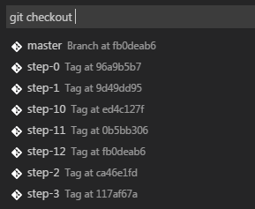

Visual Studio Codeは [Git](http://git-scm.com/)を統合してサポートしています。これは開発している間、コミット管理するための優れた選択肢になります。

>**Note:** VS CodeはPCにインストールされたGitを利用します。ですから機能を使えるように[install Git](http://git-scm.com/download)を入手してください。なお、少なくともバージョン`2.0.0`以上をインストールします。

>**Tip:** VS Codeは任意のGitレポジストリで大きな効果を発揮します。もしGitのプライベートホストを持っていない場合は、無料の[Visual Studio Team Services](https://www.visualstudio.com/products/visual-studio-team-services-vs)をぜひ活用してください。[Click here to sign-up](https://go.microsoft.com/fwlink/?LinkID=307137&campaign=o~msft~code~vc)

## 概要


画像左側のGitアイコンは現在のリポジトリーにある**変更の数**表示します。これをクリックすると、次のような詳細を表示します:
**ステージングしていない変更**、**ステージングした変更**、**未解決の競合マージ**

各項目をクリックすることで**変更したファイル**内の詳細を表示します。ステージングしていない変更は、右のエディターでもファイル編集できることに留意してください。

またVS Codeの左下には**レポジストリの状態**を示すインジゲーターがあります。状態として**現在のブランチ**、**dirty indicators**そして**incoming and outgoing commits**を示します。ブランチから**チェックアウト**するには、このボタンを押してリストから任意のGit referenceを選択してください。

> **Tip:** GitリポジトリのサブディレクトリをVS Codeで開いた場合でもGitは通常通り動作し、リポジトリ内のすべての変更を表示します。ただし現在のワークスペース外ファイル変更は、それを示すツールチップと共に表示します。

## Gitステータスバーの操作

チェックアウトしたブランチが上流ブランチに設定されている場合、ブランチインジゲーターの隣に**同期**ボタンを表示します。


上流ブランチが設定されておらずGitリポジトリがリモートに設定されている場合**パブリッシュ**ボタンを有効にします。これにより、現在のブランチをリモートに公開します。


## コミット

**ステージング**と**ステージング解除**はファイルのコンテキスト操作か、ドラッグアンドドロップによって行うことができます。

これをコミットするには、上部にあるテキストボックスにコミットメッセージを入力して`kbstyle(Ctrl+Enter)` (Mac: `kbstyle(⌘+Enter)`)を押します。一部変更をステージしたなら、それらの変更のみをコミットしますし、そうでない場合はすべての変更をコミットします。

私たちは段階的なコミット方法が素晴らしいワークフローであることを知っています。たとえば先ほどの画像で`config.js`だけがコミットに含まれています。次に、連続したコミット操作によって `vinyl-zip.js` `tests.js` の両方を別々にコミットすることでしょう。

(編集メモ: 原文の意味がくみ取れず直訳

より具体的な**コミット操作**はGitビュー上部の `...`メニューで確認できます。

## ブランチとタグ

**Quick Open**を使用してVS Code内でブランチを作成およびチェックアウトすることができます。`kb(workbench.action.quickOpen)`を押して`git`と`スペース`を入力します。これによって以下を表示します:


`checkout`と入力して`kbstyle(Space)`をもう一度押せば、現在のレポジストリ内すべてのブランチやタグを含むドロップダウンを表示します。



`git branch`コマンドを使用することで、すぐに新しいブランチを作成できます。VS Codeでは新しいブランチ名を入力するだけで、 ブランチを作成しそれに切り替えてくれます。

## リモート

チェックアウトしたブランチが、リモートで[上流リンク](https://git-scm.com/book/ja/v2/Git-%E3%81%AE%E3%83%96%E3%83%A9%E3%83%B3%E3%83%81%E6%A9%9F%E8%83%BD-%E3%83%AA%E3%83%A2%E3%83%BC%E3%83%88%E3%83%96%E3%83%A9%E3%83%B3%E3%83%81)を持っているなら、 VS Codeは**プッシュ**、**プル**、**同期**の便利な操作を可能にします(**sync**は**push**のあと**pull**)。`...`メニュー でこれら操作を確認できます。

>**Tip:** VS Codeがその都度Gitリモートに認証情報を問い合わせるのを避けるために、[set up a credential helper](https://help.github.com/articles/caching-your-github-password-in-git/)を設定するべきです。これを設定したくない場合は `git.autofetch`[設定](/docs/getstarted/settings.md)で自動フェチを無効にすることを検討する必要があります。

## ガターインジケーター

Gitリポジトリのフォルダーを開いて編集に取り組み始めると、VS Codeは便利な注釈ガターと概要ルーラーを追加します。

* 赤の三角 : 削除された行
* 緑のバー : 追加された行
* 青のバー : 変更された行


## マージの競合


競合はVS Codeによって認識できますので、マーカー提供して解決の手伝いをしようとします。解決したなら競合するファイルをステージングして、変更をコミットしてください。

## 差分表示

私たちのGitツールはVS Code内で差分表示をサポートしています。


>**Tip:** エクスプローラーか**OPEN EDITORS**リストで1つめのファイルを右クリックして**変更を開く**を選択します。その後2つ目のファイルを同じように選択することで、2つのファイルを比較することができます。あるいは`kb(workbench.action.showCommands)`を押して**File: Compare Active File With...**を選択して以前開いたファイルを表示することでも可能です。

## Git出力ウィンドウ

VS CodeがどのようにGitを使用しているのか見ることができます。何か変なことが起きている場合や、単に好奇心を刺激したいとき便利です :)

Git出力ウィンドウを表示するには **表示** > **出力** を表示してドロップダウンから`Git`を選択します。

## リポジトリーの初期化

ワークスペースがGitの管理下にない場合は**Initialize git repository**コマンドを利用して簡単にGitリポジトリーを作成できます。VS Codeが既存のGitリポジトリーを検出しない場合 **このワークスペースはまだGitソース管理下にありません。**を表示して、**Initialize git repository**コマンドを利用可能にします。


**Initialize git repository**を実行するとGitレポジストリに必要なメタデータファイルを作成して、ワークスペースファイルをステージされていない変更として表示します。

## Gitパッチ/差分モード

コマンドラインからVS Codeを起動する場合、現在のインスタンスを閉じるまでコマンド待機する`--wait`引数を設定できます。あなたがGitの外部エディターとしてVS Codeを設定するときに便利です。

実行手順:

1. コマンドラインで`code --help`を実行できることを確認してください。
    * ヘルプを表示しない場合は、次を確認します。
        * Mac: **コマンドパレット** から **Shell Command: Install 'Code' command in path** を選択
        * Windows: インストール時に**Add to PATH**を選択
        * Linux: インストールを新しい.debか.rpmパッケージで行ったか確認
2. コマンドラインから`git config --global core.editor "code --wait"`を実行してください。

`git config --global -e`を実行してGitを設定するエディターにVS Codeを使用できます。


DiffツールとしてVS Codeを使うにはGitの設定に次を追加します。

```bash
[diff]
    tool = default-difftool
[difftool "default-difftool"]
    cmd = code --wait --diff $LOCAL $REMOTE
```

これはVS Codeが受け取れる`--diff`オプションを活用して、2つのファイルを並べて比較します。

VS Codeをエディターとして使用できる例を次に示します:

* `git rebase HEAD~3 -i` - インタラクティブなリベースを行う
* `git commit` - コミットメッセージに使う
* `git add -p` - `kbstyle(e)` によるインタラクティブな追加を行う
* `git difftool <commit>^ <commit>` - 差分エディターとして使う

## 次のステップ

* [Intro Video - Git Version Control](/docs/introvideos/versioncontrol.md) - An introductory video providing an overview of VS Code Git support.
* [Basic Editing](/docs/userguide/codebasics.md) - Learn about the powerful VS Code editor.
* [Code Navigation](/docs/userguide/editingevolved.md) - Move quickly through your source code.
* [Debugging](/docs/userguide/debugging.md) - This is where VS Code really shines
* [Tasks](/docs/userguide/tasks.md) - Running tasks with Gulp, Grunt and Jake.  Showing Errors and Warnings

## よくある質問

**Q: レポジストリを初期化しましたが`...`メニューがグレーのままです**

**A:** **プッシュ、プル、同期** するにはGitのoriginを設定する必要があります。ホストからURLを取得したのち少しのコマンドライン操作をしてGit設定にURLを追加してください。たとえばVisual Studio Team Servicesの場合:

```
> git remote add origin https://<AccountName>.visualstudio.com/DefaultCollection/_git/<RepoName>
> git push -u origin master
```

**Q: Gitの代わりにTeam Foundation version control (TFVC) を使用しています。何をすべきですか?****

**A:** Team Foundationのコマンドラインツールを使用してください。

* クラスプラットホームを使う場合: [Cross-Platform Command-Line Client Beginner's Guide](https://msdn.microsoft.com/en-us/library/hh873092.aspx)
* Windowsの場合: [Use Team Foundation version control commands](https://msdn.microsoft.com/en-us/library/vstudio/cc31bk2e.aspx)

**Q: なぜプル、プッシュ、同期が終わりませんか?**

これは大抵Gitに認証情報がなく、資格情報プロンプトを取得していないことを意味しています。

VS Codeなしで認証情報を登録して、リモートサーバーからプルとプッシュするには[credential helper](https://help.github.com/articles/caching-your-github-password-in-git/)を設定します

**Q: 2段階認証を登録したTeam ServicesアカウントでGitサインインするにはどうすればいいですか?**

**A:** [Git credential helpers](http://blogs.msdn.com/b/visualstudioalm/archive/2015/11/18/visual-studio-team-services-git-credential-manager-for-mac-and-linux.aspx) を使います。こちらからダウンロードしてください。
[Git Credential Manager for Mac and Linux](https://github.com/Microsoft/Git-Credential-Manager-for-Mac-and-Linux)
[Git Credential Manager for Windows](https://github.com/Microsoft/Git-Credential-Manager-for-Windows).

**Q: Visual Studio Codeを使用して、膨大な数のファイルがあるフォルダーのGitリポジトリーを誤って初期化しました。それによってVS Codeは反応しないかハングします。どうすればいいですか?**

**A:** まずVS Code終了し、コマンドプロントで次を実行します

```bash
code -n
```

これはVS Codeを新しいウィンドウで開きます。

次に(意図しないレポジストリの初期化を削除したいと仮定し)、レポを初期化した大きなフォルダー内の`.git`サブフォルダーを探して削除します。なお`.git`は隠しフォルダーなのでこれを表示する必要があります。たとえばWindowsのコマンドプロンプトで`dir .git /ah`を実行すると、特定のフォルダー内の`.git`という名前の隠しフォルダーを表示できます。初期フォルダーをどこに作成したかわからない場合は、ルートフォルダで`dir .git /ah /s` を実行してサブフォルダーを含む`.git`フォルダーを表示します。

**Q: GitHub DesktopをインストールしていますがVS Codeはこのgitを無視します**

**A:** VS Codeは`git.exe`が`PATH`(`$PATH` on Mac or Linux)にあることを期待します。ですが **GitHub Desktop**は独自にgitバイナリーを内包し、`git.exe`を`PATH`に登録しません。

次のいずれかを実行します:

* `PATH`に`git.exe`を登録してVS Codeを再起動する
* `git.path`[設定](/docs/getstarted/settings.md)で`git.exe`の場所を設定する

**GitHub Desktop for win**の場合、通常`git.exe`は`C:\Users\USERNAME\AppData\Local\GitHub\PortableGit_COMMITID\ming32\bin`にあります。AppData\Local\GitHubで`git.exe`を検索すると、バイナリーが見つかるはずです。

[git-scm](http://git-scm.com/)からGitをインストールすることもできますが、**GitHub Desktop**とは干渉しません。
