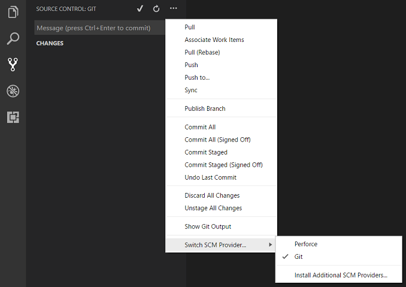
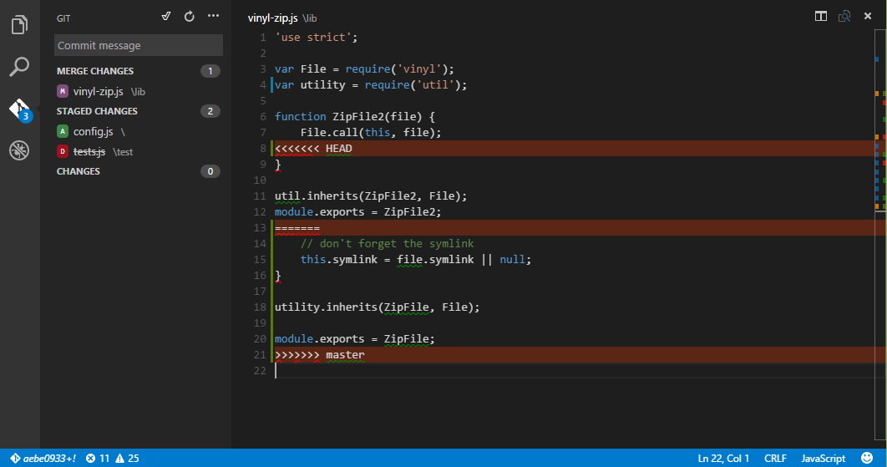
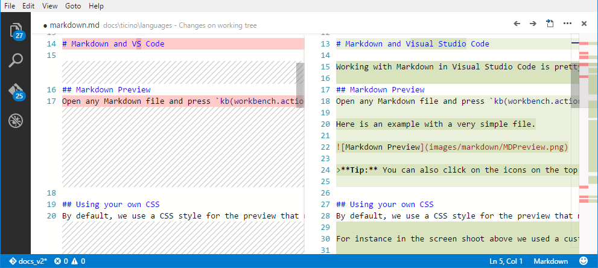
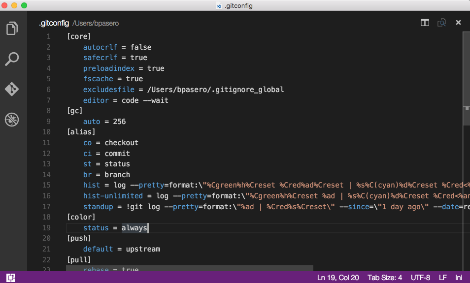

Visual Studio Code ではソース コントロールを統合しており [Git](https://git-scm.com/) のサポートを初めから含んでいます。その他のソースコントロールは[拡張機能](/docs/editor/extension-gallery.md)を通して利用可能です。

## SCM プロバイダーの切り替え  <a id="switch-scm-providers"></a>

VS Code は Git のソース コントロール プロバイダーが有効になっていますが、別の SCM プロバイダーをインストールして切り替えることができます。**ソースコントロール**ビューの**その他**(...)ボタンをクリックすることで** SCM プロバイダーを切り替える**コマンドを表示できます。このコマンドは**拡張機能**ビューから **Install Additional SCM Providers...** を実行して入手するSCMプロバイダーの一覧も表示します。



## Git サポート <a id="git-support"></a>

VS Code には Git のソース コントロール マネージャー(SCM) 拡張機能が付属しています。ソース コントロール UI とワークフローのほとんどは他の SCM 拡張機能と共通しています。ですから Git サポートについて確認することは他のプロバイダでの使い方を理解するのに役立つことになります。

>**Note:** Git を初めて利用するなら [git-scm](https://git-scm.com/documentation) の[book](https://git-scm.com/book), [video](https://git-scm.com/video/what-is-git), [cheat sheets](https://services.github.com/on-demand/downloads/github-git-cheat-sheet.pdf) が入門に役に立つことでしょう。このドキュメントは Git に慣れていることを前提としています。


>**Note:** VS Code では PC にインストールされた Git を利用します。ですからまず[ Git をインストール](https://git-scm.com/download)する必要があります。バージョン `2.0.0` 以上をインストールしてください。

>**Tip:** VS Code は Git リポジトリで大きな効果を発揮します。もし Git のプライベートホストを持っていないなら無料の [Visual Studio Team Services](https://www.visualstudio.com/products/visual-studio-team-services-vs) をぜひ活用してください。[Click here to sign-up](https://go.microsoft.com/fwlink/?LinkID=307137&campaign=o~msft~code~vc)

左側にある SCM アイコンは現在のリポジトリ内の**変更の数**を表示します。これをクリックすると現在のリポジトリ内にある変更を詳細表示します: **CHANGES**、**STAGED CHANGES**、**MERGE CHANGES**

各項目をクリックすることで**変更したファイル**内の詳細を表示します。ステージしていない変更は右のエディタでもファイル編集できます。

また VS Code の左下には**リポジトリの状態**を示すインジゲーターがあります。状態として**現在のブランチ**、**dirty indicators**、**incoming and outgoing commits** を示します。ブランチから**チェックアウト**するにはこのボタンを押してリストから任意の参照を選択してください。

> **Tip:** Git リポジトリのサブディレクトリを VS Code で開くことができます。この場合でも Git は通常通り動作しリポジトリ内のすべての変更を表示します。ただし現在のワークスペース外ファイル変更はそれを示すツールチップと共に表示します。

## Git ステータスバーの操作 <a href="git-status-bar-actions"></a>

チェックアウトしたブランチが上流ブランチに設定されているときはブランチインジゲーターの隣に **Synchronize changes** ボタンが表示されます。**Synchronize Changes** はローカルリポジトリにリモートから変更をプルし、ローカルのコミットをアップストリームにプッシュします。


上流ブランチが設定されておらず Git リポジトリにリモートが設定されている場合**パブリッシュ**ボタンを有効にします。これにより現在のブランチをリモートに公開します。


## コミット <a href="commit"></a>

**ステージング**と**ステージング解除**はファイルのコンテキスト操作か、D&D によって行います。

コミットには上部にあるテキストボックスにコミットメッセージを入力して`kbstyle(Ctrl+Enter)` (Mac: `kbstyle(⌘+Enter)`)を押します。一部変更をステージしたならそれらの変更のみをコミットしますし、そうでない場合はすべての変更をコミットします。

私たちは段階的に行うコミット方式が良いワークフローになることを知っています。例えば先ほどの画像では `config.js` だけをコミットに含みます。次に連続のコミット操作によって `vinyl-zip.js` `tests.js` の両方を別々にコミットすることでしょう。

より具体的な**コミット操作**は Git ビュー上部の `...`メニューで確認できます。

## リポジトリをクローン <a id="cloning-a-repository"></a>

**コマンド パレット** (`kb(workbench.action.showCommands)`)で **Git: Clone** コマンドを使用すると Git リポジトリをクローンすることができます。その後リモートリポジトリの URL とローカルリポジトリを配置するディレクトリを確認されます。

## ブランチとタグ <a href="branches-and-tags"></a>

**コマンドパレット** (`kb(workbench.action.showCommands)`)で **Git: Create Branch...** や **Git: Checkout to..** を使用して VS Code 内で直接ブランチを作成およびチェックアウトできます。

**Git: Checkout to...** を実行すると現在のリポジトリ内のすべてのブランチまたはタグを含むドロップダウンが表示されます。


**Git: Create Branch...** コマンドを使用することですぐに新しいブランチを作成できます。新しいブランチ名を入力するだけでブランチを作成しそれに切り替えます。

## リモート <a href="remotes"></a>

チェックアウトしたブランチがリモートで[上流リンク](https://git-scm.com/book/ch3-5.html) であれば、 VS Code は**プッシュ**、**プル**、**同期** の便利な操作を可能にします(**sync**は**push**のあと**pull**)。`...` メニューでこれら操作を確認できます。

>**Tip:** VS Code がその都度リモートに認証情報を問い合わせるのを避けるために、[credential helper](https://help.github.com/articles/caching-your-github-password-in-git/) を設定する必要があります。これを設定したくない場合は `git.autofetch` [設定](/docs/getstarted/settings.md)で自動フェチを無効にすることを検討してください。

## ガター インジケーター <a href="gutter-indicators"></a>

Git リポジトリのフォルダを開いて編集を始めたなら VS Code は便利な注釈ガターと概要ルーラーを追加します。

* 赤の三角 : 削除された行
* 緑のバー : 追加された行
* 青のバー : 変更された行


## マージの競合 <a href="merge-conficts"></a>



競合は VS Code によって認識できますのでマーカー提供して解決の手伝いをしようとします。解決したらファイルをステージングして変更をコミットします。

## 差分表示 <a href="viewing-diffs"></a>

Git ツールは VS Code 内での差分表示に対応しています。



>**Tip:** エクスプローラーか **OPEN EDITORS** リストで 1 つめのファイルを右クリックして**変更を開く**を選択します。その後 2 つめのファイルを同じように選択することで、2 つのファイルを比較することができます。あるいは `kb(workbench.action.showCommands)` を押して **File: Compare Active File With...** を選択して以前開いたファイルを表示することでも可能です。

### 差分エディターのレビュー ペイン

差分エディターには unified pathch format の変更を示すレビュー パインがあります。**次の差分に移動**(`kb(editor.action.diffReview.next)`) と **前の差分に移動**(`kb(editor.action.diffReview.prev)`) を使用することで変更の間を移動できます。行は矢印キーを使用して移動でき `kbstyle(Enter)` を押すと差分エディターの選択された行に移動します。


**Note:** このエクスペリエンスはスクリーン リーダー ユーザーにとって特に役立ちます。

## Git 出力ウィンドウ <a href="git-output-window"></a>

VS Code がどのように Git を使用しているのか見ることができます。何か変なことが起きている場合や興味がある場合に便利です:)

Git 出力ウィンドウを表示するには**表示** > **出力**を表示してドロップダウンから **Git** を選択します。

## リポジトリの初期化 <a href="initialize-a-repository"></a>

ワークスペースが Git の管理下にない場合は **Initialize git repository** コマンドを利用して簡単に Git リポジトリを作成できます。VS Code が既存の Git リポジトリを検出しない場合「**このワークスペースはまだ Git ソース管理下にありません。**」を表示して **Initialize git repository** コマンドを利用可能にします。


**Initialize git repository** を実行すると Git リポジトリに必要なメタデータファイルを作成して、ワークスペースファイルをステージされていない変更として表示します。

## Git パッチ / 差分 モード <a href="git-pass/diff-mode"></a>

コマンドラインから VS Code を起動する場合現在のインスタンスを閉じるまでコマンド待機する `--wait` 引数を設定できます。これは Git の外部エディターとして VS Code を構成するときに便利です。Git は起動した VS Code インスタンスを閉じるまで待機します。

実行手順:

1. コマンドラインで `code --help` を実行できることを確認してください。
    * ヘルプを表示しない場合は次を確認します
        * Mac: **コマンドパレット**から **Shell Command: Install 'Code' command in path** を選択
        * Windows: インストール時に **Add to PATH** を選択
        * Linux: インストールを新しい .deb か .rpm パッケージで行ったか確認
2. コマンドラインから `git config --global core.editor "code --wait"` を実行してください。

`git config --global -e` を実行して Git を設定するエディターに VS Code を使用できます。



Diff ツールとして VS Code を使うには Git の設定に次を追加します:

```bash
[diff]
    tool = default-difftool
[difftool "default-difftool"]
    cmd = code --wait --diff $LOCAL $REMOTE
```

これは VS Code が受け取れる `--diff` オプションを活用して 2 つのファイルを並べて比較します。

VS Code をエディタとして使用できる例を以下に示します:

* `git rebase HEAD~3 -i` - インタラクティブなリベースを行う
* `git commit` - コミットメッセージに使う
* `git add -p` - `kbstyle(e)` によるインタラクティブな追加を行う
* `git difftool <commit>^ <commit>` - 差分エディターとして使う

## 次のステップ

* [Intro Video - Git Version Control](/docs/introvideos/versioncontrol.md) - An introductory video providing an overview of VS Code Git support.
* [Basic Editing](/docs/editor/codebasics.md) - Learn about the powerful VS Code editor.
* [Code Navigation](/docs/editor/editingevolved.md) - Move quickly through your source code.
* [Debugging](/docs/editor/debugging.md) - This is where VS Code really shines
* [Tasks](/docs/editor/tasks.md) - Running tasks with Gulp, Grunt and Jake.  Showing Errors and Warnings
* [SCM API](/docs/extensionAPI/api-scm.md) - If you want to integrate another Source Control provider into VS Code, see our SCM API.

## よくある質問

**Q: リポジトリを初期化しましたが`...`メニューがグレーのままです**

**A:** **プッシュ、プル、同期** するには Git の origin を設定する必要があります。リポから必要な URL を取得してください。URL を取得したらコマンドライン操作をして Git 設定に URL を追加します。例えば Visual Studio Team Services の場合:

```bash
> git remote add origin https://<AccountName>.visualstudio.com/DefaultCollection/_git/<RepoName>
> git push -u origin master
```

**Q: Git の代わりに Team Foundation version control (TFVC) を使用しています。何をすべきですか?****

**A:**  [Visual Studio Team Services Extension](https://marketplace.visualstudio.com/items?itemName=ms-vsts.team)を使用して、TFVCサポートを得てください。

**Q: なぜプル、プッシュ、同期が終わりませんか?**

これは大抵 Git に認証情報がなく資格情報プロンプトを取得していないことを意味しています。

VS Code なしで認証情報を登録してリモートサーバーからプルとプッシュするには [credential helper](https://help.github.com/articles/caching-your-github-password-in-git/) を設定します

**Q: 2 段階認証を登録した Team Services アカウントで Git サインインするにはどうすればいいですか?**

**A:** [Git credential helpers](https://blogs.msdn.com/b/visualstudioalm/archive/2015/11/18/visual-studio-team-services-git-credential-manager-for-mac-and-linux.aspx) を使います。こちらからダウンロードしてください。
[Git Credential Manager for Mac and Linux](https://github.com/Microsoft/Git-Credential-Manager-for-Mac-and-Linux)
[Git Credential Manager for Windows](https://github.com/Microsoft/Git-Credential-Manager-for-Windows).

**Q: Visual Studio Code を使用して膨大な数のファイルがあるフォルダの Git リポジトリを誤って初期化しました。それによって VS Code は反応しないかハングします。どうすればいいですか?**

**A:** まず VS Code 終了し、コマンドプロントで次を実行します

```bash
code -n
```

これは VS Code を新しいウィンドウで開きます。

次に(意図しないリポジトリの初期化を削除したいと仮定し)リポを初期化した大きなフォルダ内の `.git` サブフォルダを探して削除します。なお `.git` は隠しフォルダなのでこれを表示する必要があります。例えば Windows のコマンドプロンプトで `dir .git /ah` を実行すると特定のフォルダ内の `.git` という名前の隠しフォルダを表示できます。初期フォルダをどこに作成したかわからない場合は、ルートフォルダで `dir .git /ah /s` を実行してサブフォルダを含む `.git` フォルダを表示します。

**Q: GitHub Desktop をインストールしていますが VS Code はこの Git を無視します**

**A:** VS Code は `git.exe` が `PATH`(`$PATH` on Mac or Linux) にあることを期待します。ですが **GitHub Desktop** は独自に git バイナリを内包し`git.exe` を `PATH` に登録しません。

次のいずれかを実行します:

* `PATH` に `git.exe` を登録して VS Code を再起動する
* `git.path`[設定](/docs/getstarted/settings.md) で `git.exe` の場所を設定する

**GitHub Desktop for win** の場合、通常 `git.exe` は`C:\Users\USERNAME\AppData\Local\GitHub\PortableGit_COMMITID\ming32\bin`にあります。AppData\Local\GitHub で `git.exe` を検索するとバイナリが見つかるはずです。

[git-scm](https://git-scm.com/) から Git をインストールすることもできますが、**GitHub Desktop** とは干渉しません。
